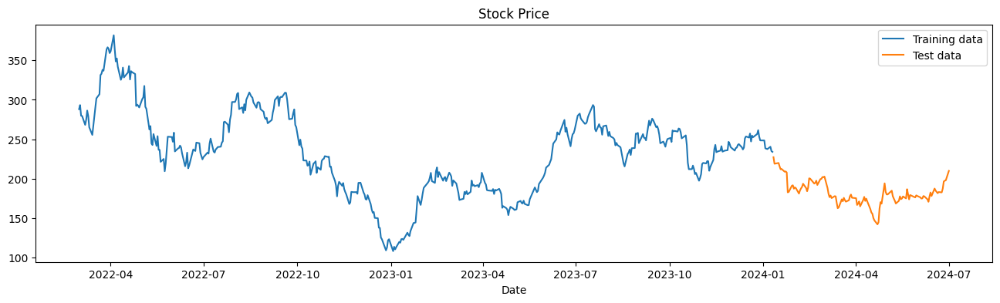
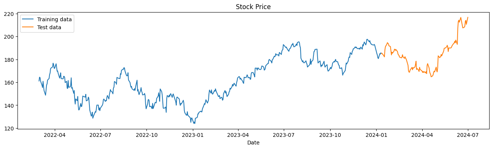
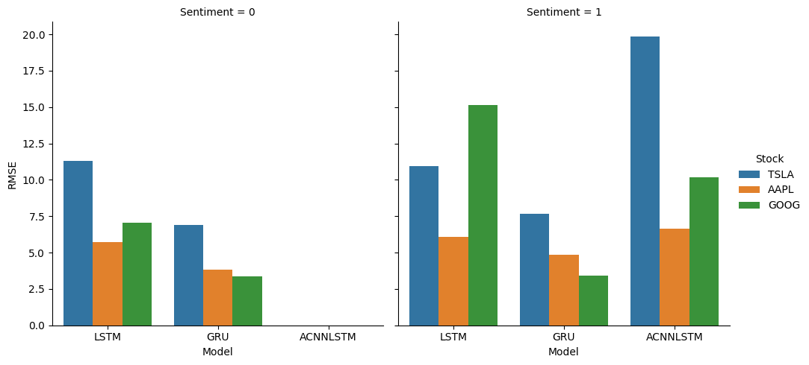

# Optimizing Stock Price Forecasting Using Modern RNNs
### Evaluating the Impact of Sentiment Analysis on LSTM, GRU, and Attention-CNN-LSTM Models

![Gensim](https://img.shields.io/badge/gensim-white?logo=data%3Aimage%2Fsvg%2Bxml%3Bbase64%2CPD94bWwgdmVyc2lvbj0iMS4wIiBzdGFuZGFsb25lPSJubyI%2FPgo8IURPQ1RZUEUgc3ZnIFBVQkxJQyAiLS8vVzNDLy9EVEQgU1ZHIDIwMDEwOTA0Ly9FTiIKICJodHRwOi8vd3d3LnczLm9yZy9UUi8yMDAxL1JFQy1TVkctMjAwMTA5MDQvRFREL3N2ZzEwLmR0ZCI%2BCjxzdmcgdmVyc2lvbj0iMS4wIiB4bWxucz0iaHR0cDovL3d3dy53My5vcmcvMjAwMC9zdmciCiB3aWR0aD0iMjAwLjAwMDAwMHB0IiBoZWlnaHQ9IjIwMC4wMDAwMDBwdCIgdmlld0JveD0iMCAwIDIwMC4wMDAwMDAgMjAwLjAwMDAwMCIKIHByZXNlcnZlQXNwZWN0UmF0aW89InhNaWRZTWlkIG1lZXQiPgoKPGcgdHJhbnNmb3JtPSJ0cmFuc2xhdGUoMC4wMDAwMDAsMjAwLjAwMDAwMCkgc2NhbGUoMC4xMDAwMDAsLTAuMTAwMDAwKSIKZmlsbD0iIzAwMDAwMCIgc3Ryb2tlPSJub25lIj4KPHBhdGggZD0iTTg3MCAxOTkwIGMtNDA4IC01NyAtNzMzIC0zNDggLTgzNyAtNzQ5IC0zMSAtMTE4IC0zNSAtMzIyIC0xMCAtNDM2CjU0IC0yNDMgMTg3IC00NTMgMzc3IC01OTcgODQgLTY0IDI0MyAtMTQyIDM0NSAtMTcwIDY4IC0xOSAxMDYgLTIyIDI1NSAtMjIKMjAwIDAgMjY2IDEzIDQxNCA4MiAxMTUgNTQgMTk4IDExMiAyODcgMjAxIDEyNCAxMjUgMjE2IDI4MiAyNjAgNDQ2IDMzIDEyMgozOCAzNTAgMTAgNDY3IC00OSAyMDUgLTEzOCAzNjUgLTI4MiA1MDMgLTEzOSAxMzIgLTI3MCAyMDYgLTQ0NiAyNTEgLTEwOCAyNwotMjczIDM4IC0zNzMgMjR6IG0zNzUgLTYxIGMyOTcgLTc1IDU2MCAtMzIwIDY2MSAtNjE2IDU5IC0xNzQgNjIgLTI4MCAxMgotNDMzIC03MiAtMjIyIC0yNDIgLTQxMSAtNDU1IC01MDUgLTE0OSAtNjcgLTM2OSAtODUgLTUyOSAtNDUgLTkzIDIzIC0yNzEKMTA3IC0yNTcgMTIxIDYgNiAyNSAzIDQ5IC03IDUxIC0yMSAxODYgLTMwIDI1MyAtMTUgMTU3IDM0IDI4NyAxNTAgMzQxIDMwNgoyOCA4MSAyNyAyMTQgLTEgMjk3IC03MyAyMTYgLTI5MCAzNDggLTUxMSAzMTAgLTE1NSAtMjcgLTI3NCAtMTE2IC0zNDQgLTI1OAotMzUgLTcwIC0zOSAtODYgLTQyIC0xNzQgLTMgLTcyIDAgLTExMyAxMyAtMTU2IDIwIC02OCAyMCAtNjcgNyAtNzIgLTE1IC01Ci04OSAxNTUgLTExMyAyNDMgLTMwIDExMiAtMzAgMjk3IDAgNDEwIDg0IDMxNSAzMjQgNTQ0IDY0MSA2MTEgNzggMTYgMTY1IDExCjI3NSAtMTd6Ii8%2BCjwvZz4KPC9zdmc%2BCg%3D%3D)

![Matplotlib](https://img.shields.io/badge/matplotlib-white?logo=data%3Aimage%2Fsvg%2Bxml%3Bbase64%2CPD94bWwgdmVyc2lvbj0iMS4wIiBlbmNvZGluZz0iVVRGLTgiPz4KPHN2ZyB4bWxucz0iaHR0cDovL3d3dy53My5vcmcvMjAwMC9zdmciIHdpZHRoPSIxODAiIGhlaWdodD0iMTgwIiBzdHJva2U9ImdyYXkiPgo8ZyBzdHJva2Utd2lkdGg9IjIiIGZpbGw9IiNGRkYiPgo8Y2lyY2xlIGN4PSI5MCIgY3k9IjkwIiByPSI4OCIvPgo8Y2lyY2xlIGN4PSI5MCIgY3k9IjkwIiByPSI2NiIvPgo8Y2lyY2xlIGN4PSI5MCIgY3k9IjkwIiByPSI0NCIvPgo8Y2lyY2xlIGN4PSI5MCIgY3k9IjkwIiByPSIyMiIvPgo8cGF0aCBkPSJtOTAsMnYxNzZtNjItMjYtMTI0LTEyNG0xMjQsMC0xMjQsMTI0bTE1MC02MkgyIi8%2BCjwvZz48ZyBvcGFjaXR5PSIuOCI%2BCjxwYXRoIGZpbGw9IiM0NEMiIGQ9Im05MCw5MGgxOGExOCwxOCAwIDAsMCAwLTV6Ii8%2BCjxwYXRoIGZpbGw9IiNCQzMiIGQ9Im05MCw5MCAzNC00M2E1NSw1NSAwIDAsMC0xNS04eiIvPgo8cGF0aCBmaWxsPSIjRDkzIiBkPSJtOTAsOTAtMTYtNzJhNzQsNzQgMCAwLDAtMzEsMTV6Ii8%2BCjxwYXRoIGZpbGw9IiNEQjMiIGQ9Im05MCw5MC01OC0yOGE2NSw2NSAwIDAsMC01LDM5eiIvPgo8cGF0aCBmaWxsPSIjM0JCIiBkPSJtOTAsOTAtMzMsMTZhMzcsMzcgMCAwLDAgMiw1eiIvPgo8cGF0aCBmaWxsPSIjM0M5IiBkPSJtOTAsOTAtMTAsNDVhNDYsNDYgMCAwLDAgMTgsMHoiLz4KPHBhdGggZmlsbD0iI0Q3MyIgZD0ibTkwLDkwIDQ2LDU4YTc0LDc0IDAgMCwwIDEyLTEyeiIvPgo8L2c%2BPC9zdmc%2B)
![Seaborn](https://img.shields.io/badge/seaborn-white?logo=data%3Aimage%2Fsvg%2Bxml%3Bbase64%2CPD94bWwgdmVyc2lvbj0iMS4wIiBzdGFuZGFsb25lPSJubyI%2FPgo8IURPQ1RZUEUgc3ZnIFBVQkxJQyAiLS8vVzNDLy9EVEQgU1ZHIDIwMDEwOTA0Ly9FTiIKICJodHRwOi8vd3d3LnczLm9yZy9UUi8yMDAxL1JFQy1TVkctMjAwMTA5MDQvRFREL3N2ZzEwLmR0ZCI%2BCjxzdmcgdmVyc2lvbj0iMS4wIiB4bWxucz0iaHR0cDovL3d3dy53My5vcmcvMjAwMC9zdmciCiB3aWR0aD0iMTg1MC4wMDAwMDBwdCIgaGVpZ2h0PSIxODUwLjAwMDAwMHB0IiB2aWV3Qm94PSIwIDAgMTg1MC4wMDAwMDAgMTg1MC4wMDAwMDAiCiBwcmVzZXJ2ZUFzcGVjdFJhdGlvPSJ4TWlkWU1pZCBtZWV0Ij4KCjxnIHRyYW5zZm9ybT0idHJhbnNsYXRlKDAuMDAwMDAwLDE4NTAuMDAwMDAwKSBzY2FsZSgwLjEwMDAwMCwtMC4xMDAwMDApIgpmaWxsPSIjMDAwMDAwIiBzdHJva2U9Im5vbmUiPgo8cGF0aCBkPSJNODgzOSAxODQ4OSBjLTIxMDMgLTk1IC00MDk2IC04OTggLTU2OTIgLTIyOTEgLTIxMCAtMTg0IC02NjUgLTYzOQotODQ2IC04NDYgLTg2OCAtOTk3IC0xNTAyIC0yMTI5IC0xODg2IC0zMzcyIC0zODkgLTEyNjAgLTUwNSAtMjU4MyAtMzM5Ci0zOTAwIDIxOCAtMTc0MiA5NDAgLTM0MDUgMjA2MyAtNDc1NCA1NjkgLTY4NCAxMjIyIC0xMjczIDE5NTYgLTE3NjYgMTIwMwotODA2IDI1NzIgLTEzMTkgNDAwNSAtMTUwMCA0MTYgLTUyIDQ3OSAtNTUgMTE1NSAtNTUgNjg4IDAgNzQwIDMgMTE5NCA2MQoxNTY5IDIwMSAzMDg4IDgxNyA0MzUxIDE3NjYgMzg1IDI4OSA2NjIgNTI5IDEwMDUgODczIDEwMTUgMTAxNiAxNzY1IDIyMjUKMjIyMCAzNTgwIDI0MCA3MTMgMzcyIDEzNDAgNDUyIDIxNDAgMTUgMTUzIDE4IDI3NyAxOCA4MjAgMCA2NzYgLTMgNzM5IC01NQoxMTU1IC0yOTQgMjMyOSAtMTQ2MCA0NDU4IC0zMjY2IDU5NjEgLTE3NjQgMTQ2OSAtNDAzOCAyMjMzIC02MzM1IDIxMjh6IG05MzEKLTMxOSBjODI2IC01MiAxNjA5IC0yMDYgMjM3MCAtNDY1IDI0MTIgLTgyMyA0MzU2IC0yNjM0IDUzNTEgLTQ5ODMgNTY1IC0xMzMzCjc5OCAtMjgwNCA2NzQgLTQyMzkgLTE0NSAtMTY2OCAtNzUxIC0zMjU2IC0xNzUwIC00NTkyIC0yNzEgLTM2MSAtNTA3IC02MzQKLTg0MCAtOTY2IC0zMzIgLTMzMyAtNjA1IC01NjkgLTk2NiAtODQwIC0xODc5IC0xNDA2IC00MjUyIC0yMDIwIC02NTY0IC0xNjk5Ci0yNzY2IDM4NCAtNTE4MyAyMDIwIC02NTYxIDQ0NDIgLTY3NSAxMTg4IC0xMDY5IDI1MTkgLTExNTQgMzkwMiAtMTMgMjE0IC0xMwo4MDMgMCAxMDIzIDEyMyAyMDU5IDk0NSA0MDA5IDIzMjcgNTUxOSAxNDIgMTU1IDQ3MSA0ODIgNjIzIDYxOSA4OTQgODA4IDE5OTIKMTQ0NiAzMTU1IDE4MzQgNzI5IDI0MyAxNTA2IDM5NCAyMjgwIDQ0NCAxOTEgMTIgODY0IDEzIDEwNTUgMXoiLz4KPHBhdGggZD0iTTY3NTAgMTAxMTMgYy0xMDIwIC0yNCAtMjA4OCAtMjcyIC0zMzYyIC03ODIgLTQ1OCAtMTgzIC04NDkgLTM1MwotMTc0MyAtNzU4IC0zNTcgLTE2MyAtNzMxIC0zMzEgLTgzMCAtMzc1IC05OSAtNDQgLTE4MSAtODEgLTE4MiAtODIgLTMgLTMgMzEKLTIzMCA1OCAtMzgxIDEzNSAtNzgxIDM5NCAtMTU3OCA3NDYgLTIzMDAgbDU4IC0xMjAgMyA0ODggMiA0ODcgMTAwNSAwIDEwMDUKMCAwIDY5NSAwIDY5NSAxMDAwIDAgMTAwMCAwIDAgMTI1IDAgMTI1IDEwNzUgMCAxMDc1IDAgMCAtNTYwIDAgLTU2MCAxMDAwIDAKMTAwMCAwIDAgLTc3MCAwIC03NzAgMTAwNSAwIDEwMDUgMCAwIC01MzAgMCAtNTMwIDEwMDAgMCAxMDAwIDAgMCAtMjI1IDAKLTIyNSAxMDAwIDAgMTAwMCAwIDAgLTE5NyAxIC0xOTggMzIgMzYgYzE4IDIwIDg0IDk3IDE0OCAxNzAgNjI5IDcyOCAxMTM1CjE1NjcgMTQ5NCAyNDc0IDEwMSAyNTcgMjE4IDU5NCAyMTEgNjEyIC0zIDcgLTEzIDEzIC0yMSAxMyAtNTIgMCAtNzk0IDE3NwotMTEzMSAyNzAgLTY2OCAxODQgLTEzNzYgNDI1IC0yMTEwIDcxOCAtNTQ3IDIxOCAtOTY3IDQwMSAtMTk5NCA4NjcgLTEzMzMKNjA1IC0xOTEzIDg0OCAtMjUzNSAxMDYyIC0xMDk5IDM4MCAtMjA3MCA1NDkgLTMwMTUgNTI2eiIvPgo8cGF0aCBkPSJNNTY1OCA0NTU4IGwtMyAtMzIzMyA4NCAtMzggYzQ4NCAtMjE3IDExMjQgLTQyNSAxNjU5IC01NDEgbDExMiAtMjQKMCAzNTM0IDAgMzUzNCAtOTI1IDAgLTkyNSAwIC0yIC0zMjMyeiIvPgo8cGF0aCBkPSJNMzY1MCA1MDY1IGwwIC0yNDc0IDExMyAtOTIgYzQ2NCAtMzgxIDEwNTUgLTc2MyAxNjE2IC0xMDQ0IGwxMzEKLTY1IDAgMzA3NSAwIDMwNzUgLTkzMCAwIC05MzAgMCAwIC0yNDc1eiIvPgo8cGF0aCBkPSJNNzY2MCAzNjgxIGwwIC0yOTg5IDY2IC0xMSBjMjYzIC00NiA1NzQgLTg2IDg2OSAtMTExIDcyIC03IDMwOSAtMTQKNTI4IC0xNyBsMzk3IC02IDAgMzA2MiAwIDMwNjEgLTkzMCAwIC05MzAgMCAwIC0yOTg5eiIvPgo8cGF0aCBkPSJNMTY0OCA1NTg4IGwtMyAtNTUzIDI5IC01NSBjNjEgLTExMiAyMTMgLTM2MSAzMzEgLTU0MCAzNjcgLTU1NiA4MjIKLTEwOTUgMTI5NSAtMTUzNiAxMDAgLTkzIDE4OCAtMTczIDE5NiAtMTc3IDEyIC03IDE0IDIyOSAxNCAxNzAzIGwwIDE3MTAKLTkzMCAwIC05MzAgMCAtMiAtNTUyeiIvPgo8cGF0aCBkPSJNOTY2MCAyODQwIGwwIC0yMjgwIDY4IDAgYzk0IDAgMzgxIDI2IDYxOCA1NSAzNDQgNDMgNjQ0IDk5IDk4NyAxODIKbDE4NyA0NiAwIDIxMzggMCAyMTM5IC05MzAgMCAtOTMwIDAgMCAtMjI4MHoiLz4KPHBhdGggZD0iTTExNjcwIDI0NzUgYzAgLTg3MiA0IC0xNTg1IDggLTE1ODUgNDEgMCA1NzIgMTgyIDgxNyAyODAgMjkxIDExNgo3MzAgMzI0IDk1NSA0NTIgbDc1IDQzIC0zIDExOTggLTIgMTE5NyAtOTI1IDAgLTkyNSAwIDAgLTE1ODV6Ii8%2BCjxwYXRoIGQ9Ik0xMzY3MCAyNjg0IGwwIC05MzYgNDggMjggYzUyOSAzMDcgMTEzNCA3NzMgMTYyNCAxMjUzIGwxODggMTgzIDAKMjA0IDAgMjA0IC05MzAgMCAtOTMwIDAgMCAtOTM2eiIvPgo8L2c%2BCjwvc3ZnPgo%3D)

📄 **WRITE-UP**: [Project Write-Up](https://marcocamilo.com/...)  
📔 **NOTEBOOK**: [Jupyter Notebook](https://github.com/marcocamilo/stock-sentiment-prediction)  

## 📌 Overview

This project focuses on optimizing the predictive capabilities of modern RNN models for stock price movements of TSLA, AAPL, and GOOG. The goal is to enhance forecasting accuracy by utilizing historical stock data and news sentiment data. The analysis evaluates the performance of LSTM, GRU, and Attention-CNN-LSTM models, tested with and without sentiment data, to determine their effectiveness in stock price prediction.

## 🚀 Key Takeaways

1. **Insight 1**: [Insight 1 description]
2. **Insight 2**: [Insight 2 description]
3. **Insight 3**: [Insight 3 description]
4. **Insight 4**: [Insight 4 description]
5. **Insight 5**: [Insight 5 description]

[👇 Jump to results and discussion](#-results-and-discussion)

## 📂 Table of Contents

- [Overview](#-overview)
- [Key Takeaways](#-key-takeaways)
- [Table of Contents](#-table-of-contents)
- [Motivation](#-motivation)
- [Approach](#-approach)
- [Dataset](#-dataset)
- [Preprocessing](#-preprocessing)
- [Model Development](#-model-development)
- [Results and Discussion](#-results-and-discussion)
- [Future Work](#-future-work)

## 📋 Motivation

My aim behind this project was to explore the dynamic field of stock price prediction by modeling a variety of stocks from the technology sector: the volatile TSLA, an innovative AAPL, and a robust GOOG. Professionally, this project deepened my expertise in advanced time series analysis, enhancing forecasting accuracy and offering insightful solutions to investors and financial analysts. Additionally, I have explored the role of architecture complexity in time series modeling and demonstrated the impact of language data on stock predictions. This showcases my technical skills and also offers valuable experience at the intersection of finance and technology.

## 🎯 Approach

1. **Data Collection**: Acquired stock data from Yahoo Finance and news data from Alpha Vantage covering TSLA, AAPL, and GOOG from March 3rd, 2022, to July 3rd, 2024.
2. **Data Preprocessing**: Cleaned and engineered features for both stock and news datasets, including handling missing values, converting date formats, creating lag features, and performing sentiment analysis.
3. **Baseline Modeling**: Implemented Moving Average and XGBoost Regressor models for initial stock price predictions based on historical data and engineered features.
4. **Model Development**: Developed LSTM, GRU, and Attention-CNN-LSTM models to capture sequential dependencies and sentiment-driven insights for improved stock price prediction.
5. **Evaluation**: Evaluated model performance using metrics such as RMSE and accuracy, visualizing predictions against actual stock prices and sentiment trends to assess effectiveness in capturing market dynamics and sentiment-driven fluctuations.

## 💾 Dataset

- **Time Frame**: March 3, 2022 to July 3, 2024 (2.25 years)
- **Stock Choices**
	- **TSLA**: Chosen to challenge the models with its high volatility during the selected period, complemented by extensive news and social media coverage, and leadership in AI and autonomous driving technologies.
    
	- **AAPL**: Selected for its consistent innovation, significant media presence, and diverse product range.
    
	- **GOOG**: Included due to its robust news coverage, stable growth trajectory, and extensive technological initiatives.
    
- **Sources**
	- **News Data**: [Alpha Vantage](https://www.alphavantage.co/)
		- Provides comprehensive financial APIs for stock market data, including news headlines and sentiment analysis.
	- **Stock Data**: [Yahoo Finance](https://finance.yahoo.com/) (via [yfinance](https://github.com/ranaroussi/yfinance) package)
		- Offers historical and real-time stock data accessible programmatically through the yfinance Python package.

## 🔨 Preprocessing

### Preprocessing

- Standard data preprocessing: missing value check, duplicate removal, data type conversion.
- I filtered the data to ensure both news and stock data consist of the same window of data, in particular after feature engineering.
- Utilized the SpaCy and SpaCy-Cleaner libraries to implement functions to remove stopwords, punctuation, and lemmatize tokens to normalize text data.

### Feature Engineering

- Implemented the FinBERT model using PyTorch (model's default library) to tokenize and compute sentiment scores (positive, negative, neutral) for both news titles and summaries.
- Computed mean sentiment scores (`title_pos`, `title_neg`, `title_neu`, `summary_pos`, `summary_neg`, `summary_neu`) grouped by stock and date to summarize sentiment trends.
- Extracted the time features such as day of the week, day, month, and year from the date column to capture temporal patterns.
- Created lag features (`lag_1` to `lag_7`) to incorporate historical prices as predictors.
- Computed rolling mean and standard deviation over 7-day and 14-day windows to capture short-term trends and volatility.

## 🧠 Model Development

### Prediction Models

#### Baseline: Moving Average and `XGBoost Regressor`

- **Moving Average**: the average closing price over the past 7 and 14 days is used as the prediction.
- **XGBoost Regressor**: an implementation of gradient boosting using decision trees, which builds sequentially optimizing models, incorporates regularization, handles missing values, supports parallel processing, and prunes branches for enhanced performance and scalability.

#### Vanilla and Sentiment-Enhanced RNN Models

- **LSTM**: uses input, output, and forget gates to manage long-term dependencies and prevent the vanishing gradient problem in sequential data.
- **GRU**: a simplified LSTM using reset and update gates to manage dependencies and improve training efficiency.
- **Attention-CNN-LSTM** (only with sentiment data): a hybrid model combining convolutional layers for feature extraction, attention mechanisms for focusing on relevant information, and LSTM layers for sequence prediction.

### Implementation

#### 1. Data Preparation: `StockData`

- Packages all data preparation tasks, including scaling, sequence creation, and train-test splitting.
- Handles the inverse transformation of scaled data for result interpretation.
- Plots the data by training and test sets for visualization.

#### 2. Model Development: `Hypermodel`

- Implements Keras Tuner for hyperparameter tuning for model selection.
- Defines the model architecture and hyperparameter search space.
- Compiles the model for fine-tuning with the chosen optimizer and loss function.

#### 3. Training and Evaluation: `StockModel`

- Integrates data and hypermodel classes for model training and evaluation.
- Conducts hyperparameter tuning to find the best model configuration.
- Evaluates the best model on the test data, calculating RMSE and accuracy.
- Plots predicted vs. actual stock prices for visualization of model performance.

## 📈 Results and Discussion

### Model Architecture and Performance
- GRU models generally outperformed LSTM models in terms of both accuracy and RMSE, indicating that the GRU's simpler architecture might be more effective for stock price prediction in this dataset.
- Attention-CNN-LSTM models, despite their complexity, did not provide significant performance improvements and consistently performed worse than LSTMs and GRUs.

### Role of Sentiment in Stock Prediction
- Incorporating sentiment data consistently resulted in lower accuracy and higher RMSE, indicating it added noise rather than improving model performance, particularly noticeably with LSTM models for GOOG.
- GRU models showed robust performance both with and without sentiment data, suggesting they handle noise better, but still did not gain significant benefit from sentiment analysis.

### Overarching Conclusions
- Simpler recurrent architectures such as GRUs yielded better and more robust results in terms of accuracy, RMSE, and noise-handling compared to traditional or complex hybrid models.
- Filtering and refining input data, such as focusing on relevant news articles, may reduce noise and improve the relevance of sentiment analysis and its impact on stock prediction models.
- Achieving a balance between model complexity and input features is crucial for optimal stock prediction. Overly complex models like Attention-CNN-LSTM performed significantly worse than all other models. Furthermore, models incorporating sentiment data consistently displayed higher RMSE than those without it. Finding the right balance between model complexity and input features is essential for achieving the best performance.

## 🪐 Future Work

1. **Additional Refinement of News Data**: Focus on news directly related to the target stock to reduce noise and improve relevance.
2. **Testing with Other Stocks and Asset Types**: Evaluate the model's performance on a further range of stocks and asset classes such as other tech companies and different index funds.
3. **Incorporating Alternative Data Sources**: Integrate data from financial reports or economic indicators to enhance model inputs and potentially improve prediction accuracy.
