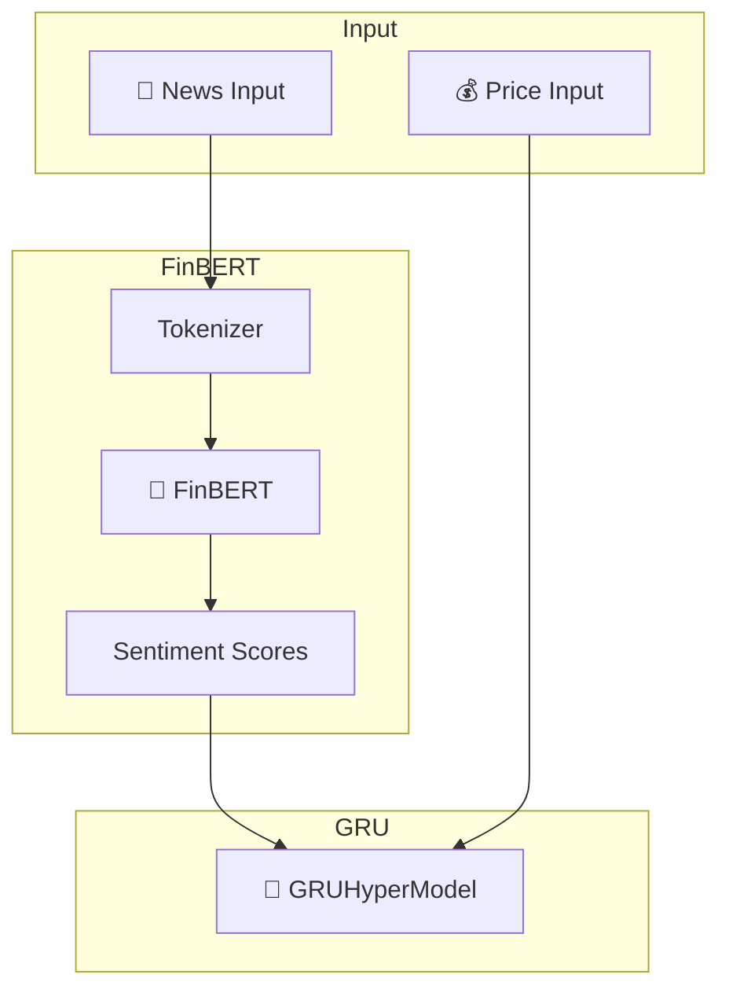
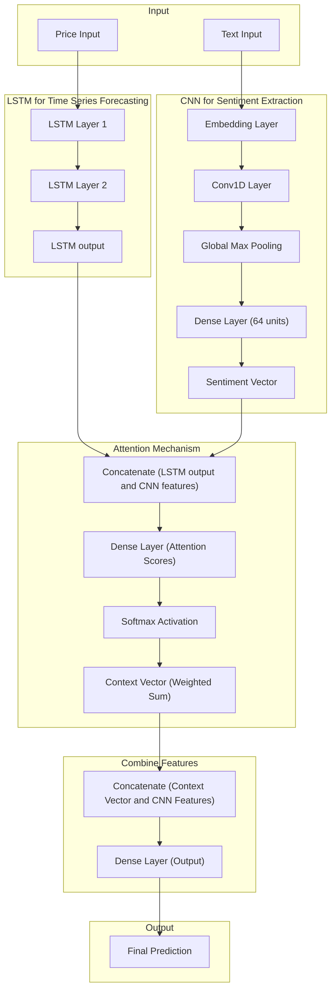

# Model Architectures

## FinBERT + GRU

```mermaid
graph TD

    subgraph Input
        A["📰 News Input"]
        B["💰 Price Input"]
    end

    subgraph FinBERT
        A --> C[Tokenizer]
        C --> D["🤗 FinBERT"]
        D --> E[Sentiment Scores]
    end

    subgraph GRU
        E --> F["🤖 GRUHyperModel"]
        B --> F
    end

```

## CNN + LSTM + Attention

```mermaid
graph TD
    subgraph Input
        A[Text Input]
        B[Price Input]
    end

    subgraph CNN for Sentiment Extraction
        A --> C[Embedding Layer]
        C --> D[Conv1D Layer]
        D --> E[Global Max Pooling]
        E --> F["Dense Layer (64 units)"]
        F --> I[Sentiment Vector]
    end

    subgraph LSTM for Time Series Forecasting
        B --> G[LSTM Layer 1]
        G --> H[LSTM Layer 2]
        H --> Z[LSTM output]
    end

    subgraph Attention Mechanism
        Z --> J
        I --> J["Concatenate (LSTM output and CNN features)"]
        J --> K["Dense Layer (Attention Scores)"]
        K --> L[Softmax Activation]
        L --> M["Context Vector (Weighted Sum)"]
    end

    subgraph Combine Features
        M --> N["Concatenate (Context Vector and CNN Features)"]
        N --> O["Dense Layer (Output)"]
    end

    subgraph Output
        O --> P[Final Prediction]
    end
```
