```python
import numpy as np
import pandas as pd
import matplotlib.pyplot as plt
from sklearn.model_selection import train_test_split, TimeSeriesSplit
from sklearn.metrics import mean_squared_error, mean_absolute_percentage_error
from sklearn.preprocessing import MinMaxScaler, StandardScaler
import tensorflow as tf
from tensorflow.keras import Sequential
from tensorflow.keras.callbacks import EarlyStopping
from tensorflow.keras.layers import GRU, LSTM, Dense, Dropout
import keras_tuner as kt

figsize = (16,4)
plt.rcParams['figure.figsize'] = figsize
pd.set_option('display.float_format', lambda x: '%.2f' % x)
```


```python
stocks = pd.read_parquet('/kaggle/input/stock-sentiment-features/stock-history-features.parquet')
stocks_full = pd.read_parquet('/kaggle/input/stock-sentiment-features/stock-history-features-full.parquet')
stocks_full.insert(17, "close", stocks_full.pop("close"))

display(stocks.sample(5))
display(stocks_full.sample(5))
```


<div>
<style scoped>
    .dataframe tbody tr th:only-of-type {
        vertical-align: middle;
    }

    .dataframe tbody tr th {
        vertical-align: top;
    }

    .dataframe thead th {
        text-align: right;
    }
</style>
<table border="1" class="dataframe">
  <thead>
    <tr style="text-align: right;">
      <th></th>
      <th>date</th>
      <th>stock</th>
      <th>day_of_week</th>
      <th>day</th>
      <th>month</th>
      <th>year</th>
      <th>lag_1</th>
      <th>lag_2</th>
      <th>rolling_mean_7</th>
      <th>rolling_mean_14</th>
      <th>close</th>
    </tr>
  </thead>
  <tbody>
    <tr>
      <th>1394</th>
      <td>2023-01-13</td>
      <td>GOOG</td>
      <td>4</td>
      <td>13</td>
      <td>1</td>
      <td>2023</td>
      <td>91.81</td>
      <td>92.16</td>
      <td>89.89</td>
      <td>89.20</td>
      <td>92.69</td>
    </tr>
    <tr>
      <th>1617</th>
      <td>2023-12-04</td>
      <td>GOOG</td>
      <td>0</td>
      <td>4</td>
      <td>12</td>
      <td>2023</td>
      <td>133.17</td>
      <td>133.77</td>
      <td>135.44</td>
      <td>136.50</td>
      <td>130.48</td>
    </tr>
    <tr>
      <th>1000</th>
      <td>2023-10-20</td>
      <td>AAPL</td>
      <td>4</td>
      <td>20</td>
      <td>10</td>
      <td>2023</td>
      <td>174.77</td>
      <td>175.15</td>
      <td>176.39</td>
      <td>176.11</td>
      <td>172.20</td>
    </tr>
    <tr>
      <th>646</th>
      <td>2022-05-24</td>
      <td>AAPL</td>
      <td>1</td>
      <td>24</td>
      <td>5</td>
      <td>2022</td>
      <td>141.51</td>
      <td>136.05</td>
      <td>140.41</td>
      <td>144.83</td>
      <td>138.79</td>
    </tr>
    <tr>
      <th>476</th>
      <td>2024-01-23</td>
      <td>TSLA</td>
      <td>1</td>
      <td>23</td>
      <td>1</td>
      <td>2024</td>
      <td>208.80</td>
      <td>212.19</td>
      <td>213.77</td>
      <td>224.77</td>
      <td>209.14</td>
    </tr>
  </tbody>
</table>
</div>


<div>
<style scoped>
    .dataframe tbody tr th:only-of-type {
        vertical-align: middle;
    }

    .dataframe tbody tr th {
        vertical-align: top;
    }

    .dataframe thead th {
        text-align: right;
    }
</style>
<table border="1" class="dataframe">
  <thead>
    <tr style="text-align: right;">
      <th></th>
      <th>date</th>
      <th>stock</th>
      <th>day_of_week</th>
      <th>day</th>
      <th>month</th>
      <th>year</th>
      <th>lag_1</th>
      <th>lag_2</th>
      <th>lag_3</th>
      <th>lag_4</th>
      <th>lag_5</th>
      <th>lag_6</th>
      <th>lag_7</th>
      <th>rolling_mean_7</th>
      <th>rolling_std_7</th>
      <th>rolling_mean_14</th>
      <th>rolling_std_14</th>
      <th>close</th>
    </tr>
  </thead>
  <tbody>
    <tr>
      <th>1475</th>
      <td>2023-05-11</td>
      <td>GOOG</td>
      <td>3</td>
      <td>11</td>
      <td>5</td>
      <td>2023</td>
      <td>112.15</td>
      <td>107.82</td>
      <td>108.12</td>
      <td>106.09</td>
      <td>105.09</td>
      <td>106.00</td>
      <td>105.86</td>
      <td>108.86</td>
      <td>4.18</td>
      <td>107.66</td>
      <td>3.29</td>
      <td>116.77</td>
    </tr>
    <tr>
      <th>73</th>
      <td>2022-06-14</td>
      <td>TSLA</td>
      <td>1</td>
      <td>14</td>
      <td>6</td>
      <td>2022</td>
      <td>215.74</td>
      <td>232.23</td>
      <td>239.71</td>
      <td>241.87</td>
      <td>238.89</td>
      <td>238.28</td>
      <td>234.52</td>
      <td>232.51</td>
      <td>10.24</td>
      <td>237.77</td>
      <td>12.81</td>
      <td>220.89</td>
    </tr>
    <tr>
      <th>521</th>
      <td>2024-03-27</td>
      <td>TSLA</td>
      <td>2</td>
      <td>27</td>
      <td>3</td>
      <td>2024</td>
      <td>177.67</td>
      <td>172.63</td>
      <td>170.83</td>
      <td>172.82</td>
      <td>175.66</td>
      <td>171.32</td>
      <td>173.80</td>
      <td>174.39</td>
      <td>3.41</td>
      <td>172.91</td>
      <td>5.15</td>
      <td>179.83</td>
    </tr>
    <tr>
      <th>1397</th>
      <td>2023-01-19</td>
      <td>GOOG</td>
      <td>3</td>
      <td>19</td>
      <td>1</td>
      <td>2023</td>
      <td>91.68</td>
      <td>92.06</td>
      <td>92.69</td>
      <td>91.81</td>
      <td>92.16</td>
      <td>89.14</td>
      <td>88.70</td>
      <td>91.90</td>
      <td>1.42</td>
      <td>90.17</td>
      <td>2.13</td>
      <td>93.80</td>
    </tr>
    <tr>
      <th>598</th>
      <td>2022-03-16</td>
      <td>AAPL</td>
      <td>2</td>
      <td>16</td>
      <td>3</td>
      <td>2022</td>
      <td>153.13</td>
      <td>148.72</td>
      <td>152.77</td>
      <td>156.52</td>
      <td>160.89</td>
      <td>155.45</td>
      <td>157.29</td>
      <td>155.01</td>
      <td>3.91</td>
      <td>158.50</td>
      <td>4.79</td>
      <td>157.57</td>
    </tr>
  </tbody>
</table>
</div>


```python
df = stocks_full.copy()
df.set_index('date', inplace=True)
```

## Data Preparation


```python
class StockData:
    def __init__(self, stock, data, look_back=30, test_size=0.2):
        self.stock = stock
        self.data = data.query(f"stock == '{stock}'").copy()
        self.index = self.data.index
        self.data.drop("stock", axis=1, inplace=True)
        self.look_back = look_back
        self.test_size = test_size
        self.x_scaler = MinMaxScaler()
        self.y_scaler = MinMaxScaler()
        
        self.X = self.data.values
        self.y = self.data['close'].values.reshape(-1, 1)
        
        self.X_scaled = self.x_scaler.fit_transform(self.X)
        self.y_scaled = self.y_scaler.fit_transform(self.y)
        
        self.X_train, self.X_test, self.y_train, self.y_test = self.split_sequence()

    def create_sequences(self, data):
        input_data = []
        target_data = []
        for i in range(len(data[0]) - self.look_back):
            input_seq = data[0][i:i+self.look_back]
            input_data.append(input_seq)

            target_value = data[1][i+self.look_back]
            target_data.append(target_value)
        return np.array(input_data), np.array(target_data)
        
    def split_sequence(self):
        X_train, X_test, y_train, y_test = train_test_split(self.X_scaled, self.y_scaled, 
                                                            test_size=self.test_size, 
                                                            shuffle=False)
        
        X_train, y_train = self.create_sequences([X_train, y_train])
        X_test, y_test = self.create_sequences([X_test, y_test])
        
        return X_train, X_test, y_train, y_test
    
    def inverse_transform(self, data, scaler='y'):
        scaler_dict = {
            'x': self.x_scaler,
            'y': self.y_scaler
        }
        data_inv = scaler_dict[scaler].inverse_transform(data)
        
        return data_inv
    
    def plot(self):
        data = self.data
        split = int(len(data) * (1 - self.test_size))

        plt.plot(data.iloc[:split, -1], label='Training data')
        plt.plot(data.iloc[split:, -1], label='Test data')
        plt.xlabel("Date")
        plt.title("Stock Price")
        plt.legend()
        plt.show()
        plt.show()
```


```python
TSLA = StockData("TSLA", df)
AAPL = StockData("AAPL", df)
GOOG = StockData("GOOG", df)
```

## Hypermodel


```python
class GRUHyperModel(kt.HyperModel):
    def __init__(self):
        self.model = "GRU"
    def build(self, hp):
        model = Sequential()
        
        # Hyperparameter settings
        num_gru_layers = hp.Int("num_gru_layers", 1, 3)
        gru_units = [hp.Int(f"gru_units_{i}", min_value=25, max_value=200, step=25) for i in range(num_gru_layers)]
        optimizer_choice = hp.Choice('optimizer', ['adam', 'rmsprop'])
        learning_rate = hp.Choice('learning_rate', values=[1e-2, 1e-3, 1e-4])
        
        # Input Layer
        model.add(Input(shape=(self.look_back, self.input_shape)))
        
        # Add GRU layers
        for i in range(num_gru_layers):
            model.add(
                GRU(
                    units=gru_units[i],
                    return_sequences=True if i < num_gru_layers - 1 else False
                )
            )
        
        # Add Output layer
        model.add(Dense(1))

        # Optimizer
        opt = {
            'adam': tf.keras.optimizers.Adam,
            'rmsprop': tf.keras.optimizers.RMSprop,
        }

        # Compile model
        model.compile(
            optimizer=opt[optimizer_choice](learning_rate=learning_rate),
            loss='mse'
        )
        
        return model
```


```python
class LSTMHyperModel(kt.HyperModel):
    def __init__(self):
        self.model = "LSTM"
        
    def build(self, hp):
        model = Sequential()
        
        # Hyperparameter settings
        num_lstm_layers = hp.Int("num_lstm_layers", 1, 3)
        lstm_units = [hp.Int(f"lstm_units_{i}", min_value=25, max_value=200, step=25) for i in range(num_lstm_layers)]
        optimizer_choice = hp.Choice('optimizer', ['adam', 'rmsprop'])
        learning_rate = hp.Choice('learning_rate', values=[1e-2, 1e-3, 1e-4])
        
        # Input Layer
        model.add(Input(shape=(self.look_back, self.input_shape)))
        
        # Add LSTM layers
        for i in range(num_lstm_layers):
            model.add(
                LSTM(
                    units=lstm_units[i],
                    return_sequences=True if i < num_lstm_layers - 1 else False
                )
            )
        
        # Add Output layer
        model.add(Dense(1))

        # Optimizer
        opt = {
            'adam': tf.keras.optimizers.Adam,
            'rmsprop': tf.keras.optimizers.RMSprop,
        }

        # Compile model
        model.compile(
            optimizer=opt[optimizer_choice](learning_rate=learning_rate),
            loss='mse'
        )
        
        return model
```

## Model Building


```python
class StockModel:
    def __init__(self, stock_data, hypermodel=None, max_trials=20, epochs=20, directory='models'):
        self.stock_data = stock_data
        self.directory = directory
        self.max_trials = max_trials
        self.epochs = epochs

        self.X_train = self.stock_data.X_train
        self.X_test = self.stock_data.X_test
        self.y_train = self.stock_data.y_train
        self.y_test = self.stock_data.y_test
        self.input_shape = self.X_train.shape[2]
        
        self.hypermodel = hypermodel if hypermodel else GRUHyperModel()
        self.hypermodel.look_back = self.stock_data.look_back
        self.hypermodel.input_shape = self.input_shape

        self.best_model = None
        self.best_hyperparameters = None
        
        self.rmse = None
        self.accuracy = None

    def train_best_model(self, monitor='val_loss', patience=5, min_delta=0):
        tuner = kt.RandomSearch(
            self.hypermodel,
            objective='val_loss',
            max_trials=self.max_trials,
            executions_per_trial=2,
            directory=f'{self.directory}',
            project_name=f'{self.stock_data.stock}/{self.hypermodel.model}'
        )

        stop_early = EarlyStopping(monitor=monitor, min_delta=min_delta, patience=patience)

        tuner.search(self.X_train, self.y_train, epochs=self.epochs, validation_split=0.2, callbacks=[stop_early])
        
        self.best_model = tuner.get_best_models(num_models=1)[0]
        self.best_hyperparameters = tuner.get_best_hyperparameters(num_trials=1)[0].values
        
        return self.best_model

    def evaluate_model(self):
        y_true = self.y_test
        y_pred = self.best_model.predict(self.X_test)
        pred = self.stock_data.inverse_transform(y_pred, scaler='y')
        true = self.stock_data.inverse_transform(y_true, scaler='y')

        self.rmse = np.sqrt(mean_squared_error(true, pred))
        print(f"Root Mean Squared Error: {self.rmse:.2f} USD")
        
        self.accuracy = (1 - np.mean(np.abs((true - pred) / true))) * 100
        print(f"Model Accuracy: {self.accuracy:.2f}%")

        data = self.stock_data.data
        split = -pred.size

        plt.plot(data.index[split:], true, label='Test data')
        plt.plot(data.index[split:], pred, label='Predicted data', color='orange')
        plt.xlabel("Date")
        plt.ylabel("Stock Price")
        plt.title(f"{self.stock_data.stock} Model Predictions")
        plt.legend()
        plt.show()
        
        plt.plot(data.index[:split], data.iloc[:split]['close'], label='Training data', color='lightgray')
        plt.plot(data.index[split:], true, label='Test data')
        plt.plot(data.index[split:], pred, label='Predicted data')
        plt.xlabel("Date")
        plt.ylabel("Stock Price")
        plt.title(f"{self.stock_data.stock} Model Performance")
        plt.legend()
        plt.show()
```


```python
import shutil

try:
    shutil.rmtree('/kaggle/working/models/')
except:
    pass
```

## TSLA


```python
TSLA.plot()
```


    
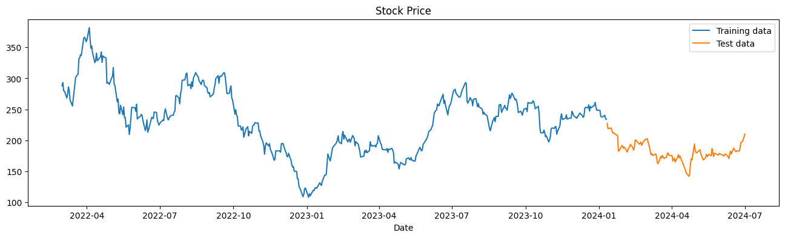
    


```python
tsla_lstm = StockModel(TSLA, LSTMHyperModel())
best_tsla_lstm = tsla_lstm.train_best_model()
best_tsla_lstm.summary()
```

    Trial 20 Complete [00h 00m 08s]
    val_loss: 0.003083544666878879
    
    Best val_loss So Far: 0.001616707246284932
    Total elapsed time: 00h 03m 06s


    /opt/conda/lib/python3.10/site-packages/keras/src/saving/saving_lib.py:415: UserWarning: Skipping variable loading for optimizer 'adam', because it has 2 variables whereas the saved optimizer has 12 variables. 
      saveable.load_own_variables(weights_store.get(inner_path))


<pre style="white-space:pre;overflow-x:auto;line-height:normal;font-family:Menlo,'DejaVu Sans Mono',consolas,'Courier New',monospace"><span style="font-weight: bold">Model: "sequential"</span>
</pre>


<pre style="white-space:pre;overflow-x:auto;line-height:normal;font-family:Menlo,'DejaVu Sans Mono',consolas,'Courier New',monospace">┏━━━━━━━━━━━━━━━━━━━━━━━━━━━━━━━━━┳━━━━━━━━━━━━━━━━━━━━━━━━┳━━━━━━━━━━━━━━━┓
┃<span style="font-weight: bold"> Layer (type)                    </span>┃<span style="font-weight: bold"> Output Shape           </span>┃<span style="font-weight: bold">       Param # </span>┃
┡━━━━━━━━━━━━━━━━━━━━━━━━━━━━━━━━━╇━━━━━━━━━━━━━━━━━━━━━━━━╇━━━━━━━━━━━━━━━┩
│ lstm (<span style="color: #0087ff; text-decoration-color: #0087ff">LSTM</span>)                     │ (<span style="color: #00d7ff; text-decoration-color: #00d7ff">None</span>, <span style="color: #00af00; text-decoration-color: #00af00">100</span>)            │        <span style="color: #00af00; text-decoration-color: #00af00">46,800</span> │
├─────────────────────────────────┼────────────────────────┼───────────────┤
│ dense (<span style="color: #0087ff; text-decoration-color: #0087ff">Dense</span>)                   │ (<span style="color: #00d7ff; text-decoration-color: #00d7ff">None</span>, <span style="color: #00af00; text-decoration-color: #00af00">1</span>)              │           <span style="color: #00af00; text-decoration-color: #00af00">101</span> │
└─────────────────────────────────┴────────────────────────┴───────────────┘
</pre>


<pre style="white-space:pre;overflow-x:auto;line-height:normal;font-family:Menlo,'DejaVu Sans Mono',consolas,'Courier New',monospace"><span style="font-weight: bold"> Total params: </span><span style="color: #00af00; text-decoration-color: #00af00">46,901</span> (183.21 KB)
</pre>


<pre style="white-space:pre;overflow-x:auto;line-height:normal;font-family:Menlo,'DejaVu Sans Mono',consolas,'Courier New',monospace"><span style="font-weight: bold"> Trainable params: </span><span style="color: #00af00; text-decoration-color: #00af00">46,901</span> (183.21 KB)
</pre>


<pre style="white-space:pre;overflow-x:auto;line-height:normal;font-family:Menlo,'DejaVu Sans Mono',consolas,'Courier New',monospace"><span style="font-weight: bold"> Non-trainable params: </span><span style="color: #00af00; text-decoration-color: #00af00">0</span> (0.00 B)
</pre>


```python
tsla_gru = StockModel(TSLA, GRUHyperModel())
best_tsla_gru = tsla_gru.train_best_model()
best_tsla_gru.summary()
```

    Trial 20 Complete [00h 00m 09s]
    val_loss: 0.003027195343747735
    
    Best val_loss So Far: 0.000963283731834963
    Total elapsed time: 00h 09m 40s


    /opt/conda/lib/python3.10/site-packages/keras/src/saving/saving_lib.py:415: UserWarning: Skipping variable loading for optimizer 'adam', because it has 2 variables whereas the saved optimizer has 24 variables. 
      saveable.load_own_variables(weights_store.get(inner_path))


<pre style="white-space:pre;overflow-x:auto;line-height:normal;font-family:Menlo,'DejaVu Sans Mono',consolas,'Courier New',monospace"><span style="font-weight: bold">Model: "sequential"</span>
</pre>


<pre style="white-space:pre;overflow-x:auto;line-height:normal;font-family:Menlo,'DejaVu Sans Mono',consolas,'Courier New',monospace">┏━━━━━━━━━━━━━━━━━━━━━━━━━━━━━━━━━┳━━━━━━━━━━━━━━━━━━━━━━━━┳━━━━━━━━━━━━━━━┓
┃<span style="font-weight: bold"> Layer (type)                    </span>┃<span style="font-weight: bold"> Output Shape           </span>┃<span style="font-weight: bold">       Param # </span>┃
┡━━━━━━━━━━━━━━━━━━━━━━━━━━━━━━━━━╇━━━━━━━━━━━━━━━━━━━━━━━━╇━━━━━━━━━━━━━━━┩
│ gru (<span style="color: #0087ff; text-decoration-color: #0087ff">GRU</span>)                       │ (<span style="color: #00d7ff; text-decoration-color: #00d7ff">None</span>, <span style="color: #00af00; text-decoration-color: #00af00">30</span>, <span style="color: #00af00; text-decoration-color: #00af00">100</span>)        │        <span style="color: #00af00; text-decoration-color: #00af00">35,400</span> │
├─────────────────────────────────┼────────────────────────┼───────────────┤
│ gru_1 (<span style="color: #0087ff; text-decoration-color: #0087ff">GRU</span>)                     │ (<span style="color: #00d7ff; text-decoration-color: #00d7ff">None</span>, <span style="color: #00af00; text-decoration-color: #00af00">30</span>, <span style="color: #00af00; text-decoration-color: #00af00">25</span>)         │         <span style="color: #00af00; text-decoration-color: #00af00">9,525</span> │
├─────────────────────────────────┼────────────────────────┼───────────────┤
│ gru_2 (<span style="color: #0087ff; text-decoration-color: #0087ff">GRU</span>)                     │ (<span style="color: #00d7ff; text-decoration-color: #00d7ff">None</span>, <span style="color: #00af00; text-decoration-color: #00af00">25</span>)             │         <span style="color: #00af00; text-decoration-color: #00af00">3,900</span> │
├─────────────────────────────────┼────────────────────────┼───────────────┤
│ dense (<span style="color: #0087ff; text-decoration-color: #0087ff">Dense</span>)                   │ (<span style="color: #00d7ff; text-decoration-color: #00d7ff">None</span>, <span style="color: #00af00; text-decoration-color: #00af00">1</span>)              │            <span style="color: #00af00; text-decoration-color: #00af00">26</span> │
└─────────────────────────────────┴────────────────────────┴───────────────┘
</pre>


<pre style="white-space:pre;overflow-x:auto;line-height:normal;font-family:Menlo,'DejaVu Sans Mono',consolas,'Courier New',monospace"><span style="font-weight: bold"> Total params: </span><span style="color: #00af00; text-decoration-color: #00af00">48,851</span> (190.82 KB)
</pre>


<pre style="white-space:pre;overflow-x:auto;line-height:normal;font-family:Menlo,'DejaVu Sans Mono',consolas,'Courier New',monospace"><span style="font-weight: bold"> Trainable params: </span><span style="color: #00af00; text-decoration-color: #00af00">48,851</span> (190.82 KB)
</pre>


<pre style="white-space:pre;overflow-x:auto;line-height:normal;font-family:Menlo,'DejaVu Sans Mono',consolas,'Courier New',monospace"><span style="font-weight: bold"> Non-trainable params: </span><span style="color: #00af00; text-decoration-color: #00af00">0</span> (0.00 B)
</pre>


```python
tsla_lstm.evaluate_model()
```

    3/3 ━━━━━━━━━━━━━━━━━━━━ 0s 46ms/step
    Root Mean Squared Error: 11.32 USD
    Model Accuracy: 94.59%


    
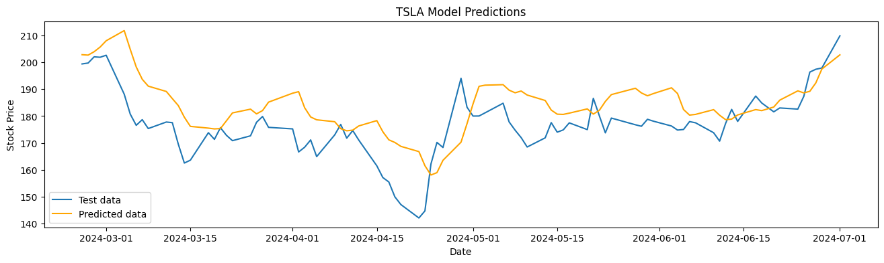
    


    
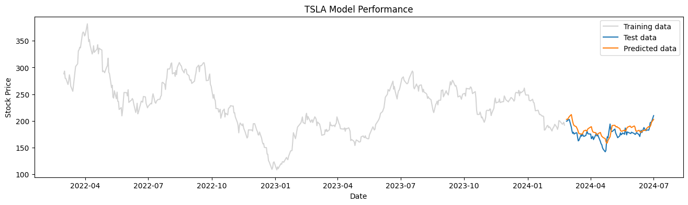
    


```python
tsla_gru.evaluate_model()
```

    3/3 ━━━━━━━━━━━━━━━━━━━━ 0s 95ms/step
    Root Mean Squared Error: 6.90 USD
    Model Accuracy: 97.02%


    
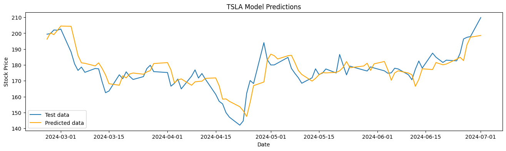
    


    
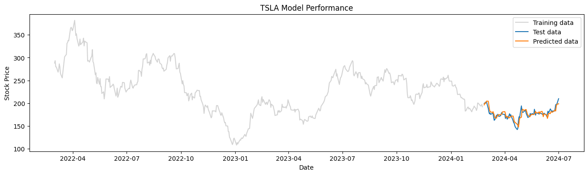
    


## AAPL


```python
AAPL.plot()
```


    
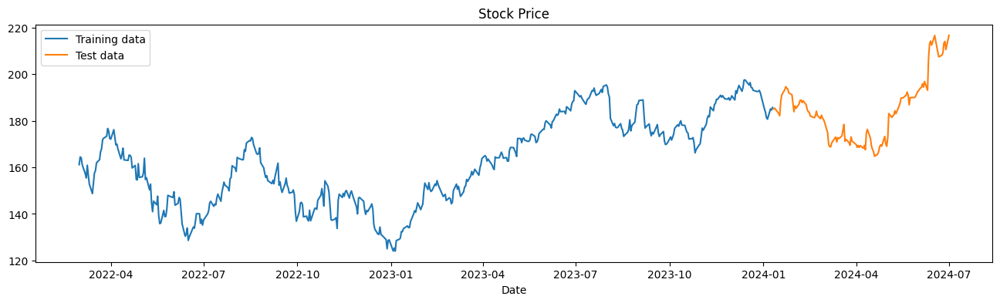
    


```python
aapl_lstm = StockModel(AAPL, LSTMHyperModel())
best_aapl_lstm = aapl_lstm.train_best_model()
best_aapl_lstm.summary()
```

    Trial 20 Complete [00h 00m 12s]
    val_loss: 0.003025678568519652
    
    Best val_loss So Far: 0.002397135889623314
    Total elapsed time: 00h 04m 04s


    /opt/conda/lib/python3.10/site-packages/keras/src/saving/saving_lib.py:415: UserWarning: Skipping variable loading for optimizer 'adam', because it has 2 variables whereas the saved optimizer has 12 variables. 
      saveable.load_own_variables(weights_store.get(inner_path))


<pre style="white-space:pre;overflow-x:auto;line-height:normal;font-family:Menlo,'DejaVu Sans Mono',consolas,'Courier New',monospace"><span style="font-weight: bold">Model: "sequential"</span>
</pre>


<pre style="white-space:pre;overflow-x:auto;line-height:normal;font-family:Menlo,'DejaVu Sans Mono',consolas,'Courier New',monospace">┏━━━━━━━━━━━━━━━━━━━━━━━━━━━━━━━━━┳━━━━━━━━━━━━━━━━━━━━━━━━┳━━━━━━━━━━━━━━━┓
┃<span style="font-weight: bold"> Layer (type)                    </span>┃<span style="font-weight: bold"> Output Shape           </span>┃<span style="font-weight: bold">       Param # </span>┃
┡━━━━━━━━━━━━━━━━━━━━━━━━━━━━━━━━━╇━━━━━━━━━━━━━━━━━━━━━━━━╇━━━━━━━━━━━━━━━┩
│ lstm (<span style="color: #0087ff; text-decoration-color: #0087ff">LSTM</span>)                     │ (<span style="color: #00d7ff; text-decoration-color: #00d7ff">None</span>, <span style="color: #00af00; text-decoration-color: #00af00">125</span>)            │        <span style="color: #00af00; text-decoration-color: #00af00">71,000</span> │
├─────────────────────────────────┼────────────────────────┼───────────────┤
│ dense (<span style="color: #0087ff; text-decoration-color: #0087ff">Dense</span>)                   │ (<span style="color: #00d7ff; text-decoration-color: #00d7ff">None</span>, <span style="color: #00af00; text-decoration-color: #00af00">1</span>)              │           <span style="color: #00af00; text-decoration-color: #00af00">126</span> │
└─────────────────────────────────┴────────────────────────┴───────────────┘
</pre>


<pre style="white-space:pre;overflow-x:auto;line-height:normal;font-family:Menlo,'DejaVu Sans Mono',consolas,'Courier New',monospace"><span style="font-weight: bold"> Total params: </span><span style="color: #00af00; text-decoration-color: #00af00">71,126</span> (277.84 KB)
</pre>


<pre style="white-space:pre;overflow-x:auto;line-height:normal;font-family:Menlo,'DejaVu Sans Mono',consolas,'Courier New',monospace"><span style="font-weight: bold"> Trainable params: </span><span style="color: #00af00; text-decoration-color: #00af00">71,126</span> (277.84 KB)
</pre>


<pre style="white-space:pre;overflow-x:auto;line-height:normal;font-family:Menlo,'DejaVu Sans Mono',consolas,'Courier New',monospace"><span style="font-weight: bold"> Non-trainable params: </span><span style="color: #00af00; text-decoration-color: #00af00">0</span> (0.00 B)
</pre>


```python
aapl_gru = StockModel(AAPL, GRUHyperModel())
best_aapl_gru = aapl_gru.train_best_model()
best_aapl_gru.summary()
```

    Trial 20 Complete [00h 00m 11s]
    val_loss: 0.0024274277966469526
    
    Best val_loss So Far: 0.0011515357182361186
    Total elapsed time: 00h 04m 10s


    /opt/conda/lib/python3.10/site-packages/keras/src/saving/saving_lib.py:415: UserWarning: Skipping variable loading for optimizer 'adam', because it has 2 variables whereas the saved optimizer has 24 variables. 
      saveable.load_own_variables(weights_store.get(inner_path))


<pre style="white-space:pre;overflow-x:auto;line-height:normal;font-family:Menlo,'DejaVu Sans Mono',consolas,'Courier New',monospace"><span style="font-weight: bold">Model: "sequential"</span>
</pre>


<pre style="white-space:pre;overflow-x:auto;line-height:normal;font-family:Menlo,'DejaVu Sans Mono',consolas,'Courier New',monospace">┏━━━━━━━━━━━━━━━━━━━━━━━━━━━━━━━━━┳━━━━━━━━━━━━━━━━━━━━━━━━┳━━━━━━━━━━━━━━━┓
┃<span style="font-weight: bold"> Layer (type)                    </span>┃<span style="font-weight: bold"> Output Shape           </span>┃<span style="font-weight: bold">       Param # </span>┃
┡━━━━━━━━━━━━━━━━━━━━━━━━━━━━━━━━━╇━━━━━━━━━━━━━━━━━━━━━━━━╇━━━━━━━━━━━━━━━┩
│ gru (<span style="color: #0087ff; text-decoration-color: #0087ff">GRU</span>)                       │ (<span style="color: #00d7ff; text-decoration-color: #00d7ff">None</span>, <span style="color: #00af00; text-decoration-color: #00af00">30</span>, <span style="color: #00af00; text-decoration-color: #00af00">150</span>)        │        <span style="color: #00af00; text-decoration-color: #00af00">75,600</span> │
├─────────────────────────────────┼────────────────────────┼───────────────┤
│ gru_1 (<span style="color: #0087ff; text-decoration-color: #0087ff">GRU</span>)                     │ (<span style="color: #00d7ff; text-decoration-color: #00d7ff">None</span>, <span style="color: #00af00; text-decoration-color: #00af00">30</span>, <span style="color: #00af00; text-decoration-color: #00af00">50</span>)         │        <span style="color: #00af00; text-decoration-color: #00af00">30,300</span> │
├─────────────────────────────────┼────────────────────────┼───────────────┤
│ gru_2 (<span style="color: #0087ff; text-decoration-color: #0087ff">GRU</span>)                     │ (<span style="color: #00d7ff; text-decoration-color: #00d7ff">None</span>, <span style="color: #00af00; text-decoration-color: #00af00">75</span>)             │        <span style="color: #00af00; text-decoration-color: #00af00">28,575</span> │
├─────────────────────────────────┼────────────────────────┼───────────────┤
│ dense (<span style="color: #0087ff; text-decoration-color: #0087ff">Dense</span>)                   │ (<span style="color: #00d7ff; text-decoration-color: #00d7ff">None</span>, <span style="color: #00af00; text-decoration-color: #00af00">1</span>)              │            <span style="color: #00af00; text-decoration-color: #00af00">76</span> │
└─────────────────────────────────┴────────────────────────┴───────────────┘
</pre>


<pre style="white-space:pre;overflow-x:auto;line-height:normal;font-family:Menlo,'DejaVu Sans Mono',consolas,'Courier New',monospace"><span style="font-weight: bold"> Total params: </span><span style="color: #00af00; text-decoration-color: #00af00">134,551</span> (525.59 KB)
</pre>


<pre style="white-space:pre;overflow-x:auto;line-height:normal;font-family:Menlo,'DejaVu Sans Mono',consolas,'Courier New',monospace"><span style="font-weight: bold"> Trainable params: </span><span style="color: #00af00; text-decoration-color: #00af00">134,551</span> (525.59 KB)
</pre>


<pre style="white-space:pre;overflow-x:auto;line-height:normal;font-family:Menlo,'DejaVu Sans Mono',consolas,'Courier New',monospace"><span style="font-weight: bold"> Non-trainable params: </span><span style="color: #00af00; text-decoration-color: #00af00">0</span> (0.00 B)
</pre>


```python
aapl_lstm.evaluate_model()
```

    3/3 ━━━━━━━━━━━━━━━━━━━━ 0s 46ms/step
    Root Mean Squared Error: 5.71 USD
    Model Accuracy: 97.59%


    
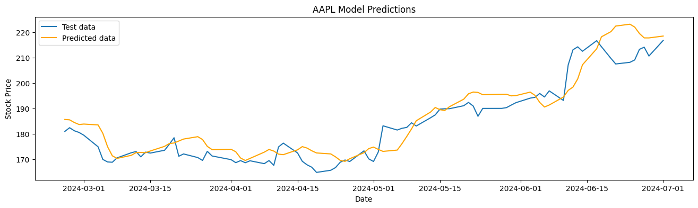
    


    
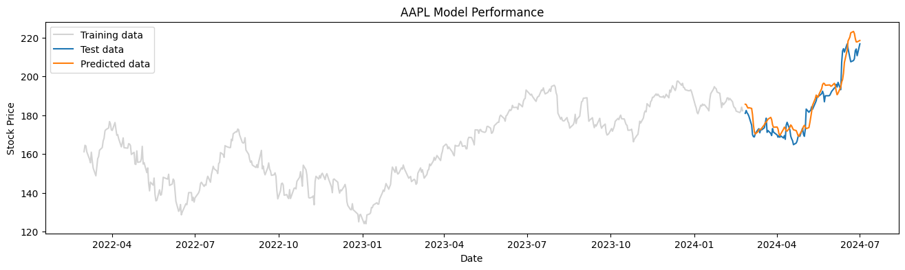
    


```python
aapl_gru.evaluate_model()
```

    3/3 ━━━━━━━━━━━━━━━━━━━━ 0s 96ms/step
    Root Mean Squared Error: 3.84 USD
    Model Accuracy: 98.40%


    
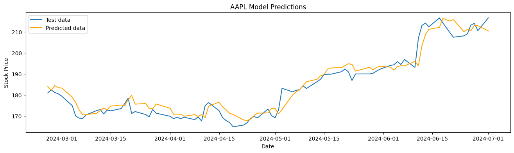
    


    
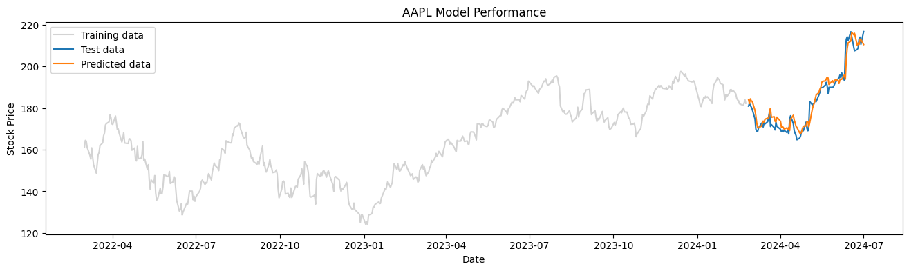
    


## GOOG


```python
GOOG.plot()
```


    
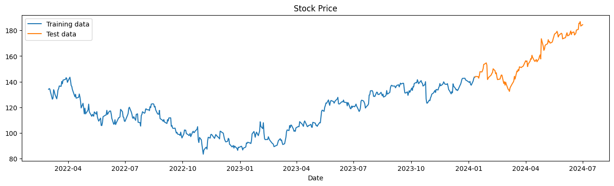
    


```python
goog_lstm = StockModel(GOOG, LSTMHyperModel())
best_goog_lstm = goog_lstm.train_best_model()
best_goog_lstm.summary()
```

    Trial 20 Complete [00h 00m 16s]
    val_loss: 0.004707953718025237
    
    Best val_loss So Far: 0.0013135995832271874
    Total elapsed time: 00h 05m 12s


    /opt/conda/lib/python3.10/site-packages/keras/src/saving/saving_lib.py:415: UserWarning: Skipping variable loading for optimizer 'adam', because it has 2 variables whereas the saved optimizer has 12 variables. 
      saveable.load_own_variables(weights_store.get(inner_path))


<pre style="white-space:pre;overflow-x:auto;line-height:normal;font-family:Menlo,'DejaVu Sans Mono',consolas,'Courier New',monospace"><span style="font-weight: bold">Model: "sequential"</span>
</pre>


<pre style="white-space:pre;overflow-x:auto;line-height:normal;font-family:Menlo,'DejaVu Sans Mono',consolas,'Courier New',monospace">┏━━━━━━━━━━━━━━━━━━━━━━━━━━━━━━━━━┳━━━━━━━━━━━━━━━━━━━━━━━━┳━━━━━━━━━━━━━━━┓
┃<span style="font-weight: bold"> Layer (type)                    </span>┃<span style="font-weight: bold"> Output Shape           </span>┃<span style="font-weight: bold">       Param # </span>┃
┡━━━━━━━━━━━━━━━━━━━━━━━━━━━━━━━━━╇━━━━━━━━━━━━━━━━━━━━━━━━╇━━━━━━━━━━━━━━━┩
│ lstm (<span style="color: #0087ff; text-decoration-color: #0087ff">LSTM</span>)                     │ (<span style="color: #00d7ff; text-decoration-color: #00d7ff">None</span>, <span style="color: #00af00; text-decoration-color: #00af00">150</span>)            │       <span style="color: #00af00; text-decoration-color: #00af00">100,200</span> │
├─────────────────────────────────┼────────────────────────┼───────────────┤
│ dense (<span style="color: #0087ff; text-decoration-color: #0087ff">Dense</span>)                   │ (<span style="color: #00d7ff; text-decoration-color: #00d7ff">None</span>, <span style="color: #00af00; text-decoration-color: #00af00">1</span>)              │           <span style="color: #00af00; text-decoration-color: #00af00">151</span> │
└─────────────────────────────────┴────────────────────────┴───────────────┘
</pre>


<pre style="white-space:pre;overflow-x:auto;line-height:normal;font-family:Menlo,'DejaVu Sans Mono',consolas,'Courier New',monospace"><span style="font-weight: bold"> Total params: </span><span style="color: #00af00; text-decoration-color: #00af00">100,351</span> (392.00 KB)
</pre>


<pre style="white-space:pre;overflow-x:auto;line-height:normal;font-family:Menlo,'DejaVu Sans Mono',consolas,'Courier New',monospace"><span style="font-weight: bold"> Trainable params: </span><span style="color: #00af00; text-decoration-color: #00af00">100,351</span> (392.00 KB)
</pre>


<pre style="white-space:pre;overflow-x:auto;line-height:normal;font-family:Menlo,'DejaVu Sans Mono',consolas,'Courier New',monospace"><span style="font-weight: bold"> Non-trainable params: </span><span style="color: #00af00; text-decoration-color: #00af00">0</span> (0.00 B)
</pre>


```python
goog_gru = StockModel(GOOG, GRUHyperModel())
best_goog_gru = goog_gru.train_best_model()
best_goog_gru.summary()
```

    Reloading Tuner from models/GOOG/GRU/tuner0.json


<pre style="white-space:pre;overflow-x:auto;line-height:normal;font-family:Menlo,'DejaVu Sans Mono',consolas,'Courier New',monospace"><span style="font-weight: bold">Model: "sequential"</span>
</pre>


<pre style="white-space:pre;overflow-x:auto;line-height:normal;font-family:Menlo,'DejaVu Sans Mono',consolas,'Courier New',monospace">┏━━━━━━━━━━━━━━━━━━━━━━━━━━━━━━━━━┳━━━━━━━━━━━━━━━━━━━━━━━━┳━━━━━━━━━━━━━━━┓
┃<span style="font-weight: bold"> Layer (type)                    </span>┃<span style="font-weight: bold"> Output Shape           </span>┃<span style="font-weight: bold">       Param # </span>┃
┡━━━━━━━━━━━━━━━━━━━━━━━━━━━━━━━━━╇━━━━━━━━━━━━━━━━━━━━━━━━╇━━━━━━━━━━━━━━━┩
│ gru (<span style="color: #0087ff; text-decoration-color: #0087ff">GRU</span>)                       │ (<span style="color: #00d7ff; text-decoration-color: #00d7ff">None</span>, <span style="color: #00af00; text-decoration-color: #00af00">25</span>)             │         <span style="color: #00af00; text-decoration-color: #00af00">3,225</span> │
├─────────────────────────────────┼────────────────────────┼───────────────┤
│ dense (<span style="color: #0087ff; text-decoration-color: #0087ff">Dense</span>)                   │ (<span style="color: #00d7ff; text-decoration-color: #00d7ff">None</span>, <span style="color: #00af00; text-decoration-color: #00af00">1</span>)              │            <span style="color: #00af00; text-decoration-color: #00af00">26</span> │
└─────────────────────────────────┴────────────────────────┴───────────────┘
</pre>


<pre style="white-space:pre;overflow-x:auto;line-height:normal;font-family:Menlo,'DejaVu Sans Mono',consolas,'Courier New',monospace"><span style="font-weight: bold"> Total params: </span><span style="color: #00af00; text-decoration-color: #00af00">3,251</span> (12.70 KB)
</pre>


<pre style="white-space:pre;overflow-x:auto;line-height:normal;font-family:Menlo,'DejaVu Sans Mono',consolas,'Courier New',monospace"><span style="font-weight: bold"> Trainable params: </span><span style="color: #00af00; text-decoration-color: #00af00">3,251</span> (12.70 KB)
</pre>


<pre style="white-space:pre;overflow-x:auto;line-height:normal;font-family:Menlo,'DejaVu Sans Mono',consolas,'Courier New',monospace"><span style="font-weight: bold"> Non-trainable params: </span><span style="color: #00af00; text-decoration-color: #00af00">0</span> (0.00 B)
</pre>


```python
goog_lstm.evaluate_model()
```

    3/3 ━━━━━━━━━━━━━━━━━━━━ 0s 46ms/step
    Root Mean Squared Error: 7.03 USD
    Model Accuracy: 96.15%


    
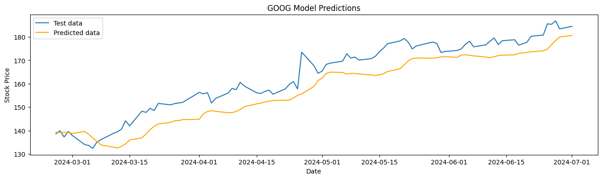
    


    
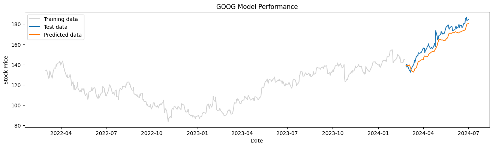
    


```python
goog_gru.evaluate_model()
```

    3/3 ━━━━━━━━━━━━━━━━━━━━ 0s 39ms/step
    Root Mean Squared Error: 3.35 USD
    Model Accuracy: 98.42%


    
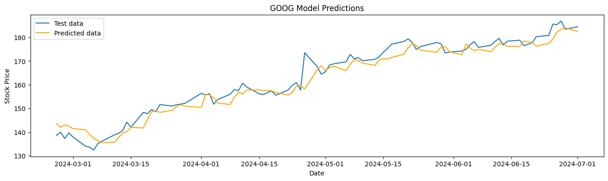
    


    
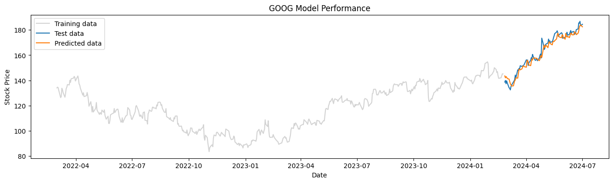
    


## Evaluation


```python
models = dict(
    tsla_lstm = tsla_lstm, 
    tsla_gru = tsla_gru,
    aapl_lstm = aapl_lstm,
    aapl_gru = aapl_gru,
    goog_lstm = goog_lstm, 
    goog_gru = goog_gru,
)

results = pd.DataFrame()

for k, v in models.items():
    stock, model = k.split('_')
    params = v.best_hyperparameters
    accuracy = v.accuracy
    rmse = v.rmse
    
    data = pd.DataFrame(params, index=[len(results)])
    data['Model'] = model.upper()
    data['Stock'] = stock.upper()
    data['Accuracy'] = accuracy
    data['RMSE'] = rmse
    
    results = pd.concat([results, data], ignore_index=True)
    
results['num_layers'] = results['num_lstm_layers'].fillna(results['num_gru_layers'])
results['units_0'] = results['lstm_units_0'].fillna(results['gru_units_0'])
results['units_1'] = results['lstm_units_1'].fillna(results['gru_units_1'])
results['units_2'] = results['lstm_units_2'].fillna(results['gru_units_2'])
results.drop(['num_lstm_layers', 'num_gru_layers', 'lstm_units_0', 'gru_units_0',
             'lstm_units_1', 'gru_units_1', 'lstm_units_2', 'gru_units_2'], axis=1, inplace=True)

results = results[['Stock', 'Model', 'Accuracy', 'RMSE', 'num_layers', 'units_0', 'units_1', 'units_2', 
                    'optimizer', 'learning_rate']]

display(results)
```


<div>
<style scoped>
    .dataframe tbody tr th:only-of-type {
        vertical-align: middle;
    }

    .dataframe tbody tr th {
        vertical-align: top;
    }

    .dataframe thead th {
        text-align: right;
    }
</style>
<table border="1" class="dataframe">
  <thead>
    <tr style="text-align: right;">
      <th></th>
      <th>Stock</th>
      <th>Model</th>
      <th>Accuracy</th>
      <th>RMSE</th>
      <th>num_layers</th>
      <th>units_0</th>
      <th>units_1</th>
      <th>units_2</th>
      <th>optimizer</th>
      <th>learning_rate</th>
    </tr>
  </thead>
  <tbody>
    <tr>
      <th>0</th>
      <td>TSLA</td>
      <td>LSTM</td>
      <td>94.59</td>
      <td>11.32</td>
      <td>1.00</td>
      <td>100.00</td>
      <td>100.00</td>
      <td>50.00</td>
      <td>adam</td>
      <td>0.01</td>
    </tr>
    <tr>
      <th>1</th>
      <td>TSLA</td>
      <td>GRU</td>
      <td>97.02</td>
      <td>6.90</td>
      <td>3.00</td>
      <td>100.00</td>
      <td>25.00</td>
      <td>25.00</td>
      <td>adam</td>
      <td>0.01</td>
    </tr>
    <tr>
      <th>2</th>
      <td>AAPL</td>
      <td>LSTM</td>
      <td>97.59</td>
      <td>5.71</td>
      <td>1.00</td>
      <td>125.00</td>
      <td>50.00</td>
      <td>75.00</td>
      <td>adam</td>
      <td>0.01</td>
    </tr>
    <tr>
      <th>3</th>
      <td>AAPL</td>
      <td>GRU</td>
      <td>98.40</td>
      <td>3.84</td>
      <td>3.00</td>
      <td>150.00</td>
      <td>50.00</td>
      <td>75.00</td>
      <td>adam</td>
      <td>0.01</td>
    </tr>
    <tr>
      <th>4</th>
      <td>GOOG</td>
      <td>LSTM</td>
      <td>96.15</td>
      <td>7.03</td>
      <td>1.00</td>
      <td>150.00</td>
      <td>100.00</td>
      <td>100.00</td>
      <td>adam</td>
      <td>0.00</td>
    </tr>
    <tr>
      <th>5</th>
      <td>GOOG</td>
      <td>GRU</td>
      <td>98.42</td>
      <td>3.35</td>
      <td>1.00</td>
      <td>25.00</td>
      <td>75.00</td>
      <td>125.00</td>
      <td>adam</td>
      <td>0.01</td>
    </tr>
  </tbody>
</table>
</div>


```python
results.to_csv('rnn-results.csv')
```


```python
# !zip -r file.zip /kaggle/working
```
