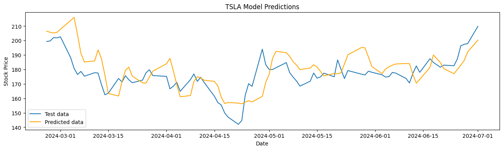
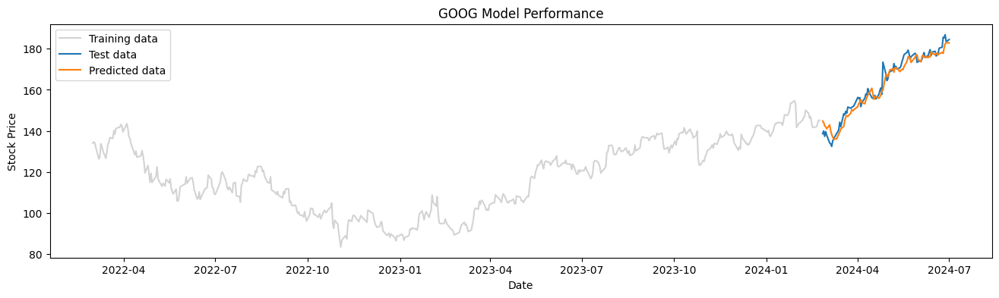

```python
import numpy as np
import pandas as pd
import matplotlib.pyplot as plt
from sklearn.model_selection import train_test_split, TimeSeriesSplit
from sklearn.metrics import mean_squared_error, mean_absolute_percentage_error
from sklearn.preprocessing import MinMaxScaler, StandardScaler
import tensorflow as tf
from tensorflow.keras import Sequential
from tensorflow.keras.callbacks import EarlyStopping
from tensorflow.keras.layers import Input, Conv1D, LSTM, GRU, Dense, Attention, Add, LayerNormalization, Dropout, GlobalAveragePooling1D
import keras_tuner as kt

figsize = (16,4)
plt.rcParams['figure.figsize'] = figsize
pd.set_option('display.float_format', lambda x: '%.2f' % x)


sentiments = pd.read_parquet('/kaggle/input/news-sentiment-aggs/news-sentiment-aggs.parquet')
stocks = pd.read_parquet('/kaggle/input/stock-sentiment-features/stock-history-features.parquet')
stocks_full = pd.read_parquet('/kaggle/input/stock-sentiment-features/stock-history-features-full.parquet')

display(sentiments.sample(5))
display(stocks.sample(5))
display(stocks_full.sample(5))
```


<div>
<style scoped>
    .dataframe tbody tr th:only-of-type {
        vertical-align: middle;
    }

    .dataframe tbody tr th {
        vertical-align: top;
    }

    .dataframe thead th {
        text-align: right;
    }
</style>
<table border="1" class="dataframe">
  <thead>
    <tr style="text-align: right;">
      <th></th>
      <th>stock</th>
      <th>date</th>
      <th>title_pos</th>
      <th>title_neg</th>
      <th>title_neu</th>
      <th>summary_pos</th>
      <th>summary_neg</th>
      <th>summary_neu</th>
    </tr>
  </thead>
  <tbody>
    <tr>
      <th>1519</th>
      <td>GOOG</td>
      <td>2023-12-26</td>
      <td>0.13</td>
      <td>0.04</td>
      <td>0.83</td>
      <td>0.19</td>
      <td>0.11</td>
      <td>0.70</td>
    </tr>
    <tr>
      <th>2260</th>
      <td>TSLA</td>
      <td>2023-09-04</td>
      <td>0.14</td>
      <td>0.06</td>
      <td>0.80</td>
      <td>0.14</td>
      <td>0.08</td>
      <td>0.77</td>
    </tr>
    <tr>
      <th>1323</th>
      <td>GOOG</td>
      <td>2023-06-13</td>
      <td>0.13</td>
      <td>0.14</td>
      <td>0.73</td>
      <td>0.15</td>
      <td>0.13</td>
      <td>0.72</td>
    </tr>
    <tr>
      <th>324</th>
      <td>AAPL</td>
      <td>2023-01-19</td>
      <td>0.15</td>
      <td>0.26</td>
      <td>0.60</td>
      <td>0.15</td>
      <td>0.25</td>
      <td>0.60</td>
    </tr>
    <tr>
      <th>2464</th>
      <td>TSLA</td>
      <td>2024-03-26</td>
      <td>0.17</td>
      <td>0.11</td>
      <td>0.72</td>
      <td>0.21</td>
      <td>0.16</td>
      <td>0.63</td>
    </tr>
  </tbody>
</table>
</div>


<div>
<style scoped>
    .dataframe tbody tr th:only-of-type {
        vertical-align: middle;
    }

    .dataframe tbody tr th {
        vertical-align: top;
    }

    .dataframe thead th {
        text-align: right;
    }
</style>
<table border="1" class="dataframe">
  <thead>
    <tr style="text-align: right;">
      <th></th>
      <th>date</th>
      <th>stock</th>
      <th>day_of_week</th>
      <th>day</th>
      <th>month</th>
      <th>year</th>
      <th>lag_1</th>
      <th>lag_2</th>
      <th>rolling_mean_7</th>
      <th>rolling_mean_14</th>
      <th>close</th>
    </tr>
  </thead>
  <tbody>
    <tr>
      <th>1442</th>
      <td>2023-03-24</td>
      <td>GOOG</td>
      <td>4</td>
      <td>24</td>
      <td>3</td>
      <td>2023</td>
      <td>106.14</td>
      <td>104.10</td>
      <td>103.86</td>
      <td>98.66</td>
      <td>105.94</td>
    </tr>
    <tr>
      <th>557</th>
      <td>2024-05-17</td>
      <td>TSLA</td>
      <td>4</td>
      <td>17</td>
      <td>5</td>
      <td>2024</td>
      <td>174.84</td>
      <td>173.99</td>
      <td>173.74</td>
      <td>177.00</td>
      <td>177.46</td>
    </tr>
    <tr>
      <th>718</th>
      <td>2022-09-07</td>
      <td>AAPL</td>
      <td>2</td>
      <td>7</td>
      <td>9</td>
      <td>2022</td>
      <td>153.01</td>
      <td>154.28</td>
      <td>155.85</td>
      <td>161.50</td>
      <td>154.43</td>
    </tr>
    <tr>
      <th>608</th>
      <td>2022-03-30</td>
      <td>AAPL</td>
      <td>2</td>
      <td>30</td>
      <td>3</td>
      <td>2022</td>
      <td>176.70</td>
      <td>173.38</td>
      <td>172.10</td>
      <td>164.34</td>
      <td>175.52</td>
    </tr>
    <tr>
      <th>1717</th>
      <td>2024-04-29</td>
      <td>GOOG</td>
      <td>0</td>
      <td>29</td>
      <td>4</td>
      <td>2024</td>
      <td>173.49</td>
      <td>157.77</td>
      <td>161.85</td>
      <td>159.71</td>
      <td>167.71</td>
    </tr>
  </tbody>
</table>
</div>


<div>
<style scoped>
    .dataframe tbody tr th:only-of-type {
        vertical-align: middle;
    }

    .dataframe tbody tr th {
        vertical-align: top;
    }

    .dataframe thead th {
        text-align: right;
    }
</style>
<table border="1" class="dataframe">
  <thead>
    <tr style="text-align: right;">
      <th></th>
      <th>date</th>
      <th>stock</th>
      <th>day_of_week</th>
      <th>day</th>
      <th>month</th>
      <th>year</th>
      <th>lag_1</th>
      <th>lag_2</th>
      <th>lag_3</th>
      <th>lag_4</th>
      <th>lag_5</th>
      <th>lag_6</th>
      <th>lag_7</th>
      <th>rolling_mean_7</th>
      <th>rolling_std_7</th>
      <th>rolling_mean_14</th>
      <th>close</th>
      <th>rolling_std_14</th>
    </tr>
  </thead>
  <tbody>
    <tr>
      <th>145</th>
      <td>2022-09-27</td>
      <td>TSLA</td>
      <td>1</td>
      <td>27</td>
      <td>9</td>
      <td>2022</td>
      <td>276.01</td>
      <td>275.33</td>
      <td>288.59</td>
      <td>300.80</td>
      <td>308.73</td>
      <td>309.07</td>
      <td>303.35</td>
      <td>291.64</td>
      <td>14.58</td>
      <td>295.48</td>
      <td>282.94</td>
      <td>11.46</td>
    </tr>
    <tr>
      <th>1575</th>
      <td>2023-10-04</td>
      <td>GOOG</td>
      <td>2</td>
      <td>4</td>
      <td>10</td>
      <td>2023</td>
      <td>133.15</td>
      <td>135.02</td>
      <td>131.70</td>
      <td>132.98</td>
      <td>131.31</td>
      <td>129.30</td>
      <td>132.02</td>
      <td>132.80</td>
      <td>2.30</td>
      <td>133.85</td>
      <td>136.12</td>
      <td>3.09</td>
    </tr>
    <tr>
      <th>1649</th>
      <td>2024-01-22</td>
      <td>GOOG</td>
      <td>0</td>
      <td>22</td>
      <td>1</td>
      <td>2024</td>
      <td>147.80</td>
      <td>144.83</td>
      <td>142.73</td>
      <td>143.92</td>
      <td>144.08</td>
      <td>143.51</td>
      <td>143.64</td>
      <td>144.91</td>
      <td>1.99</td>
      <td>142.54</td>
      <td>147.54</td>
      <td>3.21</td>
    </tr>
    <tr>
      <th>316</th>
      <td>2023-06-02</td>
      <td>TSLA</td>
      <td>4</td>
      <td>2</td>
      <td>6</td>
      <td>2023</td>
      <td>207.52</td>
      <td>203.93</td>
      <td>201.16</td>
      <td>193.17</td>
      <td>184.47</td>
      <td>182.90</td>
      <td>185.77</td>
      <td>198.16</td>
      <td>11.73</td>
      <td>187.54</td>
      <td>213.97</td>
      <td>14.85</td>
    </tr>
    <tr>
      <th>977</th>
      <td>2023-09-19</td>
      <td>AAPL</td>
      <td>1</td>
      <td>19</td>
      <td>9</td>
      <td>2023</td>
      <td>177.27</td>
      <td>174.32</td>
      <td>175.05</td>
      <td>173.52</td>
      <td>175.61</td>
      <td>178.65</td>
      <td>177.48</td>
      <td>176.11</td>
      <td>2.01</td>
      <td>180.07</td>
      <td>178.36</td>
      <td>5.59</td>
    </tr>
  </tbody>
</table>
</div>


```python
stocks_full.insert(17, 'close', stocks_full.pop('close'))
```

## Filter and Concatenate Datasets


```python
print(
f"""Range of dates:
    Stocks: {stocks.date.min()} - {stocks.date.max()}
    Sentiments: {sentiments.date.min()} - {sentiments.date.max()}"""
)

stock_dates = set(stocks.date)
sent_dates = set(sentiments.date)

print(
f"""Number of dates:
    Stocks: {len(stock_dates)}
    Sentiments: {len(sent_dates)}"""
)

diff = pd.to_datetime(list(sent_dates.difference(stock_dates)))
diff.day_of_week.value_counts()
```

    Range of dates:
        Stocks: 2022-03-01 - 2024-07-01
        Sentiments: 2022-03-01 - 2024-07-01
    Number of dates:
        Stocks: 587
        Sentiments: 854


    6    122
    5    122
    0     16
    4      3
    3      2
    1      1
    2      1
    Name: count, dtype: int64


```python
# df = sentiments.merge(stocks, how='inner', on=['date', 'stock'])
df = sentiments.merge(stocks_full, how='inner', on=['date', 'stock'])
df = df.set_index('date')
df.sample(5)
```


<div>
<style scoped>
    .dataframe tbody tr th:only-of-type {
        vertical-align: middle;
    }

    .dataframe tbody tr th {
        vertical-align: top;
    }

    .dataframe thead th {
        text-align: right;
    }
</style>
<table border="1" class="dataframe">
  <thead>
    <tr style="text-align: right;">
      <th></th>
      <th>stock</th>
      <th>title_pos</th>
      <th>title_neg</th>
      <th>title_neu</th>
      <th>summary_pos</th>
      <th>summary_neg</th>
      <th>summary_neu</th>
      <th>day_of_week</th>
      <th>day</th>
      <th>month</th>
      <th>...</th>
      <th>lag_3</th>
      <th>lag_4</th>
      <th>lag_5</th>
      <th>lag_6</th>
      <th>lag_7</th>
      <th>rolling_mean_7</th>
      <th>rolling_std_7</th>
      <th>rolling_mean_14</th>
      <th>rolling_std_14</th>
      <th>close</th>
    </tr>
    <tr>
      <th>date</th>
      <th></th>
      <th></th>
      <th></th>
      <th></th>
      <th></th>
      <th></th>
      <th></th>
      <th></th>
      <th></th>
      <th></th>
      <th></th>
      <th></th>
      <th></th>
      <th></th>
      <th></th>
      <th></th>
      <th></th>
      <th></th>
      <th></th>
      <th></th>
      <th></th>
    </tr>
  </thead>
  <tbody>
    <tr>
      <th>2023-01-13</th>
      <td>AAPL</td>
      <td>0.15</td>
      <td>0.30</td>
      <td>0.55</td>
      <td>0.14</td>
      <td>0.28</td>
      <td>0.57</td>
      <td>4</td>
      <td>13</td>
      <td>1</td>
      <td>...</td>
      <td>129.66</td>
      <td>129.09</td>
      <td>128.56</td>
      <td>124.00</td>
      <td>125.33</td>
      <td>129.96</td>
      <td>3.25</td>
      <td>128.66</td>
      <td>3.11</td>
      <td>133.66</td>
    </tr>
    <tr>
      <th>2022-09-23</th>
      <td>TSLA</td>
      <td>0.11</td>
      <td>0.26</td>
      <td>0.64</td>
      <td>0.19</td>
      <td>0.22</td>
      <td>0.60</td>
      <td>4</td>
      <td>23</td>
      <td>9</td>
      <td>...</td>
      <td>308.73</td>
      <td>309.07</td>
      <td>303.35</td>
      <td>303.75</td>
      <td>302.61</td>
      <td>298.52</td>
      <td>12.30</td>
      <td>295.42</td>
      <td>11.61</td>
      <td>275.33</td>
    </tr>
    <tr>
      <th>2023-01-27</th>
      <td>GOOG</td>
      <td>0.12</td>
      <td>0.13</td>
      <td>0.75</td>
      <td>0.14</td>
      <td>0.16</td>
      <td>0.70</td>
      <td>4</td>
      <td>27</td>
      <td>1</td>
      <td>...</td>
      <td>99.10</td>
      <td>101.09</td>
      <td>99.17</td>
      <td>93.80</td>
      <td>91.68</td>
      <td>98.49</td>
      <td>2.51</td>
      <td>94.83</td>
      <td>4.30</td>
      <td>100.60</td>
    </tr>
    <tr>
      <th>2022-03-11</th>
      <td>TSLA</td>
      <td>0.15</td>
      <td>0.22</td>
      <td>0.63</td>
      <td>0.18</td>
      <td>0.14</td>
      <td>0.68</td>
      <td>4</td>
      <td>11</td>
      <td>3</td>
      <td>...</td>
      <td>274.80</td>
      <td>268.19</td>
      <td>279.43</td>
      <td>279.76</td>
      <td>293.30</td>
      <td>276.15</td>
      <td>7.36</td>
      <td>276.43</td>
      <td>10.91</td>
      <td>265.12</td>
    </tr>
    <tr>
      <th>2024-06-04</th>
      <td>AAPL</td>
      <td>0.14</td>
      <td>0.13</td>
      <td>0.73</td>
      <td>0.15</td>
      <td>0.21</td>
      <td>0.64</td>
      <td>1</td>
      <td>4</td>
      <td>6</td>
      <td>...</td>
      <td>191.29</td>
      <td>190.29</td>
      <td>189.99</td>
      <td>189.98</td>
      <td>186.88</td>
      <td>191.74</td>
      <td>1.86</td>
      <td>190.91</td>
      <td>1.91</td>
      <td>194.35</td>
    </tr>
  </tbody>
</table>
<p>5 rows × 23 columns</p>
</div>


## Data Preparation


```python
class StockData:
    def __init__(self, stock, data, look_back=30, test_size=0.2):
        self.stock = stock
        self.data = data.query(f"stock == '{stock}'").copy()
        self.index = self.data.index
        self.data.drop("stock", axis=1, inplace=True)
        self.look_back = look_back
        self.test_size = test_size
        self.x_scaler = MinMaxScaler()
        self.y_scaler = MinMaxScaler()
        
        self.X = self.data.values
        self.y = self.data['close'].values.reshape(-1, 1)
        
        self.X_scaled = self.x_scaler.fit_transform(self.X)
        self.y_scaled = self.y_scaler.fit_transform(self.y)
        
        self.X_train, self.X_test, self.y_train, self.y_test = self.split_sequence()

    def create_sequences(self, data):
        input_data = []
        target_data = []
        for i in range(len(data[0]) - self.look_back):
            input_seq = data[0][i:i+self.look_back]
            input_data.append(input_seq)

            target_value = data[1][i+self.look_back]
            target_data.append(target_value)
        return np.array(input_data), np.array(target_data)
        
    def split_sequence(self):
        X_train, X_test, y_train, y_test = train_test_split(self.X_scaled, self.y_scaled, 
                                                            test_size=self.test_size, 
                                                            shuffle=False)
        
        X_train, y_train = self.create_sequences([X_train, y_train])
        X_test, y_test = self.create_sequences([X_test, y_test])
        
        return X_train, X_test, y_train, y_test
    
    def inverse_transform(self, data, scaler='y'):
        scaler_dict = {
            'x': self.x_scaler,
            'y': self.y_scaler
        }
        data_inv = scaler_dict[scaler].inverse_transform(data)
        
        return data_inv
    
    def plot(self):
        data = self.data
        split = int(len(data) * (1 - self.test_size))

        plt.plot(data.iloc[:split, -1], label='Training data')
        plt.plot(data.iloc[split:, -1], label='Test data')
        plt.xlabel("Date")
        plt.title("Stock Price")
        plt.legend()
        plt.show()
        plt.show()
```


```python
TSLA = StockData("TSLA", df)
AAPL = StockData("AAPL", df)
GOOG = StockData("GOOG", df)
```

## Hypermodels


```python
class GRUHyperModel(kt.HyperModel):
    def __init__(self):
        self.model = "GRU"
    def build(self, hp):
        model = Sequential()
        
        # Hyperparameter settings
        num_gru_layers = hp.Int("num_gru_layers", 1, 3)
        gru_units = [hp.Int(f"gru_units_{i}", min_value=25, max_value=200, step=25) for i in range(num_gru_layers)]
        optimizer_choice = hp.Choice('optimizer', ['adam', 'rmsprop'])
        learning_rate = hp.Choice('learning_rate', values=[1e-2, 1e-3, 1e-4])
        
        # Input Layer
        model.add(Input(shape=(self.look_back, self.input_shape)))
        
        # Add GRU layers
        for i in range(num_gru_layers):
            model.add(
                GRU(
                    units=gru_units[i],
                    return_sequences=True if i < num_gru_layers - 1 else False
                )
            )
        
        # Add Output layer
        model.add(Dense(1))

        # Optimizer
        opt = {
            'adam': tf.keras.optimizers.Adam,
            'rmsprop': tf.keras.optimizers.RMSprop,
        }

        # Compile model
        model.compile(
            optimizer=opt[optimizer_choice](learning_rate=learning_rate),
            loss='mse'
        )
        
        return model
```


```python
class LSTMHyperModel(kt.HyperModel):
    def __init__(self):
        self.model = "LSTM"
        
    def build(self, hp):
        model = Sequential()
        
        # Hyperparameter settings
        num_lstm_layers = hp.Int("num_lstm_layers", 1, 3)
        lstm_units = [hp.Int(f"lstm_units_{i}", min_value=25, max_value=200, step=25) for i in range(num_lstm_layers)]
        optimizer_choice = hp.Choice('optimizer', ['adam', 'rmsprop'])
        learning_rate = hp.Choice('learning_rate', values=[1e-2, 1e-3, 1e-4])
        
        # Input Layer
        model.add(Input(shape=(self.look_back, self.input_shape)))
        
        # Add LSTM layers
        for i in range(num_lstm_layers):
            model.add(
                LSTM(
                    units=lstm_units[i],
                    return_sequences=True if i < num_lstm_layers - 1 else False
                )
            )
        
        # Add Output layer
        model.add(Dense(1))

        # Optimizer
        opt = {
            'adam': tf.keras.optimizers.Adam,
            'rmsprop': tf.keras.optimizers.RMSprop,
        }

        # Compile model
        model.compile(
            optimizer=opt[optimizer_choice](learning_rate=learning_rate),
            loss='mse'
        )
        
        return model
```


```python
class AttentionCNNLSTMHyperModel(kt.HyperModel):
    def __init__(self):
        self.model = "Attention-CNNLSTM"
        
    def build(self, hp):
        model = Sequential()
        
        # Hyperparameter settings
        kernel_size = hp.Int('kernel_size', min_value=3, max_value=5, step=1)
        cnn_filters = hp.Int('cnn_filters', min_value=32, max_value=256, step=32)
        lstm_units = hp.Int('lstm_units', min_value=50, max_value=200, step=50)
        dropout_rate = hp.Float('dropout_rate', min_value=0.1, max_value=0.5, step=0.1)
        learning_rate = hp.Choice('learning_rate', values=[1e-2, 1e-3, 1e-4])
        optimizer_choice = hp.Choice('optimizer', ['adam', 'rmsprop'])
        
        # Input Layer
        model.add(Input(shape=(self.look_back, self.input_shape)))
        
        # CNN Layers
        model.add(Conv1D(filters=cnn_filters, kernel_size=kernel_size, activation='relu', padding='same'))
        model.add(Conv1D(filters=cnn_filters * 2, kernel_size=kernel_size, activation='relu', padding='same'))
        model.add(Conv1D(filters=cnn_filters * 4, kernel_size=kernel_size, activation='relu', padding='same'))
        
        # Attention Mechanism
        query = Dense(cnn_filters * 4)(model.layers[-1].output)
        key = Dense(cnn_filters * 4)(model.layers[-1].output)
        value = Dense(cnn_filters * 4)(model.layers[-1].output)
        attention_output = Attention()([query, key, value])
        
        # Add and Normalize
        add_output = Add()([model.layers[-1].output, attention_output])
        norm_output = LayerNormalization()(add_output)
        
        # LSTM Decoder
        model.add(LSTM(lstm_units, return_sequences=False))
        model.add(Dropout(dropout_rate))
        
        # Output Layer
        model.add(Dense(1))
        
        # Optimizer
        opt = {
            'adam': tf.keras.optimizers.Adam,
            'rmsprop': tf.keras.optimizers.RMSprop,
        }

        # Compile model
        model.compile(
            optimizer=opt[optimizer_choice](learning_rate=learning_rate),
            loss='mse'
        )
        
        return model
```

## Stock Model


```python
class StockModel:
    def __init__(self, stock_data, hypermodel=None, max_trials=20, epochs=20, directory='models'):
        self.stock_data = stock_data
        self.directory = directory
        self.max_trials = max_trials
        self.epochs = epochs

        self.X_train = self.stock_data.X_train
        self.X_test = self.stock_data.X_test
        self.y_train = self.stock_data.y_train
        self.y_test = self.stock_data.y_test
        self.input_shape = self.X_train.shape[2]
        
        self.hypermodel = hypermodel if hypermodel else GRUHyperModel()
        self.hypermodel.look_back = self.stock_data.look_back
        self.hypermodel.input_shape = self.input_shape

        self.best_model = None
        self.best_hyperparameters = None
        
        self.rmse = None
        self.accuracy = None

    def train_best_model(self, monitor='val_loss', patience=5, min_delta=0):
        tuner = kt.RandomSearch(
            self.hypermodel,
            objective='val_loss',
            max_trials=self.max_trials,
            executions_per_trial=2,
            directory=f'{self.directory}',
            project_name=f'{self.stock_data.stock}/{self.hypermodel.model}'
        )

        stop_early = EarlyStopping(monitor=monitor, min_delta=min_delta, patience=patience)

        tuner.search(self.X_train, self.y_train, epochs=self.epochs, validation_split=0.2, callbacks=[stop_early])
        
        self.best_model = tuner.get_best_models(num_models=1)[0]
        self.best_hyperparameters = tuner.get_best_hyperparameters(num_trials=1)[0].values
        
        return self.best_model

    def evaluate_model(self):
        y_true = self.y_test
        y_pred = self.best_model.predict(self.X_test)
        pred = self.stock_data.inverse_transform(y_pred, scaler='y')
        true = self.stock_data.inverse_transform(y_true, scaler='y')

        self.rmse = np.sqrt(mean_squared_error(true, pred))
        print(f"Root Mean Squared Error: {self.rmse:.2f} USD")
        
        self.accuracy = (1 - np.mean(np.abs((true - pred) / true))) * 100
        print(f"Model Accuracy: {self.accuracy:.2f}%")

        data = self.stock_data.data
        split = -pred.size

        plt.plot(data.index[split:], true, label='Test data')
        plt.plot(data.index[split:], pred, label='Predicted data', color='orange')
        plt.xlabel("Date")
        plt.ylabel("Stock Price")
        plt.title(f"{self.stock_data.stock} Model Predictions")
        plt.legend()
        plt.show()
        
        plt.plot(data.index[:split], data.iloc[:split]['close'], label='Training data', color='lightgray')
        plt.plot(data.index[split:], true, label='Test data')
        plt.plot(data.index[split:], pred, label='Predicted data')
        plt.xlabel("Date")
        plt.ylabel("Stock Price")
        plt.title(f"{self.stock_data.stock} Model Performance")
        plt.legend()
        plt.show()
```


```python
# import shutil

# try:
#     shutil.rmtree('/kaggle/working/models')
# except:
#     pass
```

## TSLA


```python
TSLA.plot()
```


    

    


```python
tsla_lstm = StockModel(TSLA, LSTMHyperModel())
best_tsla_lstm = tsla_lstm.train_best_model()
best_tsla_lstm.summary()
```

    Trial 20 Complete [00h 00m 11s]
    val_loss: 0.003267867607064545
    
    Best val_loss So Far: 0.002324711182154715
    Total elapsed time: 00h 03m 34s


    /opt/conda/lib/python3.10/site-packages/keras/src/saving/saving_lib.py:576: UserWarning: Skipping variable loading for optimizer 'adam', because it has 2 variables whereas the saved optimizer has 18 variables. 
      saveable.load_own_variables(weights_store.get(inner_path))


<pre style="white-space:pre;overflow-x:auto;line-height:normal;font-family:Menlo,'DejaVu Sans Mono',consolas,'Courier New',monospace"><span style="font-weight: bold">Model: "sequential"</span>
</pre>


<pre style="white-space:pre;overflow-x:auto;line-height:normal;font-family:Menlo,'DejaVu Sans Mono',consolas,'Courier New',monospace">┏━━━━━━━━━━━━━━━━━━━━━━━━━━━━━━━━━┳━━━━━━━━━━━━━━━━━━━━━━━━┳━━━━━━━━━━━━━━━┓
┃<span style="font-weight: bold"> Layer (type)                    </span>┃<span style="font-weight: bold"> Output Shape           </span>┃<span style="font-weight: bold">       Param # </span>┃
┡━━━━━━━━━━━━━━━━━━━━━━━━━━━━━━━━━╇━━━━━━━━━━━━━━━━━━━━━━━━╇━━━━━━━━━━━━━━━┩
│ lstm (<span style="color: #0087ff; text-decoration-color: #0087ff">LSTM</span>)                     │ (<span style="color: #00d7ff; text-decoration-color: #00d7ff">None</span>, <span style="color: #00af00; text-decoration-color: #00af00">30</span>, <span style="color: #00af00; text-decoration-color: #00af00">100</span>)        │        <span style="color: #00af00; text-decoration-color: #00af00">49,200</span> │
├─────────────────────────────────┼────────────────────────┼───────────────┤
│ lstm_1 (<span style="color: #0087ff; text-decoration-color: #0087ff">LSTM</span>)                   │ (<span style="color: #00d7ff; text-decoration-color: #00d7ff">None</span>, <span style="color: #00af00; text-decoration-color: #00af00">125</span>)            │       <span style="color: #00af00; text-decoration-color: #00af00">113,000</span> │
├─────────────────────────────────┼────────────────────────┼───────────────┤
│ dense (<span style="color: #0087ff; text-decoration-color: #0087ff">Dense</span>)                   │ (<span style="color: #00d7ff; text-decoration-color: #00d7ff">None</span>, <span style="color: #00af00; text-decoration-color: #00af00">1</span>)              │           <span style="color: #00af00; text-decoration-color: #00af00">126</span> │
└─────────────────────────────────┴────────────────────────┴───────────────┘
</pre>


<pre style="white-space:pre;overflow-x:auto;line-height:normal;font-family:Menlo,'DejaVu Sans Mono',consolas,'Courier New',monospace"><span style="font-weight: bold"> Total params: </span><span style="color: #00af00; text-decoration-color: #00af00">162,326</span> (634.09 KB)
</pre>


<pre style="white-space:pre;overflow-x:auto;line-height:normal;font-family:Menlo,'DejaVu Sans Mono',consolas,'Courier New',monospace"><span style="font-weight: bold"> Trainable params: </span><span style="color: #00af00; text-decoration-color: #00af00">162,326</span> (634.09 KB)
</pre>


<pre style="white-space:pre;overflow-x:auto;line-height:normal;font-family:Menlo,'DejaVu Sans Mono',consolas,'Courier New',monospace"><span style="font-weight: bold"> Non-trainable params: </span><span style="color: #00af00; text-decoration-color: #00af00">0</span> (0.00 B)
</pre>


```python
tsla_gru = StockModel(TSLA, GRUHyperModel())
best_tsla_gru = tsla_gru.train_best_model()
best_tsla_gru.summary()
```

    Trial 20 Complete [00h 00m 12s]
    val_loss: 0.005842530867084861
    
    Best val_loss So Far: 0.001470010494813323
    Total elapsed time: 00h 04m 15s


    /opt/conda/lib/python3.10/site-packages/keras/src/saving/saving_lib.py:576: UserWarning: Skipping variable loading for optimizer 'adam', because it has 2 variables whereas the saved optimizer has 12 variables. 
      saveable.load_own_variables(weights_store.get(inner_path))


<pre style="white-space:pre;overflow-x:auto;line-height:normal;font-family:Menlo,'DejaVu Sans Mono',consolas,'Courier New',monospace"><span style="font-weight: bold">Model: "sequential"</span>
</pre>


<pre style="white-space:pre;overflow-x:auto;line-height:normal;font-family:Menlo,'DejaVu Sans Mono',consolas,'Courier New',monospace">┏━━━━━━━━━━━━━━━━━━━━━━━━━━━━━━━━━┳━━━━━━━━━━━━━━━━━━━━━━━━┳━━━━━━━━━━━━━━━┓
┃<span style="font-weight: bold"> Layer (type)                    </span>┃<span style="font-weight: bold"> Output Shape           </span>┃<span style="font-weight: bold">       Param # </span>┃
┡━━━━━━━━━━━━━━━━━━━━━━━━━━━━━━━━━╇━━━━━━━━━━━━━━━━━━━━━━━━╇━━━━━━━━━━━━━━━┩
│ gru (<span style="color: #0087ff; text-decoration-color: #0087ff">GRU</span>)                       │ (<span style="color: #00d7ff; text-decoration-color: #00d7ff">None</span>, <span style="color: #00af00; text-decoration-color: #00af00">50</span>)             │        <span style="color: #00af00; text-decoration-color: #00af00">11,100</span> │
├─────────────────────────────────┼────────────────────────┼───────────────┤
│ dense (<span style="color: #0087ff; text-decoration-color: #0087ff">Dense</span>)                   │ (<span style="color: #00d7ff; text-decoration-color: #00d7ff">None</span>, <span style="color: #00af00; text-decoration-color: #00af00">1</span>)              │            <span style="color: #00af00; text-decoration-color: #00af00">51</span> │
└─────────────────────────────────┴────────────────────────┴───────────────┘
</pre>


<pre style="white-space:pre;overflow-x:auto;line-height:normal;font-family:Menlo,'DejaVu Sans Mono',consolas,'Courier New',monospace"><span style="font-weight: bold"> Total params: </span><span style="color: #00af00; text-decoration-color: #00af00">11,151</span> (43.56 KB)
</pre>


<pre style="white-space:pre;overflow-x:auto;line-height:normal;font-family:Menlo,'DejaVu Sans Mono',consolas,'Courier New',monospace"><span style="font-weight: bold"> Trainable params: </span><span style="color: #00af00; text-decoration-color: #00af00">11,151</span> (43.56 KB)
</pre>


<pre style="white-space:pre;overflow-x:auto;line-height:normal;font-family:Menlo,'DejaVu Sans Mono',consolas,'Courier New',monospace"><span style="font-weight: bold"> Non-trainable params: </span><span style="color: #00af00; text-decoration-color: #00af00">0</span> (0.00 B)
</pre>


```python
tsla_lstm.evaluate_model()
```

    3/3 ━━━━━━━━━━━━━━━━━━━━ 0s 103ms/step
    Root Mean Squared Error: 10.95 USD
    Model Accuracy: 95.01%


    

    


    

    


```python
tsla_gru.evaluate_model()
```

    3/3 ━━━━━━━━━━━━━━━━━━━━ 0s 55ms/step
    Root Mean Squared Error: 7.65 USD
    Model Accuracy: 96.74%


    

    


    

    


## AAPL


```python
AAPL.plot()
```


    

    


```python
aapl_lstm = StockModel(AAPL, LSTMHyperModel())
best_aapl_lstm = aapl_lstm.train_best_model()
best_aapl_lstm.summary()
```

    Trial 20 Complete [00h 00m 20s]
    val_loss: 0.0030691096326336265
    
    Best val_loss So Far: 0.0020747355883941054
    Total elapsed time: 00h 04m 47s


    /opt/conda/lib/python3.10/site-packages/keras/src/saving/saving_lib.py:576: UserWarning: Skipping variable loading for optimizer 'adam', because it has 2 variables whereas the saved optimizer has 12 variables. 
      saveable.load_own_variables(weights_store.get(inner_path))


<pre style="white-space:pre;overflow-x:auto;line-height:normal;font-family:Menlo,'DejaVu Sans Mono',consolas,'Courier New',monospace"><span style="font-weight: bold">Model: "sequential"</span>
</pre>


<pre style="white-space:pre;overflow-x:auto;line-height:normal;font-family:Menlo,'DejaVu Sans Mono',consolas,'Courier New',monospace">┏━━━━━━━━━━━━━━━━━━━━━━━━━━━━━━━━━┳━━━━━━━━━━━━━━━━━━━━━━━━┳━━━━━━━━━━━━━━━┓
┃<span style="font-weight: bold"> Layer (type)                    </span>┃<span style="font-weight: bold"> Output Shape           </span>┃<span style="font-weight: bold">       Param # </span>┃
┡━━━━━━━━━━━━━━━━━━━━━━━━━━━━━━━━━╇━━━━━━━━━━━━━━━━━━━━━━━━╇━━━━━━━━━━━━━━━┩
│ lstm (<span style="color: #0087ff; text-decoration-color: #0087ff">LSTM</span>)                     │ (<span style="color: #00d7ff; text-decoration-color: #00d7ff">None</span>, <span style="color: #00af00; text-decoration-color: #00af00">75</span>)             │        <span style="color: #00af00; text-decoration-color: #00af00">29,400</span> │
├─────────────────────────────────┼────────────────────────┼───────────────┤
│ dense (<span style="color: #0087ff; text-decoration-color: #0087ff">Dense</span>)                   │ (<span style="color: #00d7ff; text-decoration-color: #00d7ff">None</span>, <span style="color: #00af00; text-decoration-color: #00af00">1</span>)              │            <span style="color: #00af00; text-decoration-color: #00af00">76</span> │
└─────────────────────────────────┴────────────────────────┴───────────────┘
</pre>


<pre style="white-space:pre;overflow-x:auto;line-height:normal;font-family:Menlo,'DejaVu Sans Mono',consolas,'Courier New',monospace"><span style="font-weight: bold"> Total params: </span><span style="color: #00af00; text-decoration-color: #00af00">29,476</span> (115.14 KB)
</pre>


<pre style="white-space:pre;overflow-x:auto;line-height:normal;font-family:Menlo,'DejaVu Sans Mono',consolas,'Courier New',monospace"><span style="font-weight: bold"> Trainable params: </span><span style="color: #00af00; text-decoration-color: #00af00">29,476</span> (115.14 KB)
</pre>


<pre style="white-space:pre;overflow-x:auto;line-height:normal;font-family:Menlo,'DejaVu Sans Mono',consolas,'Courier New',monospace"><span style="font-weight: bold"> Non-trainable params: </span><span style="color: #00af00; text-decoration-color: #00af00">0</span> (0.00 B)
</pre>


```python
aapl_gru = StockModel(AAPL, GRUHyperModel())
best_aapl_gru = aapl_gru.train_best_model()
best_aapl_gru.summary()
```

    Trial 20 Complete [00h 00m 16s]
    val_loss: 0.0034978125477209687
    
    Best val_loss So Far: 0.0015379932592622936
    Total elapsed time: 00h 05m 03s


<pre style="white-space:pre;overflow-x:auto;line-height:normal;font-family:Menlo,'DejaVu Sans Mono',consolas,'Courier New',monospace"><span style="font-weight: bold">Model: "sequential"</span>
</pre>


<pre style="white-space:pre;overflow-x:auto;line-height:normal;font-family:Menlo,'DejaVu Sans Mono',consolas,'Courier New',monospace">┏━━━━━━━━━━━━━━━━━━━━━━━━━━━━━━━━━┳━━━━━━━━━━━━━━━━━━━━━━━━┳━━━━━━━━━━━━━━━┓
┃<span style="font-weight: bold"> Layer (type)                    </span>┃<span style="font-weight: bold"> Output Shape           </span>┃<span style="font-weight: bold">       Param # </span>┃
┡━━━━━━━━━━━━━━━━━━━━━━━━━━━━━━━━━╇━━━━━━━━━━━━━━━━━━━━━━━━╇━━━━━━━━━━━━━━━┩
│ gru (<span style="color: #0087ff; text-decoration-color: #0087ff">GRU</span>)                       │ (<span style="color: #00d7ff; text-decoration-color: #00d7ff">None</span>, <span style="color: #00af00; text-decoration-color: #00af00">125</span>)            │        <span style="color: #00af00; text-decoration-color: #00af00">55,875</span> │
├─────────────────────────────────┼────────────────────────┼───────────────┤
│ dense (<span style="color: #0087ff; text-decoration-color: #0087ff">Dense</span>)                   │ (<span style="color: #00d7ff; text-decoration-color: #00d7ff">None</span>, <span style="color: #00af00; text-decoration-color: #00af00">1</span>)              │           <span style="color: #00af00; text-decoration-color: #00af00">126</span> │
└─────────────────────────────────┴────────────────────────┴───────────────┘
</pre>


<pre style="white-space:pre;overflow-x:auto;line-height:normal;font-family:Menlo,'DejaVu Sans Mono',consolas,'Courier New',monospace"><span style="font-weight: bold"> Total params: </span><span style="color: #00af00; text-decoration-color: #00af00">56,001</span> (218.75 KB)
</pre>


<pre style="white-space:pre;overflow-x:auto;line-height:normal;font-family:Menlo,'DejaVu Sans Mono',consolas,'Courier New',monospace"><span style="font-weight: bold"> Trainable params: </span><span style="color: #00af00; text-decoration-color: #00af00">56,001</span> (218.75 KB)
</pre>


<pre style="white-space:pre;overflow-x:auto;line-height:normal;font-family:Menlo,'DejaVu Sans Mono',consolas,'Courier New',monospace"><span style="font-weight: bold"> Non-trainable params: </span><span style="color: #00af00; text-decoration-color: #00af00">0</span> (0.00 B)
</pre>


```python
aapl_lstm.evaluate_model()
```

    3/3 ━━━━━━━━━━━━━━━━━━━━ 0s 55ms/step
    Root Mean Squared Error: 6.10 USD
    Model Accuracy: 97.52%


    

    


    

    


```python
aapl_gru.evaluate_model()
```

    3/3 ━━━━━━━━━━━━━━━━━━━━ 0s 52ms/step
    Root Mean Squared Error: 4.85 USD
    Model Accuracy: 97.92%


    

    


    

    


## GOOG


```python
GOOG.plot()
```


    

    


```python
goog_lstm = StockModel(GOOG, LSTMHyperModel())
best_goog_lstm = goog_lstm.train_best_model()
best_goog_lstm.summary()
```

    Trial 20 Complete [00h 00m 15s]
    val_loss: 0.0014001522795297205
    
    Best val_loss So Far: 0.0014001522795297205
    Total elapsed time: 00h 05m 26s


    /opt/conda/lib/python3.10/site-packages/keras/src/saving/saving_lib.py:576: UserWarning: Skipping variable loading for optimizer 'adam', because it has 2 variables whereas the saved optimizer has 12 variables. 
      saveable.load_own_variables(weights_store.get(inner_path))


<pre style="white-space:pre;overflow-x:auto;line-height:normal;font-family:Menlo,'DejaVu Sans Mono',consolas,'Courier New',monospace"><span style="font-weight: bold">Model: "sequential"</span>
</pre>


<pre style="white-space:pre;overflow-x:auto;line-height:normal;font-family:Menlo,'DejaVu Sans Mono',consolas,'Courier New',monospace">┏━━━━━━━━━━━━━━━━━━━━━━━━━━━━━━━━━┳━━━━━━━━━━━━━━━━━━━━━━━━┳━━━━━━━━━━━━━━━┓
┃<span style="font-weight: bold"> Layer (type)                    </span>┃<span style="font-weight: bold"> Output Shape           </span>┃<span style="font-weight: bold">       Param # </span>┃
┡━━━━━━━━━━━━━━━━━━━━━━━━━━━━━━━━━╇━━━━━━━━━━━━━━━━━━━━━━━━╇━━━━━━━━━━━━━━━┩
│ lstm (<span style="color: #0087ff; text-decoration-color: #0087ff">LSTM</span>)                     │ (<span style="color: #00d7ff; text-decoration-color: #00d7ff">None</span>, <span style="color: #00af00; text-decoration-color: #00af00">25</span>)             │         <span style="color: #00af00; text-decoration-color: #00af00">4,800</span> │
├─────────────────────────────────┼────────────────────────┼───────────────┤
│ dense (<span style="color: #0087ff; text-decoration-color: #0087ff">Dense</span>)                   │ (<span style="color: #00d7ff; text-decoration-color: #00d7ff">None</span>, <span style="color: #00af00; text-decoration-color: #00af00">1</span>)              │            <span style="color: #00af00; text-decoration-color: #00af00">26</span> │
└─────────────────────────────────┴────────────────────────┴───────────────┘
</pre>


<pre style="white-space:pre;overflow-x:auto;line-height:normal;font-family:Menlo,'DejaVu Sans Mono',consolas,'Courier New',monospace"><span style="font-weight: bold"> Total params: </span><span style="color: #00af00; text-decoration-color: #00af00">4,826</span> (18.85 KB)
</pre>


<pre style="white-space:pre;overflow-x:auto;line-height:normal;font-family:Menlo,'DejaVu Sans Mono',consolas,'Courier New',monospace"><span style="font-weight: bold"> Trainable params: </span><span style="color: #00af00; text-decoration-color: #00af00">4,826</span> (18.85 KB)
</pre>


<pre style="white-space:pre;overflow-x:auto;line-height:normal;font-family:Menlo,'DejaVu Sans Mono',consolas,'Courier New',monospace"><span style="font-weight: bold"> Non-trainable params: </span><span style="color: #00af00; text-decoration-color: #00af00">0</span> (0.00 B)
</pre>


```python
goog_gru = StockModel(GOOG, GRUHyperModel())
best_goog_gru = goog_gru.train_best_model()
best_goog_gru.summary()
```

    Trial 20 Complete [00h 00m 14s]
    val_loss: 0.016997963190078735
    
    Best val_loss So Far: 0.0010869086836464703
    Total elapsed time: 00h 05m 25s


<pre style="white-space:pre;overflow-x:auto;line-height:normal;font-family:Menlo,'DejaVu Sans Mono',consolas,'Courier New',monospace"><span style="font-weight: bold">Model: "sequential"</span>
</pre>


<pre style="white-space:pre;overflow-x:auto;line-height:normal;font-family:Menlo,'DejaVu Sans Mono',consolas,'Courier New',monospace">┏━━━━━━━━━━━━━━━━━━━━━━━━━━━━━━━━━┳━━━━━━━━━━━━━━━━━━━━━━━━┳━━━━━━━━━━━━━━━┓
┃<span style="font-weight: bold"> Layer (type)                    </span>┃<span style="font-weight: bold"> Output Shape           </span>┃<span style="font-weight: bold">       Param # </span>┃
┡━━━━━━━━━━━━━━━━━━━━━━━━━━━━━━━━━╇━━━━━━━━━━━━━━━━━━━━━━━━╇━━━━━━━━━━━━━━━┩
│ gru (<span style="color: #0087ff; text-decoration-color: #0087ff">GRU</span>)                       │ (<span style="color: #00d7ff; text-decoration-color: #00d7ff">None</span>, <span style="color: #00af00; text-decoration-color: #00af00">150</span>)            │        <span style="color: #00af00; text-decoration-color: #00af00">78,300</span> │
├─────────────────────────────────┼────────────────────────┼───────────────┤
│ dense (<span style="color: #0087ff; text-decoration-color: #0087ff">Dense</span>)                   │ (<span style="color: #00d7ff; text-decoration-color: #00d7ff">None</span>, <span style="color: #00af00; text-decoration-color: #00af00">1</span>)              │           <span style="color: #00af00; text-decoration-color: #00af00">151</span> │
└─────────────────────────────────┴────────────────────────┴───────────────┘
</pre>


<pre style="white-space:pre;overflow-x:auto;line-height:normal;font-family:Menlo,'DejaVu Sans Mono',consolas,'Courier New',monospace"><span style="font-weight: bold"> Total params: </span><span style="color: #00af00; text-decoration-color: #00af00">78,451</span> (306.45 KB)
</pre>


<pre style="white-space:pre;overflow-x:auto;line-height:normal;font-family:Menlo,'DejaVu Sans Mono',consolas,'Courier New',monospace"><span style="font-weight: bold"> Trainable params: </span><span style="color: #00af00; text-decoration-color: #00af00">78,451</span> (306.45 KB)
</pre>


<pre style="white-space:pre;overflow-x:auto;line-height:normal;font-family:Menlo,'DejaVu Sans Mono',consolas,'Courier New',monospace"><span style="font-weight: bold"> Non-trainable params: </span><span style="color: #00af00; text-decoration-color: #00af00">0</span> (0.00 B)
</pre>


```python
goog_lstm.evaluate_model()
```

    3/3 ━━━━━━━━━━━━━━━━━━━━ 0s 54ms/step
    Root Mean Squared Error: 15.13 USD
    Model Accuracy: 92.16%


    

    


    

    


```python
goog_gru.evaluate_model()
```

    3/3 ━━━━━━━━━━━━━━━━━━━━ 0s 48ms/step
    Root Mean Squared Error: 3.42 USD
    Model Accuracy: 98.35%


    

    


    

    


## Attention-based CNN-LSTM


```python
tsla_acnnlstm = StockModel(TSLA, AttentionCNNLSTMHyperModel())
best_tsla_acnnlstm = tsla_acnnlstm.train_best_model()
best_tsla_acnnlstm.summary()
```

    Trial 20 Complete [00h 00m 19s]
    val_loss: 0.0042791294399648905
    
    Best val_loss So Far: 0.002627477399073541
    Total elapsed time: 00h 06m 18s


    /opt/conda/lib/python3.10/site-packages/keras/src/saving/saving_lib.py:576: UserWarning: Skipping variable loading for optimizer 'adam', because it has 2 variables whereas the saved optimizer has 24 variables. 
      saveable.load_own_variables(weights_store.get(inner_path))


<pre style="white-space:pre;overflow-x:auto;line-height:normal;font-family:Menlo,'DejaVu Sans Mono',consolas,'Courier New',monospace"><span style="font-weight: bold">Model: "sequential"</span>
</pre>


<pre style="white-space:pre;overflow-x:auto;line-height:normal;font-family:Menlo,'DejaVu Sans Mono',consolas,'Courier New',monospace">┏━━━━━━━━━━━━━━━━━━━━━━━━━━━━━━━━━┳━━━━━━━━━━━━━━━━━━━━━━━━┳━━━━━━━━━━━━━━━┓
┃<span style="font-weight: bold"> Layer (type)                    </span>┃<span style="font-weight: bold"> Output Shape           </span>┃<span style="font-weight: bold">       Param # </span>┃
┡━━━━━━━━━━━━━━━━━━━━━━━━━━━━━━━━━╇━━━━━━━━━━━━━━━━━━━━━━━━╇━━━━━━━━━━━━━━━┩
│ conv1d (<span style="color: #0087ff; text-decoration-color: #0087ff">Conv1D</span>)                 │ (<span style="color: #00d7ff; text-decoration-color: #00d7ff">None</span>, <span style="color: #00af00; text-decoration-color: #00af00">30</span>, <span style="color: #00af00; text-decoration-color: #00af00">32</span>)         │         <span style="color: #00af00; text-decoration-color: #00af00">3,552</span> │
├─────────────────────────────────┼────────────────────────┼───────────────┤
│ conv1d_1 (<span style="color: #0087ff; text-decoration-color: #0087ff">Conv1D</span>)               │ (<span style="color: #00d7ff; text-decoration-color: #00d7ff">None</span>, <span style="color: #00af00; text-decoration-color: #00af00">30</span>, <span style="color: #00af00; text-decoration-color: #00af00">64</span>)         │        <span style="color: #00af00; text-decoration-color: #00af00">10,304</span> │
├─────────────────────────────────┼────────────────────────┼───────────────┤
│ conv1d_2 (<span style="color: #0087ff; text-decoration-color: #0087ff">Conv1D</span>)               │ (<span style="color: #00d7ff; text-decoration-color: #00d7ff">None</span>, <span style="color: #00af00; text-decoration-color: #00af00">30</span>, <span style="color: #00af00; text-decoration-color: #00af00">128</span>)        │        <span style="color: #00af00; text-decoration-color: #00af00">41,088</span> │
├─────────────────────────────────┼────────────────────────┼───────────────┤
│ lstm (<span style="color: #0087ff; text-decoration-color: #0087ff">LSTM</span>)                     │ (<span style="color: #00d7ff; text-decoration-color: #00d7ff">None</span>, <span style="color: #00af00; text-decoration-color: #00af00">50</span>)             │        <span style="color: #00af00; text-decoration-color: #00af00">35,800</span> │
├─────────────────────────────────┼────────────────────────┼───────────────┤
│ dropout (<span style="color: #0087ff; text-decoration-color: #0087ff">Dropout</span>)               │ (<span style="color: #00d7ff; text-decoration-color: #00d7ff">None</span>, <span style="color: #00af00; text-decoration-color: #00af00">50</span>)             │             <span style="color: #00af00; text-decoration-color: #00af00">0</span> │
├─────────────────────────────────┼────────────────────────┼───────────────┤
│ dense_3 (<span style="color: #0087ff; text-decoration-color: #0087ff">Dense</span>)                 │ (<span style="color: #00d7ff; text-decoration-color: #00d7ff">None</span>, <span style="color: #00af00; text-decoration-color: #00af00">1</span>)              │            <span style="color: #00af00; text-decoration-color: #00af00">51</span> │
└─────────────────────────────────┴────────────────────────┴───────────────┘
</pre>


<pre style="white-space:pre;overflow-x:auto;line-height:normal;font-family:Menlo,'DejaVu Sans Mono',consolas,'Courier New',monospace"><span style="font-weight: bold"> Total params: </span><span style="color: #00af00; text-decoration-color: #00af00">90,795</span> (354.67 KB)
</pre>


<pre style="white-space:pre;overflow-x:auto;line-height:normal;font-family:Menlo,'DejaVu Sans Mono',consolas,'Courier New',monospace"><span style="font-weight: bold"> Trainable params: </span><span style="color: #00af00; text-decoration-color: #00af00">90,795</span> (354.67 KB)
</pre>


<pre style="white-space:pre;overflow-x:auto;line-height:normal;font-family:Menlo,'DejaVu Sans Mono',consolas,'Courier New',monospace"><span style="font-weight: bold"> Non-trainable params: </span><span style="color: #00af00; text-decoration-color: #00af00">0</span> (0.00 B)
</pre>


```python
aapl_acnnlstm = StockModel(AAPL, AttentionCNNLSTMHyperModel())
best_aapl_acnnlstm = aapl_acnnlstm.train_best_model()
best_aapl_acnnlstm.summary()
```

    Trial 20 Complete [00h 00m 20s]
    val_loss: 0.004537454340606928
    
    Best val_loss So Far: 0.002255849656648934
    Total elapsed time: 00h 07m 14s


<pre style="white-space:pre;overflow-x:auto;line-height:normal;font-family:Menlo,'DejaVu Sans Mono',consolas,'Courier New',monospace"><span style="font-weight: bold">Model: "sequential"</span>
</pre>


<pre style="white-space:pre;overflow-x:auto;line-height:normal;font-family:Menlo,'DejaVu Sans Mono',consolas,'Courier New',monospace">┏━━━━━━━━━━━━━━━━━━━━━━━━━━━━━━━━━┳━━━━━━━━━━━━━━━━━━━━━━━━┳━━━━━━━━━━━━━━━┓
┃<span style="font-weight: bold"> Layer (type)                    </span>┃<span style="font-weight: bold"> Output Shape           </span>┃<span style="font-weight: bold">       Param # </span>┃
┡━━━━━━━━━━━━━━━━━━━━━━━━━━━━━━━━━╇━━━━━━━━━━━━━━━━━━━━━━━━╇━━━━━━━━━━━━━━━┩
│ conv1d (<span style="color: #0087ff; text-decoration-color: #0087ff">Conv1D</span>)                 │ (<span style="color: #00d7ff; text-decoration-color: #00d7ff">None</span>, <span style="color: #00af00; text-decoration-color: #00af00">30</span>, <span style="color: #00af00; text-decoration-color: #00af00">256</span>)        │        <span style="color: #00af00; text-decoration-color: #00af00">17,152</span> │
├─────────────────────────────────┼────────────────────────┼───────────────┤
│ conv1d_1 (<span style="color: #0087ff; text-decoration-color: #0087ff">Conv1D</span>)               │ (<span style="color: #00d7ff; text-decoration-color: #00d7ff">None</span>, <span style="color: #00af00; text-decoration-color: #00af00">30</span>, <span style="color: #00af00; text-decoration-color: #00af00">512</span>)        │       <span style="color: #00af00; text-decoration-color: #00af00">393,728</span> │
├─────────────────────────────────┼────────────────────────┼───────────────┤
│ conv1d_2 (<span style="color: #0087ff; text-decoration-color: #0087ff">Conv1D</span>)               │ (<span style="color: #00d7ff; text-decoration-color: #00d7ff">None</span>, <span style="color: #00af00; text-decoration-color: #00af00">30</span>, <span style="color: #00af00; text-decoration-color: #00af00">1024</span>)       │     <span style="color: #00af00; text-decoration-color: #00af00">1,573,888</span> │
├─────────────────────────────────┼────────────────────────┼───────────────┤
│ lstm (<span style="color: #0087ff; text-decoration-color: #0087ff">LSTM</span>)                     │ (<span style="color: #00d7ff; text-decoration-color: #00d7ff">None</span>, <span style="color: #00af00; text-decoration-color: #00af00">150</span>)            │       <span style="color: #00af00; text-decoration-color: #00af00">705,000</span> │
├─────────────────────────────────┼────────────────────────┼───────────────┤
│ dropout (<span style="color: #0087ff; text-decoration-color: #0087ff">Dropout</span>)               │ (<span style="color: #00d7ff; text-decoration-color: #00d7ff">None</span>, <span style="color: #00af00; text-decoration-color: #00af00">150</span>)            │             <span style="color: #00af00; text-decoration-color: #00af00">0</span> │
├─────────────────────────────────┼────────────────────────┼───────────────┤
│ dense_3 (<span style="color: #0087ff; text-decoration-color: #0087ff">Dense</span>)                 │ (<span style="color: #00d7ff; text-decoration-color: #00d7ff">None</span>, <span style="color: #00af00; text-decoration-color: #00af00">1</span>)              │           <span style="color: #00af00; text-decoration-color: #00af00">151</span> │
└─────────────────────────────────┴────────────────────────┴───────────────┘
</pre>


<pre style="white-space:pre;overflow-x:auto;line-height:normal;font-family:Menlo,'DejaVu Sans Mono',consolas,'Courier New',monospace"><span style="font-weight: bold"> Total params: </span><span style="color: #00af00; text-decoration-color: #00af00">2,689,919</span> (10.26 MB)
</pre>


<pre style="white-space:pre;overflow-x:auto;line-height:normal;font-family:Menlo,'DejaVu Sans Mono',consolas,'Courier New',monospace"><span style="font-weight: bold"> Trainable params: </span><span style="color: #00af00; text-decoration-color: #00af00">2,689,919</span> (10.26 MB)
</pre>


<pre style="white-space:pre;overflow-x:auto;line-height:normal;font-family:Menlo,'DejaVu Sans Mono',consolas,'Courier New',monospace"><span style="font-weight: bold"> Non-trainable params: </span><span style="color: #00af00; text-decoration-color: #00af00">0</span> (0.00 B)
</pre>


```python
goog_acnnlstm = StockModel(GOOG, AttentionCNNLSTMHyperModel())
best_goog_acnnlstm = goog_acnnlstm.train_best_model()
best_goog_acnnlstm.summary()
```

    Trial 20 Complete [00h 00m 22s]
    val_loss: 0.0021816150983795524
    
    Best val_loss So Far: 0.001633917447179556
    Total elapsed time: 00h 07m 25s


<pre style="white-space:pre;overflow-x:auto;line-height:normal;font-family:Menlo,'DejaVu Sans Mono',consolas,'Courier New',monospace"><span style="font-weight: bold">Model: "sequential"</span>
</pre>


<pre style="white-space:pre;overflow-x:auto;line-height:normal;font-family:Menlo,'DejaVu Sans Mono',consolas,'Courier New',monospace">┏━━━━━━━━━━━━━━━━━━━━━━━━━━━━━━━━━┳━━━━━━━━━━━━━━━━━━━━━━━━┳━━━━━━━━━━━━━━━┓
┃<span style="font-weight: bold"> Layer (type)                    </span>┃<span style="font-weight: bold"> Output Shape           </span>┃<span style="font-weight: bold">       Param # </span>┃
┡━━━━━━━━━━━━━━━━━━━━━━━━━━━━━━━━━╇━━━━━━━━━━━━━━━━━━━━━━━━╇━━━━━━━━━━━━━━━┩
│ conv1d (<span style="color: #0087ff; text-decoration-color: #0087ff">Conv1D</span>)                 │ (<span style="color: #00d7ff; text-decoration-color: #00d7ff">None</span>, <span style="color: #00af00; text-decoration-color: #00af00">30</span>, <span style="color: #00af00; text-decoration-color: #00af00">96</span>)         │         <span style="color: #00af00; text-decoration-color: #00af00">6,432</span> │
├─────────────────────────────────┼────────────────────────┼───────────────┤
│ conv1d_1 (<span style="color: #0087ff; text-decoration-color: #0087ff">Conv1D</span>)               │ (<span style="color: #00d7ff; text-decoration-color: #00d7ff">None</span>, <span style="color: #00af00; text-decoration-color: #00af00">30</span>, <span style="color: #00af00; text-decoration-color: #00af00">192</span>)        │        <span style="color: #00af00; text-decoration-color: #00af00">55,488</span> │
├─────────────────────────────────┼────────────────────────┼───────────────┤
│ conv1d_2 (<span style="color: #0087ff; text-decoration-color: #0087ff">Conv1D</span>)               │ (<span style="color: #00d7ff; text-decoration-color: #00d7ff">None</span>, <span style="color: #00af00; text-decoration-color: #00af00">30</span>, <span style="color: #00af00; text-decoration-color: #00af00">384</span>)        │       <span style="color: #00af00; text-decoration-color: #00af00">221,568</span> │
├─────────────────────────────────┼────────────────────────┼───────────────┤
│ lstm (<span style="color: #0087ff; text-decoration-color: #0087ff">LSTM</span>)                     │ (<span style="color: #00d7ff; text-decoration-color: #00d7ff">None</span>, <span style="color: #00af00; text-decoration-color: #00af00">100</span>)            │       <span style="color: #00af00; text-decoration-color: #00af00">194,000</span> │
├─────────────────────────────────┼────────────────────────┼───────────────┤
│ dropout (<span style="color: #0087ff; text-decoration-color: #0087ff">Dropout</span>)               │ (<span style="color: #00d7ff; text-decoration-color: #00d7ff">None</span>, <span style="color: #00af00; text-decoration-color: #00af00">100</span>)            │             <span style="color: #00af00; text-decoration-color: #00af00">0</span> │
├─────────────────────────────────┼────────────────────────┼───────────────┤
│ dense_3 (<span style="color: #0087ff; text-decoration-color: #0087ff">Dense</span>)                 │ (<span style="color: #00d7ff; text-decoration-color: #00d7ff">None</span>, <span style="color: #00af00; text-decoration-color: #00af00">1</span>)              │           <span style="color: #00af00; text-decoration-color: #00af00">101</span> │
└─────────────────────────────────┴────────────────────────┴───────────────┘
</pre>


<pre style="white-space:pre;overflow-x:auto;line-height:normal;font-family:Menlo,'DejaVu Sans Mono',consolas,'Courier New',monospace"><span style="font-weight: bold"> Total params: </span><span style="color: #00af00; text-decoration-color: #00af00">477,589</span> (1.82 MB)
</pre>


<pre style="white-space:pre;overflow-x:auto;line-height:normal;font-family:Menlo,'DejaVu Sans Mono',consolas,'Courier New',monospace"><span style="font-weight: bold"> Trainable params: </span><span style="color: #00af00; text-decoration-color: #00af00">477,589</span> (1.82 MB)
</pre>


<pre style="white-space:pre;overflow-x:auto;line-height:normal;font-family:Menlo,'DejaVu Sans Mono',consolas,'Courier New',monospace"><span style="font-weight: bold"> Non-trainable params: </span><span style="color: #00af00; text-decoration-color: #00af00">0</span> (0.00 B)
</pre>


```python
tsla_acnnlstm.evaluate_model()
```

    3/3 ━━━━━━━━━━━━━━━━━━━━ 0s 81ms/step
    Root Mean Squared Error: 19.87 USD
    Model Accuracy: 89.59%


    

    


    

    


```python
aapl_acnnlstm.evaluate_model()
```

    3/3 ━━━━━━━━━━━━━━━━━━━━ 0s 84ms/step
    Root Mean Squared Error: 6.62 USD
    Model Accuracy: 97.37%


    

    


    

    


```python
goog_acnnlstm.evaluate_model()
```

    3/3 ━━━━━━━━━━━━━━━━━━━━ 0s 82ms/step
    Root Mean Squared Error: 10.18 USD
    Model Accuracy: 94.41%


    

    


    

    


## Evaluation


```python
models = dict(
    tsla_lstm = tsla_lstm, 
    tsla_gru = tsla_gru,
    aapl_lstm = aapl_lstm,
    aapl_gru = aapl_gru,
    goog_lstm = goog_lstm, 
    goog_gru = goog_gru,
    tsla_acnnlstm = tsla_acnnlstm,
    aapl_acnnlstm = aapl_acnnlstm,
    goog_acnnlstm = goog_acnnlstm,
)

results = pd.DataFrame()

for k, v in models.items():
    stock, model = k.split('_')
    params = v.best_hyperparameters
    accuracy = v.accuracy
    rmse = v.rmse
    
    data = pd.DataFrame(params, index=[len(results)])
    data['Model'] = model.upper()
    data['Stock'] = stock.upper()
    data['Accuracy'] = accuracy
    data['RMSE'] = rmse
    
    results = pd.concat([results, data], ignore_index=True)
    
results['num_layers'] = results['num_lstm_layers'].fillna(results['num_gru_layers'])
results['units_0'] = results['lstm_units_0'].fillna(results['gru_units_0'])
results['units_1'] = results['lstm_units_1'].fillna(results['gru_units_1'])
results['units_2'] = results['lstm_units_2'].fillna(results['gru_units_2'])
results.drop(['num_lstm_layers', 'num_gru_layers', 'lstm_units_0', 'gru_units_0',
             'lstm_units_1', 'gru_units_1', 'lstm_units_2', 'gru_units_2'], axis=1, inplace=True)

results = results[['Stock', 'Model', 'Accuracy', 'RMSE', 'num_layers', 'units_0', 'units_1', 'units_2', 
                    'optimizer', 'learning_rate', 'cnn_filters', 'kernel_size']]

display(results)
```


<div>
<style scoped>
    .dataframe tbody tr th:only-of-type {
        vertical-align: middle;
    }

    .dataframe tbody tr th {
        vertical-align: top;
    }

    .dataframe thead th {
        text-align: right;
    }
</style>
<table border="1" class="dataframe">
  <thead>
    <tr style="text-align: right;">
      <th></th>
      <th>Stock</th>
      <th>Model</th>
      <th>Accuracy</th>
      <th>RMSE</th>
      <th>num_layers</th>
      <th>units_0</th>
      <th>units_1</th>
      <th>units_2</th>
      <th>optimizer</th>
      <th>learning_rate</th>
      <th>cnn_filters</th>
      <th>kernel_size</th>
    </tr>
  </thead>
  <tbody>
    <tr>
      <th>0</th>
      <td>TSLA</td>
      <td>LSTM</td>
      <td>95.01</td>
      <td>10.95</td>
      <td>2.00</td>
      <td>100.00</td>
      <td>125.00</td>
      <td>75.00</td>
      <td>adam</td>
      <td>0.01</td>
      <td>NaN</td>
      <td>NaN</td>
    </tr>
    <tr>
      <th>1</th>
      <td>TSLA</td>
      <td>GRU</td>
      <td>96.74</td>
      <td>7.65</td>
      <td>1.00</td>
      <td>50.00</td>
      <td>75.00</td>
      <td>175.00</td>
      <td>adam</td>
      <td>0.01</td>
      <td>NaN</td>
      <td>NaN</td>
    </tr>
    <tr>
      <th>2</th>
      <td>AAPL</td>
      <td>LSTM</td>
      <td>97.52</td>
      <td>6.10</td>
      <td>1.00</td>
      <td>75.00</td>
      <td>NaN</td>
      <td>NaN</td>
      <td>adam</td>
      <td>0.01</td>
      <td>NaN</td>
      <td>NaN</td>
    </tr>
    <tr>
      <th>3</th>
      <td>AAPL</td>
      <td>GRU</td>
      <td>97.92</td>
      <td>4.85</td>
      <td>1.00</td>
      <td>125.00</td>
      <td>NaN</td>
      <td>NaN</td>
      <td>adam</td>
      <td>0.01</td>
      <td>NaN</td>
      <td>NaN</td>
    </tr>
    <tr>
      <th>4</th>
      <td>GOOG</td>
      <td>LSTM</td>
      <td>92.16</td>
      <td>15.13</td>
      <td>1.00</td>
      <td>25.00</td>
      <td>150.00</td>
      <td>50.00</td>
      <td>adam</td>
      <td>0.01</td>
      <td>NaN</td>
      <td>NaN</td>
    </tr>
    <tr>
      <th>5</th>
      <td>GOOG</td>
      <td>GRU</td>
      <td>98.35</td>
      <td>3.42</td>
      <td>1.00</td>
      <td>150.00</td>
      <td>100.00</td>
      <td>175.00</td>
      <td>adam</td>
      <td>0.00</td>
      <td>NaN</td>
      <td>NaN</td>
    </tr>
    <tr>
      <th>6</th>
      <td>TSLA</td>
      <td>ACNNLSTM</td>
      <td>89.59</td>
      <td>19.87</td>
      <td>NaN</td>
      <td>NaN</td>
      <td>NaN</td>
      <td>NaN</td>
      <td>adam</td>
      <td>0.00</td>
      <td>32.00</td>
      <td>5.00</td>
    </tr>
    <tr>
      <th>7</th>
      <td>AAPL</td>
      <td>ACNNLSTM</td>
      <td>97.37</td>
      <td>6.62</td>
      <td>NaN</td>
      <td>NaN</td>
      <td>NaN</td>
      <td>NaN</td>
      <td>adam</td>
      <td>0.00</td>
      <td>256.00</td>
      <td>3.00</td>
    </tr>
    <tr>
      <th>8</th>
      <td>GOOG</td>
      <td>ACNNLSTM</td>
      <td>94.41</td>
      <td>10.18</td>
      <td>NaN</td>
      <td>NaN</td>
      <td>NaN</td>
      <td>NaN</td>
      <td>adam</td>
      <td>0.00</td>
      <td>96.00</td>
      <td>3.00</td>
    </tr>
  </tbody>
</table>
</div>


```python
results.to_csv('finbert-rnn-results.csv')
```


```python
!zip -r file.zip /kaggle/working
```

    updating: kaggle/working/ (stored 0%)
    updating: kaggle/working/.virtual_documents/ (stored 0%)
    updating: kaggle/working/models/ (stored 0%)
    updating: kaggle/working/models/GOOG/ (stored 0%)
    updating: kaggle/working/models/GOOG/GRU/ (stored 0%)
    updating: kaggle/working/models/GOOG/GRU/trial_11/ (stored 0%)
    updating: kaggle/working/models/GOOG/GRU/trial_11/build_config.json (stored 0%)
    updating: kaggle/working/models/GOOG/GRU/trial_11/checkpoint.weights.h5 (deflated 11%)
    updating: kaggle/working/models/GOOG/GRU/trial_11/trial.json (deflated 70%)
    updating: kaggle/working/models/GOOG/GRU/trial_17/ (stored 0%)
    updating: kaggle/working/models/GOOG/GRU/trial_17/build_config.json (stored 0%)
    updating: kaggle/working/models/GOOG/GRU/trial_17/checkpoint.weights.h5 (deflated 11%)
    updating: kaggle/working/models/GOOG/GRU/trial_17/trial.json (deflated 70%)
    updating: kaggle/working/models/GOOG/GRU/tuner0.json (stored 0%)
    updating: kaggle/working/models/GOOG/GRU/trial_14/ (stored 0%)
    updating: kaggle/working/models/GOOG/GRU/trial_14/build_config.json (stored 0%)
    updating: kaggle/working/models/GOOG/GRU/trial_14/checkpoint.weights.h5 (deflated 29%)
    updating: kaggle/working/models/GOOG/GRU/trial_14/trial.json (deflated 70%)
    updating: kaggle/working/models/GOOG/GRU/trial_19/ (stored 0%)
    updating: kaggle/working/models/GOOG/GRU/trial_19/build_config.json (stored 0%)
    updating: kaggle/working/models/GOOG/GRU/trial_19/checkpoint.weights.h5 (deflated 9%)
    updating: kaggle/working/models/GOOG/GRU/trial_19/trial.json (deflated 70%)
    updating: kaggle/working/models/GOOG/GRU/trial_16/ (stored 0%)
    updating: kaggle/working/models/GOOG/GRU/trial_16/build_config.json (stored 0%)
    updating: kaggle/working/models/GOOG/GRU/trial_16/checkpoint.weights.h5 (deflated 7%)
    updating: kaggle/working/models/GOOG/GRU/trial_16/trial.json (deflated 70%)
    updating: kaggle/working/models/GOOG/GRU/trial_15/ (stored 0%)
    updating: kaggle/working/models/GOOG/GRU/trial_15/build_config.json (stored 0%)
    updating: kaggle/working/models/GOOG/GRU/trial_15/checkpoint.weights.h5 (deflated 9%)
    updating: kaggle/working/models/GOOG/GRU/trial_15/trial.json (deflated 70%)
    updating: kaggle/working/models/GOOG/GRU/trial_06/ (stored 0%)
    updating: kaggle/working/models/GOOG/GRU/trial_06/build_config.json (stored 0%)
    updating: kaggle/working/models/GOOG/GRU/trial_06/checkpoint.weights.h5 (deflated 19%)
    updating: kaggle/working/models/GOOG/GRU/trial_06/trial.json (deflated 70%)
    updating: kaggle/working/models/GOOG/GRU/trial_02/ (stored 0%)
    updating: kaggle/working/models/GOOG/GRU/trial_02/build_config.json (stored 0%)
    updating: kaggle/working/models/GOOG/GRU/trial_02/checkpoint.weights.h5 (deflated 8%)
    updating: kaggle/working/models/GOOG/GRU/trial_02/trial.json (deflated 70%)
    updating: kaggle/working/models/GOOG/GRU/trial_08/ (stored 0%)
    updating: kaggle/working/models/GOOG/GRU/trial_08/build_config.json (stored 0%)
    updating: kaggle/working/models/GOOG/GRU/trial_08/checkpoint.weights.h5 (deflated 8%)
    updating: kaggle/working/models/GOOG/GRU/trial_08/trial.json (deflated 70%)
    updating: kaggle/working/models/GOOG/GRU/trial_04/ (stored 0%)
    updating: kaggle/working/models/GOOG/GRU/trial_04/build_config.json (stored 0%)
    updating: kaggle/working/models/GOOG/GRU/trial_04/checkpoint.weights.h5 (deflated 7%)
    updating: kaggle/working/models/GOOG/GRU/trial_04/trial.json (deflated 70%)
    updating: kaggle/working/models/GOOG/GRU/trial_12/ (stored 0%)
    updating: kaggle/working/models/GOOG/GRU/trial_12/build_config.json (stored 0%)
    updating: kaggle/working/models/GOOG/GRU/trial_12/checkpoint.weights.h5 (deflated 9%)
    updating: kaggle/working/models/GOOG/GRU/trial_12/trial.json (deflated 70%)
    updating: kaggle/working/models/GOOG/GRU/trial_07/ (stored 0%)
    updating: kaggle/working/models/GOOG/GRU/trial_07/build_config.json (stored 0%)
    updating: kaggle/working/models/GOOG/GRU/trial_07/checkpoint.weights.h5 (deflated 8%)
    updating: kaggle/working/models/GOOG/GRU/trial_07/trial.json (deflated 70%)
    updating: kaggle/working/models/GOOG/GRU/trial_05/ (stored 0%)
    updating: kaggle/working/models/GOOG/GRU/trial_05/build_config.json (stored 0%)
    updating: kaggle/working/models/GOOG/GRU/trial_05/checkpoint.weights.h5 (deflated 11%)
    updating: kaggle/working/models/GOOG/GRU/trial_05/trial.json (deflated 70%)
    updating: kaggle/working/models/GOOG/GRU/trial_01/ (stored 0%)
    updating: kaggle/working/models/GOOG/GRU/trial_01/build_config.json (stored 0%)
    updating: kaggle/working/models/GOOG/GRU/trial_01/checkpoint.weights.h5 (deflated 10%)
    updating: kaggle/working/models/GOOG/GRU/trial_01/trial.json (deflated 70%)
    updating: kaggle/working/models/GOOG/GRU/trial_03/ (stored 0%)
    updating: kaggle/working/models/GOOG/GRU/trial_03/build_config.json (stored 0%)
    updating: kaggle/working/models/GOOG/GRU/trial_03/checkpoint.weights.h5 (deflated 8%)
    updating: kaggle/working/models/GOOG/GRU/trial_03/trial.json (deflated 70%)
    updating: kaggle/working/models/GOOG/GRU/oracle.json (deflated 69%)
    updating: kaggle/working/models/GOOG/GRU/trial_09/ (stored 0%)
    updating: kaggle/working/models/GOOG/GRU/trial_09/build_config.json (stored 0%)
    updating: kaggle/working/models/GOOG/GRU/trial_09/checkpoint.weights.h5 (deflated 8%)
    updating: kaggle/working/models/GOOG/GRU/trial_09/trial.json (deflated 70%)
    updating: kaggle/working/models/GOOG/GRU/trial_10/ (stored 0%)
    updating: kaggle/working/models/GOOG/GRU/trial_10/build_config.json (stored 0%)
    updating: kaggle/working/models/GOOG/GRU/trial_10/checkpoint.weights.h5 (deflated 7%)
    updating: kaggle/working/models/GOOG/GRU/trial_10/trial.json (deflated 71%)
    updating: kaggle/working/models/GOOG/GRU/trial_18/ (stored 0%)
    updating: kaggle/working/models/GOOG/GRU/trial_18/build_config.json (stored 0%)
    updating: kaggle/working/models/GOOG/GRU/trial_18/checkpoint.weights.h5 (deflated 8%)
    updating: kaggle/working/models/GOOG/GRU/trial_18/trial.json (deflated 70%)
    updating: kaggle/working/models/GOOG/GRU/trial_00/ (stored 0%)
    updating: kaggle/working/models/GOOG/GRU/trial_00/build_config.json (stored 0%)
    updating: kaggle/working/models/GOOG/GRU/trial_00/checkpoint.weights.h5 (deflated 13%)
    updating: kaggle/working/models/GOOG/GRU/trial_00/trial.json (deflated 67%)
    updating: kaggle/working/models/GOOG/GRU/trial_13/ (stored 0%)
    updating: kaggle/working/models/GOOG/GRU/trial_13/build_config.json (stored 0%)
    updating: kaggle/working/models/GOOG/GRU/trial_13/checkpoint.weights.h5 (deflated 19%)
    updating: kaggle/working/models/GOOG/GRU/trial_13/trial.json (deflated 70%)
    updating: kaggle/working/models/GOOG/Attention-CNNLSTM/ (stored 0%)
    updating: kaggle/working/models/GOOG/Attention-CNNLSTM/trial_11/ (stored 0%)
    updating: kaggle/working/models/GOOG/Attention-CNNLSTM/trial_11/build_config.json (stored 0%)
    updating: kaggle/working/models/GOOG/Attention-CNNLSTM/trial_11/checkpoint.weights.h5 (deflated 9%)
    updating: kaggle/working/models/GOOG/Attention-CNNLSTM/trial_11/trial.json (deflated 68%)
    updating: kaggle/working/models/GOOG/Attention-CNNLSTM/trial_17/ (stored 0%)
    updating: kaggle/working/models/GOOG/Attention-CNNLSTM/trial_17/build_config.json (stored 0%)
    updating: kaggle/working/models/GOOG/Attention-CNNLSTM/trial_17/checkpoint.weights.h5 (deflated 7%)
    updating: kaggle/working/models/GOOG/Attention-CNNLSTM/trial_17/trial.json (deflated 68%)
    updating: kaggle/working/models/GOOG/Attention-CNNLSTM/tuner0.json (stored 0%)
    updating: kaggle/working/models/GOOG/Attention-CNNLSTM/trial_14/ (stored 0%)
    updating: kaggle/working/models/GOOG/Attention-CNNLSTM/trial_14/build_config.json (stored 0%)
    updating: kaggle/working/models/GOOG/Attention-CNNLSTM/trial_14/checkpoint.weights.h5 (deflated 8%)
    updating: kaggle/working/models/GOOG/Attention-CNNLSTM/trial_14/trial.json (deflated 68%)
    updating: kaggle/working/models/GOOG/Attention-CNNLSTM/trial_19/ (stored 0%)
    updating: kaggle/working/models/GOOG/Attention-CNNLSTM/trial_19/build_config.json (stored 0%)
    updating: kaggle/working/models/GOOG/Attention-CNNLSTM/trial_19/checkpoint.weights.h5 (deflated 8%)
    updating: kaggle/working/models/GOOG/Attention-CNNLSTM/trial_19/trial.json (deflated 68%)
    updating: kaggle/working/models/GOOG/Attention-CNNLSTM/trial_16/ (stored 0%)
    updating: kaggle/working/models/GOOG/Attention-CNNLSTM/trial_16/build_config.json (stored 0%)
    updating: kaggle/working/models/GOOG/Attention-CNNLSTM/trial_16/checkpoint.weights.h5 (deflated 9%)
    updating: kaggle/working/models/GOOG/Attention-CNNLSTM/trial_16/trial.json (deflated 68%)
    updating: kaggle/working/models/GOOG/Attention-CNNLSTM/trial_15/ (stored 0%)
    updating: kaggle/working/models/GOOG/Attention-CNNLSTM/trial_15/build_config.json (stored 0%)
    updating: kaggle/working/models/GOOG/Attention-CNNLSTM/trial_15/checkpoint.weights.h5 (deflated 7%)
    updating: kaggle/working/models/GOOG/Attention-CNNLSTM/trial_15/trial.json (deflated 68%)
    updating: kaggle/working/models/GOOG/Attention-CNNLSTM/trial_06/ (stored 0%)
    updating: kaggle/working/models/GOOG/Attention-CNNLSTM/trial_06/build_config.json (stored 0%)
    updating: kaggle/working/models/GOOG/Attention-CNNLSTM/trial_06/checkpoint.weights.h5 (deflated 8%)
    updating: kaggle/working/models/GOOG/Attention-CNNLSTM/trial_06/trial.json (deflated 68%)
    updating: kaggle/working/models/GOOG/Attention-CNNLSTM/trial_02/ (stored 0%)
    updating: kaggle/working/models/GOOG/Attention-CNNLSTM/trial_02/build_config.json (stored 0%)
    updating: kaggle/working/models/GOOG/Attention-CNNLSTM/trial_02/checkpoint.weights.h5 (deflated 7%)
    updating: kaggle/working/models/GOOG/Attention-CNNLSTM/trial_02/trial.json (deflated 68%)
    updating: kaggle/working/models/GOOG/Attention-CNNLSTM/trial_08/ (stored 0%)
    updating: kaggle/working/models/GOOG/Attention-CNNLSTM/trial_08/build_config.json (stored 0%)
    updating: kaggle/working/models/GOOG/Attention-CNNLSTM/trial_08/checkpoint.weights.h5 (deflated 10%)
    updating: kaggle/working/models/GOOG/Attention-CNNLSTM/trial_08/trial.json (deflated 68%)
    updating: kaggle/working/models/GOOG/Attention-CNNLSTM/trial_04/ (stored 0%)
    updating: kaggle/working/models/GOOG/Attention-CNNLSTM/trial_04/build_config.json (stored 0%)
    updating: kaggle/working/models/GOOG/Attention-CNNLSTM/trial_04/checkpoint.weights.h5 (deflated 9%)
    updating: kaggle/working/models/GOOG/Attention-CNNLSTM/trial_04/trial.json (deflated 68%)
    updating: kaggle/working/models/GOOG/Attention-CNNLSTM/trial_12/ (stored 0%)
    updating: kaggle/working/models/GOOG/Attention-CNNLSTM/trial_12/build_config.json (stored 0%)
    updating: kaggle/working/models/GOOG/Attention-CNNLSTM/trial_12/checkpoint.weights.h5 (deflated 7%)
    updating: kaggle/working/models/GOOG/Attention-CNNLSTM/trial_12/trial.json (deflated 68%)
    updating: kaggle/working/models/GOOG/Attention-CNNLSTM/trial_07/ (stored 0%)
    updating: kaggle/working/models/GOOG/Attention-CNNLSTM/trial_07/build_config.json (stored 0%)
    updating: kaggle/working/models/GOOG/Attention-CNNLSTM/trial_07/checkpoint.weights.h5 (deflated 11%)
    updating: kaggle/working/models/GOOG/Attention-CNNLSTM/trial_07/trial.json (deflated 68%)
    updating: kaggle/working/models/GOOG/Attention-CNNLSTM/trial_05/ (stored 0%)
    updating: kaggle/working/models/GOOG/Attention-CNNLSTM/trial_05/build_config.json (stored 0%)
    updating: kaggle/working/models/GOOG/Attention-CNNLSTM/trial_05/checkpoint.weights.h5 (deflated 8%)
    updating: kaggle/working/models/GOOG/Attention-CNNLSTM/trial_05/trial.json (deflated 68%)
    updating: kaggle/working/models/GOOG/Attention-CNNLSTM/trial_01/ (stored 0%)
    updating: kaggle/working/models/GOOG/Attention-CNNLSTM/trial_01/build_config.json (stored 0%)
    updating: kaggle/working/models/GOOG/Attention-CNNLSTM/trial_01/checkpoint.weights.h5 (deflated 7%)
    updating: kaggle/working/models/GOOG/Attention-CNNLSTM/trial_01/trial.json (deflated 68%)
    updating: kaggle/working/models/GOOG/Attention-CNNLSTM/trial_03/ (stored 0%)
    updating: kaggle/working/models/GOOG/Attention-CNNLSTM/trial_03/build_config.json (stored 0%)
    updating: kaggle/working/models/GOOG/Attention-CNNLSTM/trial_03/checkpoint.weights.h5 (deflated 8%)
    updating: kaggle/working/models/GOOG/Attention-CNNLSTM/trial_03/trial.json (deflated 68%)
    updating: kaggle/working/models/GOOG/Attention-CNNLSTM/oracle.json (deflated 68%)
    updating: kaggle/working/models/GOOG/Attention-CNNLSTM/trial_09/ (stored 0%)
    updating: kaggle/working/models/GOOG/Attention-CNNLSTM/trial_09/build_config.json (stored 0%)
    updating: kaggle/working/models/GOOG/Attention-CNNLSTM/trial_09/checkpoint.weights.h5 (deflated 9%)
    updating: kaggle/working/models/GOOG/Attention-CNNLSTM/trial_09/trial.json (deflated 68%)
    updating: kaggle/working/models/GOOG/Attention-CNNLSTM/trial_10/ (stored 0%)
    updating: kaggle/working/models/GOOG/Attention-CNNLSTM/trial_10/build_config.json (stored 0%)
    updating: kaggle/working/models/GOOG/Attention-CNNLSTM/trial_10/checkpoint.weights.h5 (deflated 7%)
    updating: kaggle/working/models/GOOG/Attention-CNNLSTM/trial_10/trial.json (deflated 68%)
    updating: kaggle/working/models/GOOG/Attention-CNNLSTM/trial_18/ (stored 0%)
    updating: kaggle/working/models/GOOG/Attention-CNNLSTM/trial_18/build_config.json (stored 0%)
    updating: kaggle/working/models/GOOG/Attention-CNNLSTM/trial_18/checkpoint.weights.h5 (deflated 9%)
    updating: kaggle/working/models/GOOG/Attention-CNNLSTM/trial_18/trial.json (deflated 68%)
    updating: kaggle/working/models/GOOG/Attention-CNNLSTM/trial_00/ (stored 0%)
    updating: kaggle/working/models/GOOG/Attention-CNNLSTM/trial_00/build_config.json (stored 0%)
    updating: kaggle/working/models/GOOG/Attention-CNNLSTM/trial_00/checkpoint.weights.h5 (deflated 8%)
    updating: kaggle/working/models/GOOG/Attention-CNNLSTM/trial_00/trial.json (deflated 68%)
    updating: kaggle/working/models/GOOG/Attention-CNNLSTM/trial_13/ (stored 0%)
    updating: kaggle/working/models/GOOG/Attention-CNNLSTM/trial_13/build_config.json (stored 0%)
    updating: kaggle/working/models/GOOG/Attention-CNNLSTM/trial_13/checkpoint.weights.h5 (deflated 9%)
    updating: kaggle/working/models/GOOG/Attention-CNNLSTM/trial_13/trial.json (deflated 68%)
    updating: kaggle/working/models/GOOG/LSTM/ (stored 0%)
    updating: kaggle/working/models/GOOG/LSTM/trial_11/ (stored 0%)
    updating: kaggle/working/models/GOOG/LSTM/trial_11/build_config.json (stored 0%)
    updating: kaggle/working/models/GOOG/LSTM/trial_11/checkpoint.weights.h5 (deflated 7%)
    updating: kaggle/working/models/GOOG/LSTM/trial_11/trial.json (deflated 70%)
    updating: kaggle/working/models/GOOG/LSTM/trial_17/ (stored 0%)
    updating: kaggle/working/models/GOOG/LSTM/trial_17/build_config.json (stored 0%)
    updating: kaggle/working/models/GOOG/LSTM/trial_17/checkpoint.weights.h5 (deflated 7%)
    updating: kaggle/working/models/GOOG/LSTM/trial_17/trial.json (deflated 70%)
    updating: kaggle/working/models/GOOG/LSTM/tuner0.json (stored 0%)
    updating: kaggle/working/models/GOOG/LSTM/trial_14/ (stored 0%)
    updating: kaggle/working/models/GOOG/LSTM/trial_14/build_config.json (stored 0%)
    updating: kaggle/working/models/GOOG/LSTM/trial_14/checkpoint.weights.h5 (deflated 13%)
    updating: kaggle/working/models/GOOG/LSTM/trial_14/trial.json (deflated 70%)
    updating: kaggle/working/models/GOOG/LSTM/trial_19/ (stored 0%)
    updating: kaggle/working/models/GOOG/LSTM/trial_19/build_config.json (stored 0%)
    updating: kaggle/working/models/GOOG/LSTM/trial_19/checkpoint.weights.h5 (deflated 24%)
    updating: kaggle/working/models/GOOG/LSTM/trial_19/trial.json (deflated 71%)
    updating: kaggle/working/models/GOOG/LSTM/trial_16/ (stored 0%)
    updating: kaggle/working/models/GOOG/LSTM/trial_16/build_config.json (stored 0%)
    updating: kaggle/working/models/GOOG/LSTM/trial_16/checkpoint.weights.h5 (deflated 16%)
    updating: kaggle/working/models/GOOG/LSTM/trial_16/trial.json (deflated 70%)
    updating: kaggle/working/models/GOOG/LSTM/trial_15/ (stored 0%)
    updating: kaggle/working/models/GOOG/LSTM/trial_15/build_config.json (stored 0%)
    updating: kaggle/working/models/GOOG/LSTM/trial_15/checkpoint.weights.h5 (deflated 7%)
    updating: kaggle/working/models/GOOG/LSTM/trial_15/trial.json (deflated 70%)
    updating: kaggle/working/models/GOOG/LSTM/trial_06/ (stored 0%)
    updating: kaggle/working/models/GOOG/LSTM/trial_06/build_config.json (stored 0%)
    updating: kaggle/working/models/GOOG/LSTM/trial_06/checkpoint.weights.h5 (deflated 7%)
    updating: kaggle/working/models/GOOG/LSTM/trial_06/trial.json (deflated 70%)
    updating: kaggle/working/models/GOOG/LSTM/trial_02/ (stored 0%)
    updating: kaggle/working/models/GOOG/LSTM/trial_02/build_config.json (stored 0%)
    updating: kaggle/working/models/GOOG/LSTM/trial_02/checkpoint.weights.h5 (deflated 9%)
    updating: kaggle/working/models/GOOG/LSTM/trial_02/trial.json (deflated 70%)
    updating: kaggle/working/models/GOOG/LSTM/trial_08/ (stored 0%)
    updating: kaggle/working/models/GOOG/LSTM/trial_08/build_config.json (stored 0%)
    updating: kaggle/working/models/GOOG/LSTM/trial_08/checkpoint.weights.h5 (deflated 7%)
    updating: kaggle/working/models/GOOG/LSTM/trial_08/trial.json (deflated 71%)
    updating: kaggle/working/models/GOOG/LSTM/trial_04/ (stored 0%)
    updating: kaggle/working/models/GOOG/LSTM/trial_04/build_config.json (stored 0%)
    updating: kaggle/working/models/GOOG/LSTM/trial_04/checkpoint.weights.h5 (deflated 7%)
    updating: kaggle/working/models/GOOG/LSTM/trial_04/trial.json (deflated 71%)
    updating: kaggle/working/models/GOOG/LSTM/trial_12/ (stored 0%)
    updating: kaggle/working/models/GOOG/LSTM/trial_12/build_config.json (stored 0%)
    updating: kaggle/working/models/GOOG/LSTM/trial_12/checkpoint.weights.h5 (deflated 6%)
    updating: kaggle/working/models/GOOG/LSTM/trial_12/trial.json (deflated 70%)
    updating: kaggle/working/models/GOOG/LSTM/trial_07/ (stored 0%)
    updating: kaggle/working/models/GOOG/LSTM/trial_07/build_config.json (stored 0%)
    updating: kaggle/working/models/GOOG/LSTM/trial_07/checkpoint.weights.h5 (deflated 10%)
    updating: kaggle/working/models/GOOG/LSTM/trial_07/trial.json (deflated 71%)
    updating: kaggle/working/models/GOOG/LSTM/trial_05/ (stored 0%)
    updating: kaggle/working/models/GOOG/LSTM/trial_05/build_config.json (stored 0%)
    updating: kaggle/working/models/GOOG/LSTM/trial_05/checkpoint.weights.h5 (deflated 7%)
    updating: kaggle/working/models/GOOG/LSTM/trial_05/trial.json (deflated 70%)
    updating: kaggle/working/models/GOOG/LSTM/trial_01/ (stored 0%)
    updating: kaggle/working/models/GOOG/LSTM/trial_01/build_config.json (stored 0%)
    updating: kaggle/working/models/GOOG/LSTM/trial_01/checkpoint.weights.h5 (deflated 15%)
    updating: kaggle/working/models/GOOG/LSTM/trial_01/trial.json (deflated 71%)
    updating: kaggle/working/models/GOOG/LSTM/trial_03/ (stored 0%)
    updating: kaggle/working/models/GOOG/LSTM/trial_03/build_config.json (stored 0%)
    updating: kaggle/working/models/GOOG/LSTM/trial_03/checkpoint.weights.h5 (deflated 7%)
    updating: kaggle/working/models/GOOG/LSTM/trial_03/trial.json (deflated 71%)
    updating: kaggle/working/models/GOOG/LSTM/oracle.json (deflated 69%)
    updating: kaggle/working/models/GOOG/LSTM/trial_09/ (stored 0%)
    updating: kaggle/working/models/GOOG/LSTM/trial_09/build_config.json (stored 0%)
    updating: kaggle/working/models/GOOG/LSTM/trial_09/checkpoint.weights.h5 (deflated 8%)
    updating: kaggle/working/models/GOOG/LSTM/trial_09/trial.json (deflated 71%)
    updating: kaggle/working/models/GOOG/LSTM/trial_10/ (stored 0%)
    updating: kaggle/working/models/GOOG/LSTM/trial_10/build_config.json (stored 0%)
    updating: kaggle/working/models/GOOG/LSTM/trial_10/checkpoint.weights.h5 (deflated 7%)
    updating: kaggle/working/models/GOOG/LSTM/trial_10/trial.json (deflated 71%)
    updating: kaggle/working/models/GOOG/LSTM/trial_18/ (stored 0%)
    updating: kaggle/working/models/GOOG/LSTM/trial_18/build_config.json (stored 0%)
    updating: kaggle/working/models/GOOG/LSTM/trial_18/checkpoint.weights.h5 (deflated 30%)
    updating: kaggle/working/models/GOOG/LSTM/trial_18/trial.json (deflated 70%)
    updating: kaggle/working/models/GOOG/LSTM/trial_00/ (stored 0%)
    updating: kaggle/working/models/GOOG/LSTM/trial_00/build_config.json (stored 0%)
    updating: kaggle/working/models/GOOG/LSTM/trial_00/checkpoint.weights.h5 (deflated 8%)
    updating: kaggle/working/models/GOOG/LSTM/trial_00/trial.json (deflated 63%)
    updating: kaggle/working/models/GOOG/LSTM/trial_13/ (stored 0%)
    updating: kaggle/working/models/GOOG/LSTM/trial_13/build_config.json (stored 0%)
    updating: kaggle/working/models/GOOG/LSTM/trial_13/checkpoint.weights.h5 (deflated 13%)
    updating: kaggle/working/models/GOOG/LSTM/trial_13/trial.json (deflated 70%)
    updating: kaggle/working/models/AAPL/ (stored 0%)
    updating: kaggle/working/models/AAPL/GRU/ (stored 0%)
    updating: kaggle/working/models/AAPL/GRU/trial_11/ (stored 0%)
    updating: kaggle/working/models/AAPL/GRU/trial_11/build_config.json (stored 0%)
    updating: kaggle/working/models/AAPL/GRU/trial_11/checkpoint.weights.h5 (deflated 7%)
    updating: kaggle/working/models/AAPL/GRU/trial_11/trial.json (deflated 70%)
    updating: kaggle/working/models/AAPL/GRU/trial_17/ (stored 0%)
    updating: kaggle/working/models/AAPL/GRU/trial_17/build_config.json (stored 0%)
    updating: kaggle/working/models/AAPL/GRU/trial_17/checkpoint.weights.h5 (deflated 8%)
    updating: kaggle/working/models/AAPL/GRU/trial_17/trial.json (deflated 70%)
    updating: kaggle/working/models/AAPL/GRU/tuner0.json (stored 0%)
    updating: kaggle/working/models/AAPL/GRU/trial_14/ (stored 0%)
    updating: kaggle/working/models/AAPL/GRU/trial_14/build_config.json (stored 0%)
    updating: kaggle/working/models/AAPL/GRU/trial_14/checkpoint.weights.h5 (deflated 7%)
    updating: kaggle/working/models/AAPL/GRU/trial_14/trial.json (deflated 70%)
    updating: kaggle/working/models/AAPL/GRU/trial_19/ (stored 0%)
    updating: kaggle/working/models/AAPL/GRU/trial_19/build_config.json (stored 0%)
    updating: kaggle/working/models/AAPL/GRU/trial_19/checkpoint.weights.h5 (deflated 8%)
    updating: kaggle/working/models/AAPL/GRU/trial_19/trial.json (deflated 70%)
    updating: kaggle/working/models/AAPL/GRU/trial_16/ (stored 0%)
    updating: kaggle/working/models/AAPL/GRU/trial_16/build_config.json (stored 0%)
    updating: kaggle/working/models/AAPL/GRU/trial_16/checkpoint.weights.h5 (deflated 29%)
    updating: kaggle/working/models/AAPL/GRU/trial_16/trial.json (deflated 70%)
    updating: kaggle/working/models/AAPL/GRU/trial_15/ (stored 0%)
    updating: kaggle/working/models/AAPL/GRU/trial_15/build_config.json (stored 0%)
    updating: kaggle/working/models/AAPL/GRU/trial_15/checkpoint.weights.h5 (deflated 7%)
    updating: kaggle/working/models/AAPL/GRU/trial_15/trial.json (deflated 70%)
    updating: kaggle/working/models/AAPL/GRU/trial_06/ (stored 0%)
    updating: kaggle/working/models/AAPL/GRU/trial_06/build_config.json (stored 0%)
    updating: kaggle/working/models/AAPL/GRU/trial_06/checkpoint.weights.h5 (deflated 6%)
    updating: kaggle/working/models/AAPL/GRU/trial_06/trial.json (deflated 70%)
    updating: kaggle/working/models/AAPL/GRU/trial_02/ (stored 0%)
    updating: kaggle/working/models/AAPL/GRU/trial_02/build_config.json (stored 0%)
    updating: kaggle/working/models/AAPL/GRU/trial_02/checkpoint.weights.h5 (deflated 13%)
    updating: kaggle/working/models/AAPL/GRU/trial_02/trial.json (deflated 67%)
    updating: kaggle/working/models/AAPL/GRU/trial_08/ (stored 0%)
    updating: kaggle/working/models/AAPL/GRU/trial_08/build_config.json (stored 0%)
    updating: kaggle/working/models/AAPL/GRU/trial_08/checkpoint.weights.h5 (deflated 7%)
    updating: kaggle/working/models/AAPL/GRU/trial_08/trial.json (deflated 70%)
    updating: kaggle/working/models/AAPL/GRU/trial_04/ (stored 0%)
    updating: kaggle/working/models/AAPL/GRU/trial_04/build_config.json (stored 0%)
    updating: kaggle/working/models/AAPL/GRU/trial_04/checkpoint.weights.h5 (deflated 10%)
    updating: kaggle/working/models/AAPL/GRU/trial_04/trial.json (deflated 70%)
    updating: kaggle/working/models/AAPL/GRU/trial_12/ (stored 0%)
    updating: kaggle/working/models/AAPL/GRU/trial_12/build_config.json (stored 0%)
    updating: kaggle/working/models/AAPL/GRU/trial_12/checkpoint.weights.h5 (deflated 10%)
    updating: kaggle/working/models/AAPL/GRU/trial_12/trial.json (deflated 70%)
    updating: kaggle/working/models/AAPL/GRU/trial_07/ (stored 0%)
    updating: kaggle/working/models/AAPL/GRU/trial_07/build_config.json (stored 0%)
    updating: kaggle/working/models/AAPL/GRU/trial_07/checkpoint.weights.h5 (deflated 9%)
    updating: kaggle/working/models/AAPL/GRU/trial_07/trial.json (deflated 70%)
    updating: kaggle/working/models/AAPL/GRU/trial_05/ (stored 0%)
    updating: kaggle/working/models/AAPL/GRU/trial_05/build_config.json (stored 0%)
    updating: kaggle/working/models/AAPL/GRU/trial_05/checkpoint.weights.h5 (deflated 7%)
    updating: kaggle/working/models/AAPL/GRU/trial_05/trial.json (deflated 70%)
    updating: kaggle/working/models/AAPL/GRU/trial_01/ (stored 0%)
    updating: kaggle/working/models/AAPL/GRU/trial_01/build_config.json (stored 0%)
    updating: kaggle/working/models/AAPL/GRU/trial_01/checkpoint.weights.h5 (deflated 29%)
    updating: kaggle/working/models/AAPL/GRU/trial_01/trial.json (deflated 63%)
    updating: kaggle/working/models/AAPL/GRU/trial_03/ (stored 0%)
    updating: kaggle/working/models/AAPL/GRU/trial_03/build_config.json (stored 0%)
    updating: kaggle/working/models/AAPL/GRU/trial_03/checkpoint.weights.h5 (deflated 9%)
    updating: kaggle/working/models/AAPL/GRU/trial_03/trial.json (deflated 67%)
    updating: kaggle/working/models/AAPL/GRU/oracle.json (deflated 69%)
    updating: kaggle/working/models/AAPL/GRU/trial_09/ (stored 0%)
    updating: kaggle/working/models/AAPL/GRU/trial_09/build_config.json (stored 0%)
    updating: kaggle/working/models/AAPL/GRU/trial_09/checkpoint.weights.h5 (deflated 7%)
    updating: kaggle/working/models/AAPL/GRU/trial_09/trial.json (deflated 70%)
    updating: kaggle/working/models/AAPL/GRU/trial_10/ (stored 0%)
    updating: kaggle/working/models/AAPL/GRU/trial_10/build_config.json (stored 0%)
    updating: kaggle/working/models/AAPL/GRU/trial_10/checkpoint.weights.h5 (deflated 7%)
    updating: kaggle/working/models/AAPL/GRU/trial_10/trial.json (deflated 70%)
    updating: kaggle/working/models/AAPL/GRU/trial_18/ (stored 0%)
    updating: kaggle/working/models/AAPL/GRU/trial_18/build_config.json (stored 0%)
    updating: kaggle/working/models/AAPL/GRU/trial_18/checkpoint.weights.h5 (deflated 9%)
    updating: kaggle/working/models/AAPL/GRU/trial_18/trial.json (deflated 70%)
    updating: kaggle/working/models/AAPL/GRU/trial_00/ (stored 0%)
    updating: kaggle/working/models/AAPL/GRU/trial_00/build_config.json (stored 0%)
    updating: kaggle/working/models/AAPL/GRU/trial_00/checkpoint.weights.h5 (deflated 8%)
    updating: kaggle/working/models/AAPL/GRU/trial_00/trial.json (deflated 63%)
    updating: kaggle/working/models/AAPL/GRU/trial_13/ (stored 0%)
    updating: kaggle/working/models/AAPL/GRU/trial_13/build_config.json (stored 0%)
    updating: kaggle/working/models/AAPL/GRU/trial_13/checkpoint.weights.h5 (deflated 7%)
    updating: kaggle/working/models/AAPL/GRU/trial_13/trial.json (deflated 70%)
    updating: kaggle/working/models/AAPL/Attention-CNNLSTM/ (stored 0%)
    updating: kaggle/working/models/AAPL/Attention-CNNLSTM/trial_11/ (stored 0%)
    updating: kaggle/working/models/AAPL/Attention-CNNLSTM/trial_11/build_config.json (stored 0%)
    updating: kaggle/working/models/AAPL/Attention-CNNLSTM/trial_11/checkpoint.weights.h5 (deflated 8%)
    updating: kaggle/working/models/AAPL/Attention-CNNLSTM/trial_11/trial.json (deflated 68%)
    updating: kaggle/working/models/AAPL/Attention-CNNLSTM/trial_17/ (stored 0%)
    updating: kaggle/working/models/AAPL/Attention-CNNLSTM/trial_17/build_config.json (stored 0%)
    updating: kaggle/working/models/AAPL/Attention-CNNLSTM/trial_17/checkpoint.weights.h5 (deflated 8%)
    updating: kaggle/working/models/AAPL/Attention-CNNLSTM/trial_17/trial.json (deflated 68%)
    updating: kaggle/working/models/AAPL/Attention-CNNLSTM/tuner0.json (stored 0%)
    updating: kaggle/working/models/AAPL/Attention-CNNLSTM/trial_14/ (stored 0%)
    updating: kaggle/working/models/AAPL/Attention-CNNLSTM/trial_14/build_config.json (stored 0%)
    updating: kaggle/working/models/AAPL/Attention-CNNLSTM/trial_14/checkpoint.weights.h5 (deflated 10%)
    updating: kaggle/working/models/AAPL/Attention-CNNLSTM/trial_14/trial.json (deflated 68%)
    updating: kaggle/working/models/AAPL/Attention-CNNLSTM/trial_19/ (stored 0%)
    updating: kaggle/working/models/AAPL/Attention-CNNLSTM/trial_19/build_config.json (stored 0%)
    updating: kaggle/working/models/AAPL/Attention-CNNLSTM/trial_19/checkpoint.weights.h5 (deflated 8%)
    updating: kaggle/working/models/AAPL/Attention-CNNLSTM/trial_19/trial.json (deflated 68%)
    updating: kaggle/working/models/AAPL/Attention-CNNLSTM/trial_16/ (stored 0%)
    updating: kaggle/working/models/AAPL/Attention-CNNLSTM/trial_16/build_config.json (stored 0%)
    updating: kaggle/working/models/AAPL/Attention-CNNLSTM/trial_16/checkpoint.weights.h5 (deflated 8%)
    updating: kaggle/working/models/AAPL/Attention-CNNLSTM/trial_16/trial.json (deflated 68%)
    updating: kaggle/working/models/AAPL/Attention-CNNLSTM/trial_15/ (stored 0%)
    updating: kaggle/working/models/AAPL/Attention-CNNLSTM/trial_15/build_config.json (stored 0%)
    updating: kaggle/working/models/AAPL/Attention-CNNLSTM/trial_15/checkpoint.weights.h5 (deflated 9%)
    updating: kaggle/working/models/AAPL/Attention-CNNLSTM/trial_15/trial.json (deflated 68%)
    updating: kaggle/working/models/AAPL/Attention-CNNLSTM/trial_06/ (stored 0%)
    updating: kaggle/working/models/AAPL/Attention-CNNLSTM/trial_06/build_config.json (stored 0%)
    updating: kaggle/working/models/AAPL/Attention-CNNLSTM/trial_06/checkpoint.weights.h5 (deflated 10%)
    updating: kaggle/working/models/AAPL/Attention-CNNLSTM/trial_06/trial.json (deflated 68%)
    updating: kaggle/working/models/AAPL/Attention-CNNLSTM/trial_02/ (stored 0%)
    updating: kaggle/working/models/AAPL/Attention-CNNLSTM/trial_02/build_config.json (stored 0%)
    updating: kaggle/working/models/AAPL/Attention-CNNLSTM/trial_02/checkpoint.weights.h5 (deflated 10%)
    updating: kaggle/working/models/AAPL/Attention-CNNLSTM/trial_02/trial.json (deflated 68%)
    updating: kaggle/working/models/AAPL/Attention-CNNLSTM/trial_08/ (stored 0%)
    updating: kaggle/working/models/AAPL/Attention-CNNLSTM/trial_08/build_config.json (stored 0%)
    updating: kaggle/working/models/AAPL/Attention-CNNLSTM/trial_08/checkpoint.weights.h5 (deflated 9%)
    updating: kaggle/working/models/AAPL/Attention-CNNLSTM/trial_08/trial.json (deflated 68%)
    updating: kaggle/working/models/AAPL/Attention-CNNLSTM/trial_04/ (stored 0%)
    updating: kaggle/working/models/AAPL/Attention-CNNLSTM/trial_04/build_config.json (stored 0%)
    updating: kaggle/working/models/AAPL/Attention-CNNLSTM/trial_04/checkpoint.weights.h5 (deflated 10%)
    updating: kaggle/working/models/AAPL/Attention-CNNLSTM/trial_04/trial.json (deflated 68%)
    updating: kaggle/working/models/AAPL/Attention-CNNLSTM/trial_12/ (stored 0%)
    updating: kaggle/working/models/AAPL/Attention-CNNLSTM/trial_12/build_config.json (stored 0%)
    updating: kaggle/working/models/AAPL/Attention-CNNLSTM/trial_12/checkpoint.weights.h5 (deflated 8%)
    updating: kaggle/working/models/AAPL/Attention-CNNLSTM/trial_12/trial.json (deflated 68%)
    updating: kaggle/working/models/AAPL/Attention-CNNLSTM/trial_07/ (stored 0%)
    updating: kaggle/working/models/AAPL/Attention-CNNLSTM/trial_07/build_config.json (stored 0%)
    updating: kaggle/working/models/AAPL/Attention-CNNLSTM/trial_07/checkpoint.weights.h5 (deflated 9%)
    updating: kaggle/working/models/AAPL/Attention-CNNLSTM/trial_07/trial.json (deflated 68%)
    updating: kaggle/working/models/AAPL/Attention-CNNLSTM/trial_05/ (stored 0%)
    updating: kaggle/working/models/AAPL/Attention-CNNLSTM/trial_05/build_config.json (stored 0%)
    updating: kaggle/working/models/AAPL/Attention-CNNLSTM/trial_05/checkpoint.weights.h5 (deflated 8%)
    updating: kaggle/working/models/AAPL/Attention-CNNLSTM/trial_05/trial.json (deflated 68%)
    updating: kaggle/working/models/AAPL/Attention-CNNLSTM/trial_01/ (stored 0%)
    updating: kaggle/working/models/AAPL/Attention-CNNLSTM/trial_01/build_config.json (stored 0%)
    updating: kaggle/working/models/AAPL/Attention-CNNLSTM/trial_01/checkpoint.weights.h5 (deflated 9%)
    updating: kaggle/working/models/AAPL/Attention-CNNLSTM/trial_01/trial.json (deflated 68%)
    updating: kaggle/working/models/AAPL/Attention-CNNLSTM/trial_03/ (stored 0%)
    updating: kaggle/working/models/AAPL/Attention-CNNLSTM/trial_03/build_config.json (stored 0%)
    updating: kaggle/working/models/AAPL/Attention-CNNLSTM/trial_03/checkpoint.weights.h5 (deflated 8%)
    updating: kaggle/working/models/AAPL/Attention-CNNLSTM/trial_03/trial.json (deflated 68%)
    updating: kaggle/working/models/AAPL/Attention-CNNLSTM/oracle.json (deflated 68%)
    updating: kaggle/working/models/AAPL/Attention-CNNLSTM/trial_09/ (stored 0%)
    updating: kaggle/working/models/AAPL/Attention-CNNLSTM/trial_09/build_config.json (stored 0%)
    updating: kaggle/working/models/AAPL/Attention-CNNLSTM/trial_09/checkpoint.weights.h5 (deflated 8%)
    updating: kaggle/working/models/AAPL/Attention-CNNLSTM/trial_09/trial.json (deflated 68%)
    updating: kaggle/working/models/AAPL/Attention-CNNLSTM/trial_10/ (stored 0%)
    updating: kaggle/working/models/AAPL/Attention-CNNLSTM/trial_10/build_config.json (stored 0%)
    updating: kaggle/working/models/AAPL/Attention-CNNLSTM/trial_10/checkpoint.weights.h5 (deflated 8%)
    updating: kaggle/working/models/AAPL/Attention-CNNLSTM/trial_10/trial.json (deflated 68%)
    updating: kaggle/working/models/AAPL/Attention-CNNLSTM/trial_18/ (stored 0%)
    updating: kaggle/working/models/AAPL/Attention-CNNLSTM/trial_18/build_config.json (stored 0%)
    updating: kaggle/working/models/AAPL/Attention-CNNLSTM/trial_18/checkpoint.weights.h5 (deflated 9%)
    updating: kaggle/working/models/AAPL/Attention-CNNLSTM/trial_18/trial.json (deflated 68%)
    updating: kaggle/working/models/AAPL/Attention-CNNLSTM/trial_00/ (stored 0%)
    updating: kaggle/working/models/AAPL/Attention-CNNLSTM/trial_00/build_config.json (stored 0%)
    updating: kaggle/working/models/AAPL/Attention-CNNLSTM/trial_00/checkpoint.weights.h5 (deflated 7%)
    updating: kaggle/working/models/AAPL/Attention-CNNLSTM/trial_00/trial.json (deflated 68%)
    updating: kaggle/working/models/AAPL/Attention-CNNLSTM/trial_13/ (stored 0%)
    updating: kaggle/working/models/AAPL/Attention-CNNLSTM/trial_13/build_config.json (stored 0%)
    updating: kaggle/working/models/AAPL/Attention-CNNLSTM/trial_13/checkpoint.weights.h5 (deflated 9%)
    updating: kaggle/working/models/AAPL/Attention-CNNLSTM/trial_13/trial.json (deflated 68%)
    updating: kaggle/working/models/AAPL/LSTM/ (stored 0%)
    updating: kaggle/working/models/AAPL/LSTM/trial_11/ (stored 0%)
    updating: kaggle/working/models/AAPL/LSTM/trial_11/build_config.json (stored 0%)
    updating: kaggle/working/models/AAPL/LSTM/trial_11/checkpoint.weights.h5 (deflated 8%)
    updating: kaggle/working/models/AAPL/LSTM/trial_11/trial.json (deflated 70%)
    updating: kaggle/working/models/AAPL/LSTM/trial_17/ (stored 0%)
    updating: kaggle/working/models/AAPL/LSTM/trial_17/build_config.json (stored 0%)
    updating: kaggle/working/models/AAPL/LSTM/trial_17/checkpoint.weights.h5 (deflated 10%)
    updating: kaggle/working/models/AAPL/LSTM/trial_17/trial.json (deflated 70%)
    updating: kaggle/working/models/AAPL/LSTM/tuner0.json (stored 0%)
    updating: kaggle/working/models/AAPL/LSTM/trial_14/ (stored 0%)
    updating: kaggle/working/models/AAPL/LSTM/trial_14/build_config.json (stored 0%)
    updating: kaggle/working/models/AAPL/LSTM/trial_14/checkpoint.weights.h5 (deflated 7%)
    updating: kaggle/working/models/AAPL/LSTM/trial_14/trial.json (deflated 70%)
    updating: kaggle/working/models/AAPL/LSTM/trial_19/ (stored 0%)
    updating: kaggle/working/models/AAPL/LSTM/trial_19/build_config.json (stored 0%)
    updating: kaggle/working/models/AAPL/LSTM/trial_19/checkpoint.weights.h5 (deflated 7%)
    updating: kaggle/working/models/AAPL/LSTM/trial_19/trial.json (deflated 71%)
    updating: kaggle/working/models/AAPL/LSTM/trial_16/ (stored 0%)
    updating: kaggle/working/models/AAPL/LSTM/trial_16/build_config.json (stored 0%)
    updating: kaggle/working/models/AAPL/LSTM/trial_16/checkpoint.weights.h5 (deflated 8%)
    updating: kaggle/working/models/AAPL/LSTM/trial_16/trial.json (deflated 70%)
    updating: kaggle/working/models/AAPL/LSTM/trial_15/ (stored 0%)
    updating: kaggle/working/models/AAPL/LSTM/trial_15/build_config.json (stored 0%)
    updating: kaggle/working/models/AAPL/LSTM/trial_15/checkpoint.weights.h5 (deflated 8%)
    updating: kaggle/working/models/AAPL/LSTM/trial_15/trial.json (deflated 70%)
    updating: kaggle/working/models/AAPL/LSTM/trial_06/ (stored 0%)
    updating: kaggle/working/models/AAPL/LSTM/trial_06/build_config.json (stored 0%)
    updating: kaggle/working/models/AAPL/LSTM/trial_06/checkpoint.weights.h5 (deflated 8%)
    updating: kaggle/working/models/AAPL/LSTM/trial_06/trial.json (deflated 70%)
    updating: kaggle/working/models/AAPL/LSTM/trial_02/ (stored 0%)
    updating: kaggle/working/models/AAPL/LSTM/trial_02/build_config.json (stored 0%)
    updating: kaggle/working/models/AAPL/LSTM/trial_02/checkpoint.weights.h5 (deflated 9%)
    updating: kaggle/working/models/AAPL/LSTM/trial_02/trial.json (deflated 67%)
    updating: kaggle/working/models/AAPL/LSTM/trial_08/ (stored 0%)
    updating: kaggle/working/models/AAPL/LSTM/trial_08/build_config.json (stored 0%)
    updating: kaggle/working/models/AAPL/LSTM/trial_08/checkpoint.weights.h5 (deflated 10%)
    updating: kaggle/working/models/AAPL/LSTM/trial_08/trial.json (deflated 71%)
    updating: kaggle/working/models/AAPL/LSTM/trial_04/ (stored 0%)
    updating: kaggle/working/models/AAPL/LSTM/trial_04/build_config.json (stored 0%)
    updating: kaggle/working/models/AAPL/LSTM/trial_04/checkpoint.weights.h5 (deflated 7%)
    updating: kaggle/working/models/AAPL/LSTM/trial_04/trial.json (deflated 70%)
    updating: kaggle/working/models/AAPL/LSTM/trial_12/ (stored 0%)
    updating: kaggle/working/models/AAPL/LSTM/trial_12/build_config.json (stored 0%)
    updating: kaggle/working/models/AAPL/LSTM/trial_12/checkpoint.weights.h5 (deflated 7%)
    updating: kaggle/working/models/AAPL/LSTM/trial_12/trial.json (deflated 70%)
    updating: kaggle/working/models/AAPL/LSTM/trial_07/ (stored 0%)
    updating: kaggle/working/models/AAPL/LSTM/trial_07/build_config.json (stored 0%)
    updating: kaggle/working/models/AAPL/LSTM/trial_07/checkpoint.weights.h5 (deflated 7%)
    updating: kaggle/working/models/AAPL/LSTM/trial_07/trial.json (deflated 70%)
    updating: kaggle/working/models/AAPL/LSTM/trial_05/ (stored 0%)
    updating: kaggle/working/models/AAPL/LSTM/trial_05/build_config.json (stored 0%)
    updating: kaggle/working/models/AAPL/LSTM/trial_05/checkpoint.weights.h5 (deflated 8%)
    updating: kaggle/working/models/AAPL/LSTM/trial_05/trial.json (deflated 71%)
    updating: kaggle/working/models/AAPL/LSTM/trial_01/ (stored 0%)
    updating: kaggle/working/models/AAPL/LSTM/trial_01/build_config.json (stored 0%)
    updating: kaggle/working/models/AAPL/LSTM/trial_01/checkpoint.weights.h5 (deflated 10%)
    updating: kaggle/working/models/AAPL/LSTM/trial_01/trial.json (deflated 63%)
    updating: kaggle/working/models/AAPL/LSTM/trial_03/ (stored 0%)
    updating: kaggle/working/models/AAPL/LSTM/trial_03/build_config.json (stored 0%)
    updating: kaggle/working/models/AAPL/LSTM/trial_03/checkpoint.weights.h5 (deflated 11%)
    updating: kaggle/working/models/AAPL/LSTM/trial_03/trial.json (deflated 71%)
    updating: kaggle/working/models/AAPL/LSTM/oracle.json (deflated 69%)
    updating: kaggle/working/models/AAPL/LSTM/trial_09/ (stored 0%)
    updating: kaggle/working/models/AAPL/LSTM/trial_09/build_config.json (stored 0%)
    updating: kaggle/working/models/AAPL/LSTM/trial_09/checkpoint.weights.h5 (deflated 7%)
    updating: kaggle/working/models/AAPL/LSTM/trial_09/trial.json (deflated 71%)
    updating: kaggle/working/models/AAPL/LSTM/trial_10/ (stored 0%)
    updating: kaggle/working/models/AAPL/LSTM/trial_10/build_config.json (stored 0%)
    updating: kaggle/working/models/AAPL/LSTM/trial_10/checkpoint.weights.h5 (deflated 7%)
    updating: kaggle/working/models/AAPL/LSTM/trial_10/trial.json (deflated 70%)
    updating: kaggle/working/models/AAPL/LSTM/trial_18/ (stored 0%)
    updating: kaggle/working/models/AAPL/LSTM/trial_18/build_config.json (stored 0%)
    updating: kaggle/working/models/AAPL/LSTM/trial_18/checkpoint.weights.h5 (deflated 9%)
    updating: kaggle/working/models/AAPL/LSTM/trial_18/trial.json (deflated 70%)
    updating: kaggle/working/models/AAPL/LSTM/trial_00/ (stored 0%)
    updating: kaggle/working/models/AAPL/LSTM/trial_00/build_config.json (stored 0%)
    updating: kaggle/working/models/AAPL/LSTM/trial_00/checkpoint.weights.h5 (deflated 8%)
    updating: kaggle/working/models/AAPL/LSTM/trial_00/trial.json (deflated 63%)
    updating: kaggle/working/models/AAPL/LSTM/trial_13/ (stored 0%)
    updating: kaggle/working/models/AAPL/LSTM/trial_13/build_config.json (stored 0%)
    updating: kaggle/working/models/AAPL/LSTM/trial_13/checkpoint.weights.h5 (deflated 10%)
    updating: kaggle/working/models/AAPL/LSTM/trial_13/trial.json (deflated 71%)
    updating: kaggle/working/models/TSLA/ (stored 0%)
    updating: kaggle/working/models/TSLA/GRU/ (stored 0%)
    updating: kaggle/working/models/TSLA/GRU/trial_11/ (stored 0%)
    updating: kaggle/working/models/TSLA/GRU/trial_11/build_config.json (stored 0%)
    updating: kaggle/working/models/TSLA/GRU/trial_11/checkpoint.weights.h5 (deflated 23%)
    updating: kaggle/working/models/TSLA/GRU/trial_11/trial.json (deflated 70%)
    updating: kaggle/working/models/TSLA/GRU/trial_17/ (stored 0%)
    updating: kaggle/working/models/TSLA/GRU/trial_17/build_config.json (stored 0%)
    updating: kaggle/working/models/TSLA/GRU/trial_17/checkpoint.weights.h5 (deflated 9%)
    updating: kaggle/working/models/TSLA/GRU/trial_17/trial.json (deflated 70%)
    updating: kaggle/working/models/TSLA/GRU/tuner0.json (stored 0%)
    updating: kaggle/working/models/TSLA/GRU/trial_14/ (stored 0%)
    updating: kaggle/working/models/TSLA/GRU/trial_14/build_config.json (stored 0%)
    updating: kaggle/working/models/TSLA/GRU/trial_14/checkpoint.weights.h5 (deflated 7%)
    updating: kaggle/working/models/TSLA/GRU/trial_14/trial.json (deflated 70%)
    updating: kaggle/working/models/TSLA/GRU/trial_19/ (stored 0%)
    updating: kaggle/working/models/TSLA/GRU/trial_19/build_config.json (stored 0%)
    updating: kaggle/working/models/TSLA/GRU/trial_19/checkpoint.weights.h5 (deflated 8%)
    updating: kaggle/working/models/TSLA/GRU/trial_19/trial.json (deflated 70%)
    updating: kaggle/working/models/TSLA/GRU/trial_16/ (stored 0%)
    updating: kaggle/working/models/TSLA/GRU/trial_16/build_config.json (stored 0%)
    updating: kaggle/working/models/TSLA/GRU/trial_16/checkpoint.weights.h5 (deflated 9%)
    updating: kaggle/working/models/TSLA/GRU/trial_16/trial.json (deflated 70%)
    updating: kaggle/working/models/TSLA/GRU/trial_15/ (stored 0%)
    updating: kaggle/working/models/TSLA/GRU/trial_15/build_config.json (stored 0%)
    updating: kaggle/working/models/TSLA/GRU/trial_15/checkpoint.weights.h5 (deflated 8%)
    updating: kaggle/working/models/TSLA/GRU/trial_15/trial.json (deflated 70%)
    updating: kaggle/working/models/TSLA/GRU/trial_06/ (stored 0%)
    updating: kaggle/working/models/TSLA/GRU/trial_06/build_config.json (stored 0%)
    updating: kaggle/working/models/TSLA/GRU/trial_06/checkpoint.weights.h5 (deflated 9%)
    updating: kaggle/working/models/TSLA/GRU/trial_06/trial.json (deflated 70%)
    updating: kaggle/working/models/TSLA/GRU/trial_02/ (stored 0%)
    updating: kaggle/working/models/TSLA/GRU/trial_02/build_config.json (stored 0%)
    updating: kaggle/working/models/TSLA/GRU/trial_02/checkpoint.weights.h5 (deflated 6%)
    updating: kaggle/working/models/TSLA/GRU/trial_02/trial.json (deflated 70%)
    updating: kaggle/working/models/TSLA/GRU/trial_08/ (stored 0%)
    updating: kaggle/working/models/TSLA/GRU/trial_08/build_config.json (stored 0%)
    updating: kaggle/working/models/TSLA/GRU/trial_08/checkpoint.weights.h5 (deflated 7%)
    updating: kaggle/working/models/TSLA/GRU/trial_08/trial.json (deflated 71%)
    updating: kaggle/working/models/TSLA/GRU/trial_04/ (stored 0%)
    updating: kaggle/working/models/TSLA/GRU/trial_04/build_config.json (stored 0%)
    updating: kaggle/working/models/TSLA/GRU/trial_04/checkpoint.weights.h5 (deflated 11%)
    updating: kaggle/working/models/TSLA/GRU/trial_04/trial.json (deflated 70%)
    updating: kaggle/working/models/TSLA/GRU/trial_12/ (stored 0%)
    updating: kaggle/working/models/TSLA/GRU/trial_12/build_config.json (stored 0%)
    updating: kaggle/working/models/TSLA/GRU/trial_12/checkpoint.weights.h5 (deflated 35%)
    updating: kaggle/working/models/TSLA/GRU/trial_12/trial.json (deflated 70%)
    updating: kaggle/working/models/TSLA/GRU/trial_07/ (stored 0%)
    updating: kaggle/working/models/TSLA/GRU/trial_07/build_config.json (stored 0%)
    updating: kaggle/working/models/TSLA/GRU/trial_07/checkpoint.weights.h5 (deflated 7%)
    updating: kaggle/working/models/TSLA/GRU/trial_07/trial.json (deflated 70%)
    updating: kaggle/working/models/TSLA/GRU/trial_05/ (stored 0%)
    updating: kaggle/working/models/TSLA/GRU/trial_05/build_config.json (stored 0%)
    updating: kaggle/working/models/TSLA/GRU/trial_05/checkpoint.weights.h5 (deflated 15%)
    updating: kaggle/working/models/TSLA/GRU/trial_05/trial.json (deflated 70%)
    updating: kaggle/working/models/TSLA/GRU/trial_01/ (stored 0%)
    updating: kaggle/working/models/TSLA/GRU/trial_01/build_config.json (stored 0%)
    updating: kaggle/working/models/TSLA/GRU/trial_01/checkpoint.weights.h5 (deflated 7%)
    updating: kaggle/working/models/TSLA/GRU/trial_01/trial.json (deflated 70%)
    updating: kaggle/working/models/TSLA/GRU/trial_03/ (stored 0%)
    updating: kaggle/working/models/TSLA/GRU/trial_03/build_config.json (stored 0%)
    updating: kaggle/working/models/TSLA/GRU/trial_03/checkpoint.weights.h5 (deflated 10%)
    updating: kaggle/working/models/TSLA/GRU/trial_03/trial.json (deflated 70%)
    updating: kaggle/working/models/TSLA/GRU/oracle.json (deflated 69%)
    updating: kaggle/working/models/TSLA/GRU/trial_09/ (stored 0%)
    updating: kaggle/working/models/TSLA/GRU/trial_09/build_config.json (stored 0%)
    updating: kaggle/working/models/TSLA/GRU/trial_09/checkpoint.weights.h5 (deflated 9%)
    updating: kaggle/working/models/TSLA/GRU/trial_09/trial.json (deflated 70%)
    updating: kaggle/working/models/TSLA/GRU/trial_10/ (stored 0%)
    updating: kaggle/working/models/TSLA/GRU/trial_10/build_config.json (stored 0%)
    updating: kaggle/working/models/TSLA/GRU/trial_10/checkpoint.weights.h5 (deflated 8%)
    updating: kaggle/working/models/TSLA/GRU/trial_10/trial.json (deflated 70%)
    updating: kaggle/working/models/TSLA/GRU/trial_18/ (stored 0%)
    updating: kaggle/working/models/TSLA/GRU/trial_18/build_config.json (stored 0%)
    updating: kaggle/working/models/TSLA/GRU/trial_18/checkpoint.weights.h5 (deflated 15%)
    updating: kaggle/working/models/TSLA/GRU/trial_18/trial.json (deflated 70%)
    updating: kaggle/working/models/TSLA/GRU/trial_00/ (stored 0%)
    updating: kaggle/working/models/TSLA/GRU/trial_00/build_config.json (stored 0%)
    updating: kaggle/working/models/TSLA/GRU/trial_00/checkpoint.weights.h5 (deflated 21%)
    updating: kaggle/working/models/TSLA/GRU/trial_00/trial.json (deflated 71%)
    updating: kaggle/working/models/TSLA/GRU/trial_13/ (stored 0%)
    updating: kaggle/working/models/TSLA/GRU/trial_13/build_config.json (stored 0%)
    updating: kaggle/working/models/TSLA/GRU/trial_13/checkpoint.weights.h5 (deflated 7%)
    updating: kaggle/working/models/TSLA/GRU/trial_13/trial.json (deflated 70%)
    updating: kaggle/working/models/TSLA/Attention-CNNLSTM/ (stored 0%)
    updating: kaggle/working/models/TSLA/Attention-CNNLSTM/trial_11/ (stored 0%)
    updating: kaggle/working/models/TSLA/Attention-CNNLSTM/trial_11/build_config.json (stored 0%)
    updating: kaggle/working/models/TSLA/Attention-CNNLSTM/trial_11/checkpoint.weights.h5 (deflated 8%)
    updating: kaggle/working/models/TSLA/Attention-CNNLSTM/trial_11/trial.json (deflated 68%)
    updating: kaggle/working/models/TSLA/Attention-CNNLSTM/trial_17/ (stored 0%)
    updating: kaggle/working/models/TSLA/Attention-CNNLSTM/trial_17/build_config.json (stored 0%)
    updating: kaggle/working/models/TSLA/Attention-CNNLSTM/trial_17/checkpoint.weights.h5 (deflated 8%)
    updating: kaggle/working/models/TSLA/Attention-CNNLSTM/trial_17/trial.json (deflated 68%)
    updating: kaggle/working/models/TSLA/Attention-CNNLSTM/tuner0.json (stored 0%)
    updating: kaggle/working/models/TSLA/Attention-CNNLSTM/trial_14/ (stored 0%)
    updating: kaggle/working/models/TSLA/Attention-CNNLSTM/trial_14/build_config.json (stored 0%)
    updating: kaggle/working/models/TSLA/Attention-CNNLSTM/trial_14/checkpoint.weights.h5 (deflated 9%)
    updating: kaggle/working/models/TSLA/Attention-CNNLSTM/trial_14/trial.json (deflated 68%)
    updating: kaggle/working/models/TSLA/Attention-CNNLSTM/trial_19/ (stored 0%)
    updating: kaggle/working/models/TSLA/Attention-CNNLSTM/trial_19/build_config.json (stored 0%)
    updating: kaggle/working/models/TSLA/Attention-CNNLSTM/trial_19/checkpoint.weights.h5 (deflated 8%)
    updating: kaggle/working/models/TSLA/Attention-CNNLSTM/trial_19/trial.json (deflated 68%)
    updating: kaggle/working/models/TSLA/Attention-CNNLSTM/trial_16/ (stored 0%)
    updating: kaggle/working/models/TSLA/Attention-CNNLSTM/trial_16/build_config.json (stored 0%)
    updating: kaggle/working/models/TSLA/Attention-CNNLSTM/trial_16/checkpoint.weights.h5 (deflated 8%)
    updating: kaggle/working/models/TSLA/Attention-CNNLSTM/trial_16/trial.json (deflated 68%)
    updating: kaggle/working/models/TSLA/Attention-CNNLSTM/trial_15/ (stored 0%)
    updating: kaggle/working/models/TSLA/Attention-CNNLSTM/trial_15/build_config.json (stored 0%)
    updating: kaggle/working/models/TSLA/Attention-CNNLSTM/trial_15/checkpoint.weights.h5 (deflated 8%)
    updating: kaggle/working/models/TSLA/Attention-CNNLSTM/trial_15/trial.json (deflated 68%)
    updating: kaggle/working/models/TSLA/Attention-CNNLSTM/trial_06/ (stored 0%)
    updating: kaggle/working/models/TSLA/Attention-CNNLSTM/trial_06/build_config.json (stored 0%)
    updating: kaggle/working/models/TSLA/Attention-CNNLSTM/trial_06/checkpoint.weights.h5 (deflated 11%)
    updating: kaggle/working/models/TSLA/Attention-CNNLSTM/trial_06/trial.json (deflated 68%)
    updating: kaggle/working/models/TSLA/Attention-CNNLSTM/trial_02/ (stored 0%)
    updating: kaggle/working/models/TSLA/Attention-CNNLSTM/trial_02/build_config.json (stored 0%)
    updating: kaggle/working/models/TSLA/Attention-CNNLSTM/trial_02/checkpoint.weights.h5 (deflated 9%)
    updating: kaggle/working/models/TSLA/Attention-CNNLSTM/trial_02/trial.json (deflated 68%)
    updating: kaggle/working/models/TSLA/Attention-CNNLSTM/trial_08/ (stored 0%)
    updating: kaggle/working/models/TSLA/Attention-CNNLSTM/trial_08/build_config.json (stored 0%)
    updating: kaggle/working/models/TSLA/Attention-CNNLSTM/trial_08/checkpoint.weights.h5 (deflated 8%)
    updating: kaggle/working/models/TSLA/Attention-CNNLSTM/trial_08/trial.json (deflated 68%)
    updating: kaggle/working/models/TSLA/Attention-CNNLSTM/trial_04/ (stored 0%)
    updating: kaggle/working/models/TSLA/Attention-CNNLSTM/trial_04/build_config.json (stored 0%)
    updating: kaggle/working/models/TSLA/Attention-CNNLSTM/trial_04/checkpoint.weights.h5 (deflated 8%)
    updating: kaggle/working/models/TSLA/Attention-CNNLSTM/trial_04/trial.json (deflated 68%)
    updating: kaggle/working/models/TSLA/Attention-CNNLSTM/trial_12/ (stored 0%)
    updating: kaggle/working/models/TSLA/Attention-CNNLSTM/trial_12/build_config.json (stored 0%)
    updating: kaggle/working/models/TSLA/Attention-CNNLSTM/trial_12/checkpoint.weights.h5 (deflated 9%)
    updating: kaggle/working/models/TSLA/Attention-CNNLSTM/trial_12/trial.json (deflated 68%)
    updating: kaggle/working/models/TSLA/Attention-CNNLSTM/trial_07/ (stored 0%)
    updating: kaggle/working/models/TSLA/Attention-CNNLSTM/trial_07/build_config.json (stored 0%)
    updating: kaggle/working/models/TSLA/Attention-CNNLSTM/trial_07/checkpoint.weights.h5 (deflated 10%)
    updating: kaggle/working/models/TSLA/Attention-CNNLSTM/trial_07/trial.json (deflated 68%)
    updating: kaggle/working/models/TSLA/Attention-CNNLSTM/trial_05/ (stored 0%)
    updating: kaggle/working/models/TSLA/Attention-CNNLSTM/trial_05/build_config.json (stored 0%)
    updating: kaggle/working/models/TSLA/Attention-CNNLSTM/trial_05/checkpoint.weights.h5 (deflated 7%)
    updating: kaggle/working/models/TSLA/Attention-CNNLSTM/trial_05/trial.json (deflated 68%)
    updating: kaggle/working/models/TSLA/Attention-CNNLSTM/trial_01/ (stored 0%)
    updating: kaggle/working/models/TSLA/Attention-CNNLSTM/trial_01/build_config.json (stored 0%)
    updating: kaggle/working/models/TSLA/Attention-CNNLSTM/trial_01/checkpoint.weights.h5 (deflated 7%)
    updating: kaggle/working/models/TSLA/Attention-CNNLSTM/trial_01/trial.json (deflated 68%)
    updating: kaggle/working/models/TSLA/Attention-CNNLSTM/trial_03/ (stored 0%)
    updating: kaggle/working/models/TSLA/Attention-CNNLSTM/trial_03/build_config.json (stored 0%)
    updating: kaggle/working/models/TSLA/Attention-CNNLSTM/trial_03/checkpoint.weights.h5 (deflated 7%)
    updating: kaggle/working/models/TSLA/Attention-CNNLSTM/trial_03/trial.json (deflated 68%)
    updating: kaggle/working/models/TSLA/Attention-CNNLSTM/oracle.json (deflated 68%)
    updating: kaggle/working/models/TSLA/Attention-CNNLSTM/trial_09/ (stored 0%)
    updating: kaggle/working/models/TSLA/Attention-CNNLSTM/trial_09/build_config.json (stored 0%)
    updating: kaggle/working/models/TSLA/Attention-CNNLSTM/trial_09/checkpoint.weights.h5 (deflated 8%)
    updating: kaggle/working/models/TSLA/Attention-CNNLSTM/trial_09/trial.json (deflated 68%)
    updating: kaggle/working/models/TSLA/Attention-CNNLSTM/trial_10/ (stored 0%)
    updating: kaggle/working/models/TSLA/Attention-CNNLSTM/trial_10/build_config.json (stored 0%)
    updating: kaggle/working/models/TSLA/Attention-CNNLSTM/trial_10/checkpoint.weights.h5 (deflated 8%)
    updating: kaggle/working/models/TSLA/Attention-CNNLSTM/trial_10/trial.json (deflated 68%)
    updating: kaggle/working/models/TSLA/Attention-CNNLSTM/trial_18/ (stored 0%)
    updating: kaggle/working/models/TSLA/Attention-CNNLSTM/trial_18/build_config.json (stored 0%)
    updating: kaggle/working/models/TSLA/Attention-CNNLSTM/trial_18/checkpoint.weights.h5 (deflated 8%)
    updating: kaggle/working/models/TSLA/Attention-CNNLSTM/trial_18/trial.json (deflated 68%)
    updating: kaggle/working/models/TSLA/Attention-CNNLSTM/trial_00/ (stored 0%)
    updating: kaggle/working/models/TSLA/Attention-CNNLSTM/trial_00/build_config.json (stored 0%)
    updating: kaggle/working/models/TSLA/Attention-CNNLSTM/trial_00/checkpoint.weights.h5 (deflated 9%)
    updating: kaggle/working/models/TSLA/Attention-CNNLSTM/trial_00/trial.json (deflated 68%)
    updating: kaggle/working/models/TSLA/Attention-CNNLSTM/trial_13/ (stored 0%)
    updating: kaggle/working/models/TSLA/Attention-CNNLSTM/trial_13/build_config.json (stored 0%)
    updating: kaggle/working/models/TSLA/Attention-CNNLSTM/trial_13/checkpoint.weights.h5 (deflated 11%)
    updating: kaggle/working/models/TSLA/Attention-CNNLSTM/trial_13/trial.json (deflated 68%)
    updating: kaggle/working/models/TSLA/LSTM/ (stored 0%)
    updating: kaggle/working/models/TSLA/LSTM/trial_11/ (stored 0%)
    updating: kaggle/working/models/TSLA/LSTM/trial_11/build_config.json (stored 0%)
    updating: kaggle/working/models/TSLA/LSTM/trial_11/checkpoint.weights.h5 (deflated 11%)
    updating: kaggle/working/models/TSLA/LSTM/trial_11/trial.json (deflated 70%)
    updating: kaggle/working/models/TSLA/LSTM/trial_17/ (stored 0%)
    updating: kaggle/working/models/TSLA/LSTM/trial_17/build_config.json (stored 0%)
    updating: kaggle/working/models/TSLA/LSTM/trial_17/checkpoint.weights.h5 (deflated 8%)
    updating: kaggle/working/models/TSLA/LSTM/trial_17/trial.json (deflated 71%)
    updating: kaggle/working/models/TSLA/LSTM/tuner0.json (stored 0%)
    updating: kaggle/working/models/TSLA/LSTM/trial_14/ (stored 0%)
    updating: kaggle/working/models/TSLA/LSTM/trial_14/build_config.json (stored 0%)
    updating: kaggle/working/models/TSLA/LSTM/trial_14/checkpoint.weights.h5 (deflated 7%)
    updating: kaggle/working/models/TSLA/LSTM/trial_14/trial.json (deflated 70%)
    updating: kaggle/working/models/TSLA/LSTM/trial_19/ (stored 0%)
    updating: kaggle/working/models/TSLA/LSTM/trial_19/build_config.json (stored 0%)
    updating: kaggle/working/models/TSLA/LSTM/trial_19/checkpoint.weights.h5 (deflated 13%)
    updating: kaggle/working/models/TSLA/LSTM/trial_19/trial.json (deflated 70%)
    updating: kaggle/working/models/TSLA/LSTM/trial_16/ (stored 0%)
    updating: kaggle/working/models/TSLA/LSTM/trial_16/build_config.json (stored 0%)
    updating: kaggle/working/models/TSLA/LSTM/trial_16/checkpoint.weights.h5 (deflated 10%)
    updating: kaggle/working/models/TSLA/LSTM/trial_16/trial.json (deflated 70%)
    updating: kaggle/working/models/TSLA/LSTM/trial_15/ (stored 0%)
    updating: kaggle/working/models/TSLA/LSTM/trial_15/build_config.json (stored 0%)
    updating: kaggle/working/models/TSLA/LSTM/trial_15/checkpoint.weights.h5 (deflated 8%)
    updating: kaggle/working/models/TSLA/LSTM/trial_15/trial.json (deflated 70%)
    updating: kaggle/working/models/TSLA/LSTM/trial_06/ (stored 0%)
    updating: kaggle/working/models/TSLA/LSTM/trial_06/build_config.json (stored 0%)
    updating: kaggle/working/models/TSLA/LSTM/trial_06/checkpoint.weights.h5 (deflated 15%)
    updating: kaggle/working/models/TSLA/LSTM/trial_06/trial.json (deflated 70%)
    updating: kaggle/working/models/TSLA/LSTM/trial_02/ (stored 0%)
    updating: kaggle/working/models/TSLA/LSTM/trial_02/build_config.json (stored 0%)
    updating: kaggle/working/models/TSLA/LSTM/trial_02/checkpoint.weights.h5 (deflated 9%)
    updating: kaggle/working/models/TSLA/LSTM/trial_02/trial.json (deflated 70%)
    updating: kaggle/working/models/TSLA/LSTM/trial_08/ (stored 0%)
    updating: kaggle/working/models/TSLA/LSTM/trial_08/build_config.json (stored 0%)
    updating: kaggle/working/models/TSLA/LSTM/trial_08/checkpoint.weights.h5 (deflated 8%)
    updating: kaggle/working/models/TSLA/LSTM/trial_08/trial.json (deflated 70%)
    updating: kaggle/working/models/TSLA/LSTM/trial_04/ (stored 0%)
    updating: kaggle/working/models/TSLA/LSTM/trial_04/build_config.json (stored 0%)
    updating: kaggle/working/models/TSLA/LSTM/trial_04/checkpoint.weights.h5 (deflated 8%)
    updating: kaggle/working/models/TSLA/LSTM/trial_04/trial.json (deflated 70%)
    updating: kaggle/working/models/TSLA/LSTM/trial_12/ (stored 0%)
    updating: kaggle/working/models/TSLA/LSTM/trial_12/build_config.json (stored 0%)
    updating: kaggle/working/models/TSLA/LSTM/trial_12/checkpoint.weights.h5 (deflated 8%)
    updating: kaggle/working/models/TSLA/LSTM/trial_12/trial.json (deflated 70%)
    updating: kaggle/working/models/TSLA/LSTM/trial_07/ (stored 0%)
    updating: kaggle/working/models/TSLA/LSTM/trial_07/build_config.json (stored 0%)
    updating: kaggle/working/models/TSLA/LSTM/trial_07/checkpoint.weights.h5 (deflated 10%)
    updating: kaggle/working/models/TSLA/LSTM/trial_07/trial.json (deflated 70%)
    updating: kaggle/working/models/TSLA/LSTM/trial_05/ (stored 0%)
    updating: kaggle/working/models/TSLA/LSTM/trial_05/build_config.json (stored 0%)
    updating: kaggle/working/models/TSLA/LSTM/trial_05/checkpoint.weights.h5 (deflated 10%)
    updating: kaggle/working/models/TSLA/LSTM/trial_05/trial.json (deflated 70%)
    updating: kaggle/working/models/TSLA/LSTM/trial_01/ (stored 0%)
    updating: kaggle/working/models/TSLA/LSTM/trial_01/build_config.json (stored 0%)
    updating: kaggle/working/models/TSLA/LSTM/trial_01/checkpoint.weights.h5 (deflated 9%)
    updating: kaggle/working/models/TSLA/LSTM/trial_01/trial.json (deflated 70%)
    updating: kaggle/working/models/TSLA/LSTM/trial_03/ (stored 0%)
    updating: kaggle/working/models/TSLA/LSTM/trial_03/build_config.json (stored 0%)
    updating: kaggle/working/models/TSLA/LSTM/trial_03/checkpoint.weights.h5 (deflated 8%)
    updating: kaggle/working/models/TSLA/LSTM/trial_03/trial.json (deflated 70%)
    updating: kaggle/working/models/TSLA/LSTM/oracle.json (deflated 69%)
    updating: kaggle/working/models/TSLA/LSTM/trial_09/ (stored 0%)
    updating: kaggle/working/models/TSLA/LSTM/trial_09/build_config.json (stored 0%)
    updating: kaggle/working/models/TSLA/LSTM/trial_09/checkpoint.weights.h5 (deflated 7%)
    updating: kaggle/working/models/TSLA/LSTM/trial_09/trial.json (deflated 70%)
    updating: kaggle/working/models/TSLA/LSTM/trial_10/ (stored 0%)
    updating: kaggle/working/models/TSLA/LSTM/trial_10/build_config.json (stored 0%)
    updating: kaggle/working/models/TSLA/LSTM/trial_10/checkpoint.weights.h5 (deflated 9%)
    updating: kaggle/working/models/TSLA/LSTM/trial_10/trial.json (deflated 70%)
    updating: kaggle/working/models/TSLA/LSTM/trial_18/ (stored 0%)
    updating: kaggle/working/models/TSLA/LSTM/trial_18/build_config.json (stored 0%)
    updating: kaggle/working/models/TSLA/LSTM/trial_18/checkpoint.weights.h5 (deflated 7%)
    updating: kaggle/working/models/TSLA/LSTM/trial_18/trial.json (deflated 71%)
    updating: kaggle/working/models/TSLA/LSTM/trial_00/ (stored 0%)
    updating: kaggle/working/models/TSLA/LSTM/trial_00/build_config.json (stored 0%)
    updating: kaggle/working/models/TSLA/LSTM/trial_00/checkpoint.weights.h5 (deflated 7%)
    updating: kaggle/working/models/TSLA/LSTM/trial_00/trial.json (deflated 67%)
    updating: kaggle/working/models/TSLA/LSTM/trial_13/ (stored 0%)
    updating: kaggle/working/models/TSLA/LSTM/trial_13/build_config.json (stored 0%)
    updating: kaggle/working/models/TSLA/LSTM/trial_13/checkpoint.weights.h5 (deflated 8%)
    updating: kaggle/working/models/TSLA/LSTM/trial_13/trial.json (deflated 71%)
    updating: kaggle/working/finbert-rnn-results.csv (deflated 47%)

